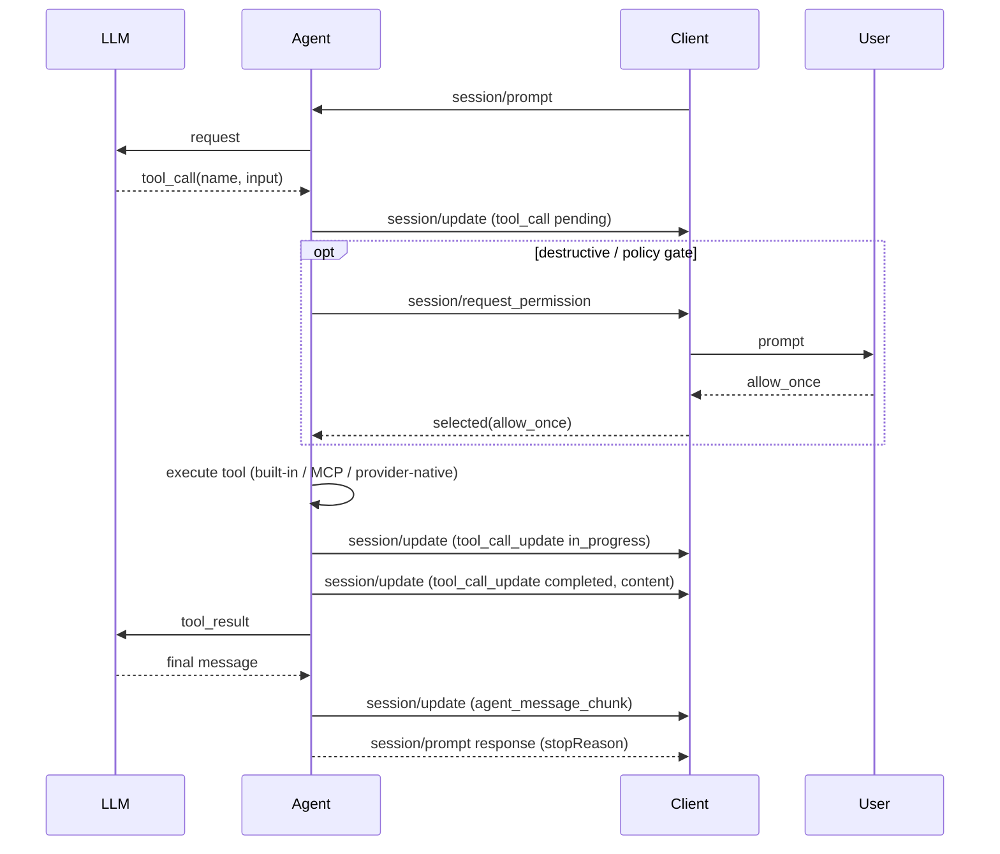
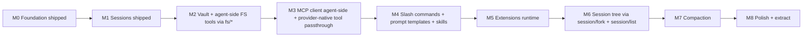

# ACP architectural briefing + web-acp milestone re-sequence

This turn is planning + docs only. No code under `packages/web-acp/src/`. It (a) enlightens on ACP architecture with references, (b) recommends a posture, (c) re-sequences milestones, and (d) produces the next prompt.

---

## Part 1 — How ACP recommends implementing tools, MCP, filesystem, commands, and server-native tools

Sources cited inline. All are in-repo clones under `/Users/amir36/Documents/workspace/src/github.com/agentclientprotocol/`.

### 1a. The "thick agent, thin client" philosophy

The spec is explicit in [`docs/protocol/overview.mdx`](../../../agentclientprotocol/agent-client-protocol/docs/protocol/overview.mdx):

- **Agents** are "programs that use generative AI to autonomously modify code" — they own the LLM loop, tool execution, session state.
- **Clients** "provide the interface between users and agents ... manage the environment, handle user interactions, and control access to resources."

The agent has baseline methods (`initialize`, `authenticate`, `session/new`, `session/prompt`) and optional ones (`session/load`, `session/set_mode`, `session/list`). The client has only **one** baseline method: `session/request_permission`. Filesystem and terminal are *optional client capabilities* that exist for the agent to reach things the client uniquely owns.

This directly validates your preference: **tool implementations belong to the agent.** The client's job is to render and arbitrate, not to execute.

### 1b. Tool calls — the single surface

Per [`docs/protocol/tool-calls.mdx`](../../../agentclientprotocol/agent-client-protocol/docs/protocol/tool-calls.mdx) and [`prompt-turn.mdx`](../../../agentclientprotocol/agent-client-protocol/docs/protocol/prompt-turn.mdx):



Key rules:

- **Tools are never enumerated over the wire.** Clients don't request the tool list — they only react to `tool_call` notifications. This matters: we don't need a `bodhi/listTools` or `bodhi/setMcpTools`. The agent decides which tools to load; the client discovers their existence by seeing tool calls happen.
- **`tool_call` kinds are open-vocabulary hints** (`read`, `edit`, `execute`, `think`, `fetch`, `search`, `switch_mode`, `other`) — clients use them for icons/UX, not routing.
- **Permission is per-call** via `session/request_permission` — not a pre-approval policy. The agent gates; the client answers.
- **Tool output is `ContentBlock[]`** — same shape as MCP, so MCP tool output forwards verbatim without transformation.

### 1c. Filesystem — two primitives, always client-delegated

Per [`docs/protocol/file-system.mdx`](../../../agentclientprotocol/agent-client-protocol/docs/protocol/file-system.mdx) and the draft session-root-scope addition:

- Only two methods exist, both agent→client: `fs/read_text_file` and `fs/write_text_file`.
- "These methods enable Agents to access **unsaved editor state** and allow Clients to track file modifications made during agent execution." That is the design intent — not a generic VFS, an editor bridge.
- Client authorises paths against the session's root set (`cwd` + optional `additionalDirectories`).
- There is no `fs/list`, `fs/glob`, `fs/grep`, `fs/edit`, or binary I/O — those are agent-side compositions on top of the two primitives.

Real-world proof that this is how "thick" agents use `fs/*`: [`agentclientprotocol/claude-agent-acp/src/acp-agent.ts`](../../../agentclientprotocol/claude-agent-acp/src/acp-agent.ts) lines 1003-1011 — the Claude Agent SDK owns all six-ish tools (Read/Write/Edit/Glob/Grep/Bash); when they need raw file I/O, the adapter delegates to the ACP client:

```1003:1011:../../agentclientprotocol/claude-agent-acp/src/acp-agent.ts
  async readTextFile(params: ReadTextFileRequest): Promise<ReadTextFileResponse> {
    const response = await this.client.readTextFile(params);
    return response;
  }

  async writeTextFile(params: WriteTextFileRequest): Promise<WriteTextFileResponse> {
    const response = await this.client.writeTextFile(params);
    return response;
  }
```

That is the canonical pattern for an ACP-aligned thick agent: the **agent implements tools, but the two FS primitives delegate.**

### 1d. MCP — agent is the MCP client

Per [`docs/protocol/session-setup.mdx`](../../../agentclientprotocol/agent-client-protocol/docs/protocol/session-setup.mdx) (§ MCP Servers) and [`docs/protocol/initialization.mdx`](../../../agentclientprotocol/agent-client-protocol/docs/protocol/initialization.mdx) (§ MCP capabilities):

- The client includes `mcpServers: McpServerConfig[]` in `session/new` and `session/load` params.
- **The agent connects to the servers** — "Agents **SHOULD** connect to all MCP servers specified by the Client."
- Transports: stdio (required), HTTP (optional, recommended for new agents), SSE (deprecated). Advertised via `agentCapabilities.mcpCapabilities.{http,sse}`.
- Notable quote: "Clients **MAY** use this ability to provide tools directly to the underlying language model **by including their own MCP server**." This is the pattern for a client to expose its own state (editor buffers, vault, etc.) to the agent — stand up a local MCP server and advertise it in `mcpServers`.

Claude-agent-acp confirms it: in [`src/acp-agent.ts`](../../../agentclientprotocol/claude-agent-acp/src/acp-agent.ts) around lines 1256-1337, the adapter merges `params.mcpServers` from ACP with any user-provided Claude Code MCPs and hands the merged map to Claude Code SDK — which **is** the MCP client.

Our current `packages/web-agent/src/worker-agent/worker/worker-host.ts` pattern (main-thread MCP + `_bodhi/toolCall` upcall) is a deliberate inversion of this, inherited from the web-agent spike when there was no ACP framing. Under ACP, the worker can and should be the MCP client.

### 1e. Provider-native / "hosted" tools (OpenAI `web_search`, Anthropic computer use, etc.)

**ACP doesn't distinguish them.** A provider-native tool is just a tool the LLM invokes; the "execution" happens inside the provider, not the agent. The agent's job is:

1. Detect the native tool call in the stream (pi-ai already surfaces these).
2. Emit `session/update (tool_call, kind: 'search' | 'fetch' | 'other')` so the client can render progress.
3. Not execute anything locally.
4. Stream provider results and emit `session/update (tool_call_update, status: completed, content)`.

Permission: typically none, because no user-machine side effect. The agent MAY gate anyway (e.g., `web_search` cost limits).

This elegance is a big reason to keep the agent as the single tool-surface arbiter: built-in, MCP, and provider-native tools all ride the same notification channel. The client never cares which bucket a tool came from.

### 1f. Slash commands — advertised by agent, expanded by client

Per [`docs/protocol/slash-commands.mdx`](../../../agentclientprotocol/agent-client-protocol/docs/protocol/slash-commands.mdx):

- Agent sends `session/update (available_commands_update, availableCommands: [...])`.
- Client renders the picker.
- When the user picks, the command text (`/compact foo`) is included in the next `session/prompt` prompt array as a normal text block.
- The agent recognizes the prefix and handles it.

No new methods. Commands ride `session/prompt` like any message.

### 1g. Prompt templates, skills, resources — NOT in core spec

- Prompt templates and skills are *agent concerns*. They're sourced from somewhere the agent can read (vault, config dir, extension) and optionally surfaced as slash commands.
- The ACP "resource" concept is **different** — it refers to `ContentBlock::Resource` (embedded text/blob) and `ContentBlock::ResourceLink`, used to pass files/images as prompt content. Per [`docs/protocol/content.mdx`](../../../agentclientprotocol/agent-client-protocol/docs/protocol/content.mdx). This is distinct from "resources" as an M5 concept (templates/skills).

### 1h. Session lifecycle — what's stable vs unstable in the schema

From `schema/meta.json` (stable) vs `schema/meta.unstable.json`:

- **Stable**: `session/new`, `session/prompt`, `session/cancel`, `session/load`, `session/list` (new in recent spec), `session/set_mode`, `session/set_config_option`. Client-side: `fs/*`, `terminal/*`, `session/request_permission`, `session/update`.
- **Unstable**: `session/fork`, `session/resume`, `session/close`, `session/set_model`, `document/*` (editor integration), `elicitation/create`, `nes/*` (next-edit-suggestions), `providers/*`, session `session_info_update` notification.

Implications:

- M1's `bodhi/listSessions` can be replaced by `session/list` once we bump SDK to 0.19+ (check availability).
- M3's session-fork story is `session/fork` — a **native method** in unstable. We don't need a custom RFC.
- `session/set_model` exists in unstable — our `bodhi/getSession.lastModelId` snapshot can evolve toward that.

### 1i. Extension-method naming — we have a bug today

Per [`docs/protocol/extensibility.mdx`](../../../agentclientprotocol/agent-client-protocol/docs/protocol/extensibility.mdx):

> "The protocol reserves any method name **starting with an underscore (`_`)** for custom extensions."

Our current `bodhi/listSessions`, `bodhi/listModels`, `bodhi/getSession` method names are **non-conformant**. They happen to work because the SDK doesn't enforce the `_` prefix, but they risk colliding with future stable methods (`bodhi/*` is not reserved to us). We should rename them `_bodhi/listSessions`, `_bodhi/listModels`, `_bodhi/getSession` as a hygiene fix in the next milestone (strictly compatible rename — old constants can stay as deprecated aliases for the transition).

### 1j. ACP architectural variations we can choose from

Four postures are viable; each has a clear pros/cons profile.

**Variation A — Thick agent, client-delegated FS (the canonical ACP pattern):**
- Agent owns all tool implementations (read/write/edit/ls/glob/grep); tools internally call `fs/read_text_file` / `fs/write_text_file` when they need primitive I/O.
- Client handlers back those methods with the ZenFS vault mounted main-thread.
- Client capabilities advertise `fs.readTextFile = true`, `fs.writeTextFile = true`.
- MCP: agent is MCP client via `mcpCapabilities.http`; client passes server configs via `session/new`.
- **Pros:** spec-canonical; matches [`claude-agent-acp`](../../../agentclientprotocol/claude-agent-acp/) pattern; preserves remote-agent future (agent can run on a server and still reach user files via `fs/*`); round-trip cost across a same-tab `MessageChannel` is microseconds, trivially fine; boundary between agent and client is clean for extraction into `@bodhiapp/bodhi-web-acp`.
- **Cons:** every file touch is a postMessage round-trip (negligible today, network-bound if remote); the agent-side tool implementations must be written on top of the two primitives.

**Variation B — Thick agent, direct worker FS access (no `fs/*`):**
- FSA handle transferred to the worker; ZenFS mounted inside the worker; tools read/write directly.
- Do not advertise `fs.readTextFile` / `fs.writeTextFile`.
- **Pros:** zero round-trip; simplest tool implementation; philosophical purity on "agent owns everything".
- **Cons:** **breaks the remote-agent extraction story** — a backend agent can't reach the user's disk, so `fs/*` is the only sustainable path; gives up interop with ACP clients that want to authorise paths; no client-side audit trail of file touches; diverges from every published ACP agent.

**Variation C — Hybrid (direct + fs/* opportunistic):**
- Worker mounts vault directly; `fs/*` also advertised and used only when the client has something the agent doesn't (e.g., "unsaved editor state" in a future IDE integration).
- **Pros:** best perf today, remote future available later via `fs/*`.
- **Cons:** tool implementations need two code paths (direct + delegated) — complexity now; weakens the invariant "worker never sees the vault" which was a specific M2.1 design goal for the remote-agent story.

**Variation D — Client-as-MCP-server:**
- Main thread exposes the vault as a local in-memory MCP server; worker consumes it via `session/new mcpServers`.
- **Pros:** fully ACP-idiomatic; uniform "everything the agent consumes is an MCP tool"; reuses Bodhi JS MCP plumbing later.
- **Cons:** needs an in-browser MCP server implementation; more engineering than `fs/*`; MCP filesystem servers are slow for fine-grained I/O.

**Recommendation: Variation A.** Spec-canonical, matches the reference ACP adapter for Claude, preserves future remote deployment, and the `fs/*` round-trip cost over a same-tab `MessageChannel` is non-material. The `fs/*` primitives let the agent do all six tools locally without needing a second protocol for vault I/O. Your "thick agent" preference is fully satisfied: **the agent implements every tool; it just uses `fs/*` for raw I/O the same way claude-agent-acp does.**

**Recommendation for MCP: Agent-side HTTP MCP client.** Worker advertises `agentCapabilities.mcpCapabilities.http = true`, `sse = false` (deprecated), stdio false (no browser shell). Client passes `mcpServers: McpServerConfig[]` via `session/new`. Worker dials each server and registers their tools alongside built-ins. Client-as-MCP-server (Variation D, applied to MCP rather than FS) is an explicit future option for bridging Bodhi JS's MCP registry.

These recommendations are what the re-sequenced milestones assume.

---

## Part 2 — Re-sequenced milestones (after M1 shipped)

### 2a. Driving principle

> "Complex first, iteratively" — nail the tool-registry shape with built-in FS tools, then widen the registry to absorb MCP and provider-native tools, then layer commands/skills/extensions on top. Session tree, compaction, polish trail because they're surfaces on top of the stable core.

### 2b. The new sequence



Each milestone's *compliance* posture vs ACP is stated in its header so future readers can see where we're canonical and where we diverge.

### 2c. Per-milestone brief

#### M2 — Vault + agent-side FS tools (was M2.1 + M2.2, M2.3 lifted out)

- **Scope:** FSA handle + ZenFS mounted *main thread*; client handlers for `fs/read_text_file` / `fs/write_text_file`; six agent-side tools (`read`/`write`/`edit`/`ls`/`glob`/`grep`) registered on `InlineAgent`, implemented on top of the two primitives; `session/request_permission` for destructive tools.
- **ACP compliance:** ✅ canonical. Advertises `clientCapabilities.fs.{readTextFile,writeTextFile} = true`; agent uses the primitives; no custom FS extension methods.
- **Divergence:** none.
- **Why this first:** biggest architectural shape of the agent-side tool registry. Every later milestone (M3 MCP, M4 commands, M5 extensions) reuses this registry.

#### M3 — MCP client (agent-side) + provider-native tool passthrough

- **Scope:** Worker implements an HTTP MCP client (SDK: `@modelcontextprotocol/sdk` browser build, or hand-rolled since we control the wire); advertise `agentCapabilities.mcpCapabilities.http = true`. `session/new` accepts `mcpServers`. Client-side component surfaces the Bodhi JS MCP registry and flattens entries into ACP `McpServerConfig` (with `headers[]` carrying Bodhi-minted auth tokens). Provider-native tools (OpenAI `web_search`, Anthropic tool use etc.) stream through as-is via pi-ai; agent just reports `session/update (tool_call)` around them.
- **ACP compliance:** ✅ canonical on MCP. Provider-native tools are also canonical (ACP makes no distinction).
- **Divergence:** none — we deprecate the old `set_mcp_tools` / `tool_call_request` upcall from web-agent and do not port it.
- **Why second:** MCP is the second tool source on the same registry. Nailing it after built-ins means one registry abstraction, not two.

#### M4 — Slash commands + prompt templates + skills

- **Scope:** Agent advertises `available_commands_update` over `session/update`; built-ins `/compact`, `/new`, `/fork`, `/export`, `/help`, plus any user-provided. Prompt templates sourced from `/vault/.pi/prompts/*.md` — read via the agent's own `read` tool (dogfood M2). Skills sourced from `/vault/.pi/skills/` — persona + template + optional tool wrapper; loaded at `session/new`.
- **ACP compliance:** ✅ canonical. `available_commands_update` is the native notification; no new methods.
- **Divergence:** none (vault layout is our own convention).
- **Why third:** commands/skills are pure UX on top of the agent's turn loop and tool registry. They depend on M2 vault reads and M3 registry shape.

#### M5 — Extensions runtime

- **Scope:** `/vault/.pi/extensions/*` loaded into the worker at session start (pattern mirrors `packages/web-agent/src/worker-agent/...`). Extensions can register tools, slash commands, prompt templates, hooks. `vault+code` trust boundary documented.
- **ACP compliance:** ✅ — extensions don't change the wire. They add tools/commands that flow through the standard `session/update` surface.
- **Divergence:** none.
- **Why fourth:** extensions need all three prior surfaces (tool registry, MCP, commands) to be meaningful registration targets.

#### M6 — Session tree: fork / list

- **Scope:** Adopt `session/list` (stable) and `session/fork` (unstable) from the SDK when we bump. Rename our `_bodhi/listSessions` → `session/list`, keep old constant as deprecated alias until downstreams migrate. Add fork UX to the picker; session store acquires parent-pointer.
- **ACP compliance:** ✅ on `session/list`; ⚠️ unstable on `session/fork` — we advertise via `_meta` in capabilities per the extensibility doc and gate with a feature flag. When `session/fork` stabilises, drop the feature flag.
- **Divergence:** we deliberately adopt an unstable method — the alternative is a bespoke `_bodhi/fork` that we'd have to rip out later. Unstable-with-flag is cheaper.
- **Why fifth:** web-agent already has the shape; fork is small once the store tracks parents. Low complexity, high UX value.

#### M7 — Compaction

- **Scope:** Auto-compact threshold + manual `/compact`; summary entries in session store (third `entries.kind`). Compaction reuses the LLM stream — no new wire surface.
- **ACP compliance:** ✅ — no protocol impact.
- **Divergence:** none.
- **Why sixth:** compaction is a turn-orchestration feature; it's independent of the tool/command layer, but easier to validate once `/compact` exists as a command (M4).

#### M8 — Polish + extract to `@bodhiapp/bodhi-web-acp`

- **Scope:** diagnostics, HTML export, library package carve-out.
- **ACP compliance:** ✅ — pure packaging.

### 2d. Compliance / divergence summary at a glance

- **Canonical:** tool-call surface, `fs/*` delegation, MCP agent-side via `mcpServers`, slash commands, permission flow, content blocks, session/list, session-mode, compaction.
- **Unstable-but-used-with-flag:** `session/fork` (M6), possibly `session/set_model` (later M1 hygiene).
- **Custom extension methods (must prefix with `_`):** `_bodhi/listModels` (M0 artefact, renamed from `bodhi/listModels`), `_bodhi/getSession` (M1 artefact) — keep for now; deprecate once stable equivalents land.
- **Known hygiene fixes:** rename `bodhi/*` → `_bodhi/*`; plan to drop `_bodhi/listSessions` in M6 in favour of `session/list`.

---

## Part 3 — Files this plan edits (when executed)

All edits are docs/markdown; no runtime code.

### Milestone docs

- [`ai-docs/web-acp/milestones/index.md`](ai-docs/web-acp/milestones/index.md) — replace the status board and load-when hooks for M2-M8 with the new sequence; add a "Scope adjustments (2026-04)" paragraph citing the ACP architectural briefing; add a compliance-at-a-glance subsection.
- [`ai-docs/web-acp/milestones/m2-tools.md`](ai-docs/web-acp/milestones/m2-tools.md) — rename to "M2 — Vault + agent-side FS tools"; drop M2.3 MCP slice entirely; restate scope as vault mount + six agent-side tools + permission flow; add "ACP compliance" header block.
- New file `ai-docs/web-acp/milestones/m3-mcp-and-native-tools.md` — content copied from scratch: agent-side HTTP MCP client, provider-native tool passthrough, `mcpCapabilities.http` advertisement, `mcpServers` in `session/new`. ACP compliance block cites `session-setup.mdx` + `initialization.mdx`.
- Rename existing `m3-session-tree.md` → `m6-session-tree.md`; update content to use `session/list` (stable) and `session/fork` (unstable with flag); cite `schema/meta.unstable.json`.
- Rename existing `m4-compaction.md` → `m7-compaction.md` (content stays).
- Rename existing `m5-resources.md` → `m4-commands-and-skills.md`; restructure content around (i) slash commands via `available_commands_update`, (ii) prompt templates at `/vault/.pi/prompts/`, (iii) skills at `/vault/.pi/skills/`. Drop the "resources" term where it conflicted with ACP content-block "resource" — use "commands, templates, skills".
- Rename `m6-extensions.md` → `m5-extensions.md`. Tighten to vault-sourced only; note trust model.
- `m7-polish-and-extract.md` → `m8-polish-and-extract.md`. Content unchanged.

### Steering

- [`ai-docs/web-acp/steering/02-architecture.md`](ai-docs/web-acp/steering/02-architecture.md) — add a new section "ACP architectural postures" that reproduces the four-variation matrix from Part 1j with the chosen posture called out (Variation A).
- [`ai-docs/web-acp/steering/04-principles.md`](ai-docs/web-acp/steering/04-principles.md) — add principle "Extension methods MUST be prefixed with `_`" citing `docs/protocol/extensibility.mdx`. Add principle "Agent owns all tool surfaces; client delegates only FS primitives."

### Specs

- [`ai-docs/web-acp/specs/web-acp/index.md`](ai-docs/web-acp/specs/web-acp/index.md) — under "Scope out (deferred)" replace the old M2.3 MCP / M3 session-tree / M4 compaction entries with the new M3-M8 lineup. No changes to "Scope in (M0)" or the module layout.

### Next prompt

- New file `ai-docs/web-acp/prompts/003-m2-vault-and-fs-tools.md` — rewrite from scratch using the new M2 scope. "Read before planning" list cites:
  - The new milestone doc.
  - Steering (02 + 04).
  - [`docs/protocol/file-system.mdx`](../../../agentclientprotocol/agent-client-protocol/docs/protocol/file-system.mdx) and [`docs/protocol/tool-calls.mdx`](../../../agentclientprotocol/agent-client-protocol/docs/protocol/tool-calls.mdx) (ACP canon).
  - [`agentclientprotocol/claude-agent-acp/src/acp-agent.ts`](../../../agentclientprotocol/claude-agent-acp/src/acp-agent.ts) § `readTextFile`/`writeTextFile` (reference thick-agent pattern).
  - [`packages/coding-agent/src/core/tools/`](packages/coding-agent/src/core/tools/) — the six-tool reference implementation (port shape, not code).
  - [`packages/web-agent/src/vault/`](packages/web-agent/src/vault/) and [`packages/web-agent/e2e/tests/vault-*.spec.ts`](packages/web-agent/e2e/tests/) — FSA mount + e2e harness shape.
  - `ai-docs/specs/worker-agent/vault-tools.md` — LLM-surface reference.
- Delete `ai-docs/web-acp/prompts/003-m2-tools.md` (replaced by the new prompt) OR leave as a stub redirecting to the new file — I'll do the latter to preserve any PR references.

---

## Part 4 — Open questions to raise in the plan's decision log (not blockers)

- Whether to use upstream `@modelcontextprotocol/sdk` in the worker or a minimal hand-rolled HTTP MCP client (decide at M3 start; affects bundle size + browser-compat).
- Timing of `bodhi/*` → `_bodhi/*` rename: do we do it as part of M3 (forced by extensibility cleanup), or defer to M6 alongside the `session/list` adoption? Recommend M3 since M3 already rewrites capabilities advertisement.
- Whether to cold-transfer the vault FSA handle to the worker as a *performance escape hatch* for `ls`/`glob`/`grep` (bulk ops), while keeping `read`/`write`/`edit` on `fs/*`. Flag as optional M2.5 if the e2e shows round-trip cost matters — tentatively NOT worth the hybrid complexity.

---

## Part 5 — What this plan does NOT do

- No runtime code under `packages/web-acp/src/`.
- No changes to the agent-adapter wire today (renames tracked for M3 to keep this diff docs-only).
- No production of architecture comparison reports (deferred — was in the prior plan; re-sequenced to land alongside M2 execution's exit turn).
- No touching of M0 or M1 docs except the milestones index status board.

---

## Execution order when approved

1. Edit milestones index (status board + scope adjustments + load-when hooks + compliance summary).
2. Edit existing milestone files that stay in place (m2-tools, rename m3/m4/m5/m6/m7).
3. Create m3-mcp-and-native-tools.md.
4. Steering updates (02 + 04).
5. Spec scope-out block.
6. Create 003-m2-vault-and-fs-tools.md; convert the old 003-m2-tools.md to a pointer stub.
7. Commit as a single docs-only commit: `web-acp: resequence milestones M2-M8 + ACP-compliance docs`.