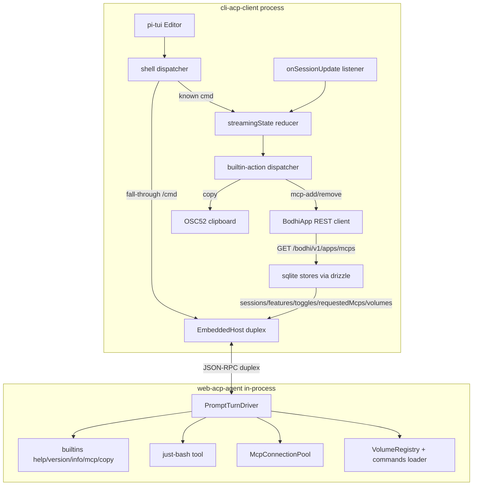

# cli-acp-client ↔ web-acp parity bridge

## Architecture deltas (target)



## Decisions locked (from this conversation)

- **Streaming state machine**: full `streamingReducer` port. Long-lived `client.onSessionUpdate` listener at boot routes every notification through `turn-start | turn-end | load-start | load-end | reset | session-update`. Owns `messages`, `streamingMessage`, `toolCalls: Map<string, ToolCallView>`, `mcpStates: Record<string, McpConnectionMeta>`, `availableCommands`, `isReplaying`.
- **Slash fall-through**: unknown `/cmd` is forwarded to the agent (`onPrompt(parsed.raw)`). Existing CLI commands (`host`, `login`, `logout`, `models`, `model`, `mcp`, `session`, `help`, `quit`) keep their CLI-shell semantics. Builtin model-gate skip: when `text.startsWith('/')` and `isBuiltinName(name)` (mirrored locally), skip the "no model selected" gate.
- **MCP catalog discovery**: direct `fetch(host + '/bodhi/v1/apps/mcps', {Authorization})` (no `bodhi-js-react` dep). Re-fetch on `/login` complete and on token rotation; refresh after agent-driven `mcp-add`/`mcp-remove` actions.
- **MCP toggles**: `/mcp on <slug>` / `/mcp off <slug>` / `/mcp on <slug>:<tool1>,<tool2>,...` / `/mcp off <slug>:<tool1>,<tool2>,...` (calls `client.setMcpToggle`). `/mcp list` shows `[connected|connecting|error|disabled]` plus toggled-off tool count.
- **Volumes**: `/volume list`, `/volume add <path> [<mountName>]`, `/volume remove <mountName>`. Persisted in sqlite. Auto-mount on every launch in addition to `$cwd`. Unlocks multi-volume vault commands (`<mount>:<name>` canonical form).
- **Markdown**: plain text everywhere (current). pi-tui `Markdown` component not used.
- **Cancel**: Esc while streaming → `client.cancel(sessionId)`. Ctrl+C always quits.
- **/copy**: OSC 52 ANSI escape (`\x1b]52;c;<base64>\x07`); when stdout is not a TTY or `TERM` blocks OSC, print "Copy from above:" + transcript. Transcript built from `client.getSession(id)` history with `_builtin`-tagged turns filtered out.
- **/session naming clash**: rename agent's builtin `name: "session"` to `name: "info"` in `packages/web-acp-agent/src/agent/commands/builtins/session.ts` (rename file to `info.ts`). web-acp's own embedded copy at `packages/web-acp/src/agent/commands/builtins/session.ts` is untouched. Add `packages/web-acp/techdebt.md` documenting the divergence and listing the affected web-acp references: [packages/web-acp/src/agent/commands/builtins/index.ts:5](packages/web-acp/src/agent/commands/builtins/index.ts), [packages/web-acp/src/acp/agent-adapter.test.ts:285](packages/web-acp/src/acp/agent-adapter.test.ts), [packages/web-acp/e2e/builtins.spec.ts:53,67](packages/web-acp/e2e/builtins.spec.ts).
- **DEV mode**: `isDev=true` by default; `CLI_ACP_DEV=0|false|no` disables. `/feature forceToolCall` always exposed.
- **Persistence**: sqlite via drizzle-orm + better-sqlite3 at `$cwd/.cli-acp-client/state.db`. Drizzle schemas in TS, migrations via `drizzle-kit`. Tables: `sessions` (mirrors web-acp `SessionRow`), `features` (FeatureRow), `mcp_toggles` (McpTogglesRow), `kv` (requestedMcps[], lastModelId, volumes[]). Settings JSON file kept for `host`, `authServerUrl`, `callbackPort`, `tokens`.
- **fs/\* capabilities**: keep `false` advertised in `initialize` ([packages/cli-acp-client/src/acp/client.ts:71](packages/cli-acp-client/src/acp/client.ts:71)). In-process embed never invokes `fs/*`.

## Architecture: streamingReducer port

Mirror [packages/web-acp/src/acp/streaming-reducer.ts](packages/web-acp/src/acp/streaming-reducer.ts) at [packages/cli-acp-client/src/acp/streaming-reducer.ts](packages/cli-acp-client/src/acp/streaming-reducer.ts) with the same union shape minus React-specific types. Owner is a new `StreamController` class held by `AppContext`. Subscribed once at boot via `client.onSessionUpdate(notif => controller.dispatch({type: 'session-update', notif}))`. The controller emits `ShellMessage` on transitions: `agent_message_chunk` → assistant text (id-keyed for streaming append), `tool_call`/`tool_call_update` → renderer `tool` kind, `available_commands_update` → updates autocomplete provider + `/help` listing, `_meta.bodhi.mcp` → updates `mcpStates` + emits status line, `_meta.bodhi.builtin.action` → forwards to `dispatchBuiltinAction`.

## Architecture: MCP catalog + lifecycle

New module [packages/cli-acp-client/src/mcp/bodhi-client.ts](packages/cli-acp-client/src/mcp/bodhi-client.ts) — direct `GET /bodhi/v1/apps/mcps` returning `McpInstanceView[]` (`{slug, name, path}`). New module [packages/cli-acp-client/src/mcp/compose.ts](packages/cli-acp-client/src/mcp/compose.ts) ports [packages/web-acp/src/mcp/compose-mcp-servers.ts](packages/web-acp/src/mcp/compose-mcp-servers.ts) without React deps. Composes `McpServerHttp[]` from `(instances, token, host, toggles)`. `requestedMcpUrls` (the user-asked-for URL list, persisted in sqlite kv) flows through `_meta.bodhi = {requestedMcpUrls, mcpInstances}` on every `session/new` and `session/load`. On token rotation, the host re-issues `loadSession(sessionId, freshServers, freshMeta)` mirroring [packages/web-acp/src/hooks/useAcpAuth.ts:112-135](packages/web-acp/src/hooks/useAcpAuth.ts).

## Architecture: builtin-action dispatcher

New [packages/cli-acp-client/src/acp/builtin-dispatch.ts](packages/cli-acp-client/src/acp/builtin-dispatch.ts) ports the web-acp dispatcher. Cases:

- `kind: 'copy'` → fetch `client.getSession(sessionId)`, filter `_builtin`-tagged turns (mirror [packages/web-acp/src/lib/builtin-format.ts:89-103](packages/web-acp/src/lib/builtin-format.ts)), render markdown via `renderConversationMarkdown`, write OSC52 (`\x1b]52;c;<base64>\x07` to `process.stdout`); on non-TTY or no-OSC env, print transcript with banner.
- `kind: 'mcp-add'` → push `params.url` into sqlite `requestedMcps`, then re-trigger the OAuth login flow ([packages/cli-acp-client/src/auth/index.ts](packages/cli-acp-client/src/auth/index.ts)) so Keycloak picks up the new resource.
- `kind: 'mcp-remove'` → drop `params.url` from sqlite `requestedMcps`, re-trigger login.

## Architecture: cancel via Esc

pi-tui `Editor` accepts custom keybindings. Add an Esc binding that, when `streamingState.isStreaming === true`, calls `client.cancel(sessionId)` and dispatches `{type: 'reset'}`. Ctrl+C remains the quit binding. Default keybindings live in `packages/cli-acp-client/src/shell/keybindings.ts` (new); per AGENTS.md no hardcoded `matchesKey` checks elsewhere.

## Architecture: sqlite persistence

New module [packages/cli-acp-client/src/storage/db.ts](packages/cli-acp-client/src/storage/db.ts):

```typescript
import Database from 'better-sqlite3';
import { drizzle } from 'drizzle-orm/better-sqlite3';
import { sessions, features, mcpToggles, kv } from './schema';
export function openDb(cwd: string) {
  const db = new Database(`${cwd}/.cli-acp-client/state.db`);
  return drizzle(db, { schema: { sessions, features, mcpToggles, kv } });
}
```

Schemas in [packages/cli-acp-client/src/storage/schema.ts](packages/cli-acp-client/src/storage/schema.ts) mirror web-acp-agent's `SessionRow`/`FeatureRow`/`McpTogglesRow`. Migrations via `drizzle-kit generate` checked into `packages/cli-acp-client/migrations/`. Stores in [packages/cli-acp-client/src/storage/sqlite-stores.ts](packages/cli-acp-client/src/storage/sqlite-stores.ts) implement `SessionStore` / `FeatureStore` / `McpToggleStore` from `@bodhiapp/web-acp-agent`. The `kv` table holds `requestedMcps`, `lastModelId`, `volumes` (JSON arrays).

## Tasks (ordered for execution)

Each task lists its primary file changes and the e2e seam that proves it.

## Risks

- **Drizzle/better-sqlite3 native build**: better-sqlite3 ships prebuilt arm64/x64 macOS+linux binaries, but Node version mismatches surface at boot. Mitigation: pin to a matrix-tested version, document `npm rebuild` in README troubleshooting.
- **OSC 52 silent failure**: not every terminal forwards OSC 52. Mitigation: print-fallback when `process.stdout.isTTY === false` or when `TERM` matches a known-broken list; emit a one-line hint after the escape so users can verify.
- **/session→/info rename divergence**: web-acp e2e references `/session` builtin reply by exact name. Without updating web-acp this round, web-acp e2e continues to pass against its **own** embedded copy (untouched), and the CLI suite tests `/info`. Tech-debt doc must explicitly state both packages' builtin sets are now divergent until web-acp is updated.
- **Token rotation race**: re-issuing `loadSession` while a prompt turn is in-flight can dispatch out of order. Mitigation: wait for `streamingState.isStreaming === false` before issuing rotation `loadSession`, mirror [packages/web-acp/src/hooks/useAcpAuth.ts](packages/web-acp/src/hooks/useAcpAuth.ts) idempotency via `lastWorkerTokenRef`.
- **Multi-volume canonical-name churn**: existing vault commands authored with the cwd-only assumption render as `cwd:foo`. After this change every command author must qualify; document migration in user guide.
- **better-sqlite3 + WAL on shared cwd**: two CLIs in the same `$cwd` would compete on the same db. Mitigation: WAL mode on by default, single-writer assumption documented; future enhancement: row-level session ownership.