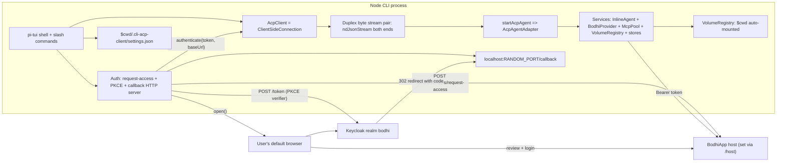
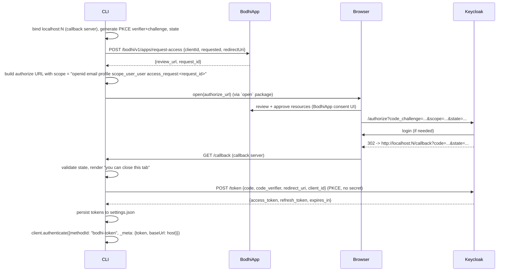

# CLI ACP Client (`packages/cli-acp-client/`)

## 1. Goals and non-goals

**Goal.** A Node CLI that talks the same ACP wire to the same `AcpAgentAdapter` that powers the browser worker today, so we prove `web-acp-agent` is genuinely transport- and runtime-neutral. UX target: Claude-Code-style interactive REPL with slash commands, streamed assistant output, tool-call surfacing, and the user's `$cwd` automatically available as a volume to the agent.

**Non-goals (v0).**
- No standalone TCP/WS ACP server on `:8080` (CLI hosts the agent in-process).
- No multi-user / remote agent.
- No bash-tool parity with web-acp on day one — guarded behind `--enable-bash` (see Risks).
- No fake/stub BodhiApp or Keycloak — e2e uses the same real `@bodhiapp/app-bindings` BodhiServer that web-acp uses.

## 2. Architecture (in-process embed)



The duplex pair is a single in-memory `TransformStream` per direction (no MessagePort, no socket); this is the cheapest implementation of the `AcpTransport` shape `web-acp-agent` already accepts ([packages/web-acp-agent/src/bootstrap.ts](packages/web-acp-agent/src/bootstrap.ts)).

## 3. Startup behavior (passive, no auto-probe)

Per your call: the CLI never silently probes `localhost:1135`. Boot sequence:

1. Read `$cwd/.cli-acp-client/settings.json` if present.
2. Mount `$cwd` as the volume `cwd` on the in-process agent. This is unconditional; no settings flag.
3. Render the TUI shell with status `disconnected`. If `settings.host` exists, attempt token refresh using stored refresh token and call `client.authenticate(...)` — go to `authenticated` on success or `disconnected` with hint `Run /login` on failure. If no `settings.host`, status is `disconnected` with hint `Run /host <url> to begin`.
4. User runs `/host <url>` — write to settings (drops tokens if URL changes) and immediately kick off `/login`.

This means `host` is the single trigger; nothing happens to the BodhiApp on a different port from a stray test run.

## 4. OAuth + access-request flow (Node-native)

The browser SDK (`@bodhiapp/bodhi-js-react`) is not usable from Node — it relies on `localStorage`, `window`, and a static SPA redirect URI. We re-implement the documented flow with raw HTTP using the SKILL.md sequence (`requesting` → `reviewing` → `authenticating`):



If the redirect lands with `?error=...`, the local callback page renders an error and a retry button; clicking it XHRs to `POST /retry` on the same callback server, which restarts the flow with a fresh `request_id` and re-opens the authorize URL.

**Scopes (per your spec).** `openid email profile scope_user_user access_request:<request_id>`. The `access_request:<id>` segment is dynamic per login attempt and is the protocol-level binding that ties the issued access token back to the resources approved in step 2. Other roles (e.g. `scope_user_power_user`) are not configurable in v0 — `scope_user_user` matches what web-acp does today ([packages/web-acp/src/components/Header.tsx](packages/web-acp/src/components/Header.tsx)).

**Client ID.** Hardcoded as a `const APP_CLIENT_ID = "..."` at [src/auth/config.ts](src/auth/config.ts). No `--client-id` argv, no setting. Whoever registers the OAuth client outside the repo bakes the value into the source. `authServerUrl` defaults to the SDK production default (`https://id.getbodhi.app/realms/bodhi`) and can be overridden in `settings.authServerUrl` for dev (`https://main-id.getbodhi.app/realms/bodhi`); discovery is intentionally out of scope.

## 5. Package layout

```
packages/cli-acp-client/
├── package.json              # bin: cli-acp -> dist/cli.js
├── tsconfig.json
├── README.md
├── src/
│   ├── cli.ts                # entry: parse argv, bootstrap, run loop
│   ├── shell/                # parser, dispatcher, history (TUI-agnostic)
│   ├── tui/                  # pi-tui renderer + components (sec. 6)
│   ├── acp/
│   │   ├── embedded-host.ts  # creates duplex pair, starts agent, returns AcpClient
│   │   └── client.ts         # thin wrapper over ClientSideConnection (mirrors packages/web-acp/src/acp/client.ts)
│   ├── auth/
│   │   ├── config.ts         # const APP_CLIENT_ID, default authServerUrl
│   │   ├── access-request.ts # POST /bodhi/v1/apps/request-access
│   │   ├── pkce.ts           # verifier/challenge/state helpers
│   │   ├── callback-server.ts# ephemeral http.Server with /callback and /retry
│   │   ├── browser-opener.ts # `open` package wrapper, with --no-browser fallback
│   │   └── token-exchange.ts # POST keycloak /token, refresh handling
│   ├── settings/
│   │   ├── store.ts          # read/write $cwd/.cli-acp-client/settings.json
│   │   └── schema.ts         # zod (host, authServerUrl?, tokens, lastModelId, mcps)
│   ├── services/
│   │   ├── assemble.ts       # node-side assembleServices() for the agent
│   │   ├── cwd-volume.ts     # mount $cwd as ZenFS volume "cwd"
│   │   ├── node-bash.ts      # gated behind --enable-bash; uses child_process not just-bash/browser
│   │   └── stores.ts         # in-memory or filesystem-backed SessionStore/FeatureStore/McpToggleStore
│   └── commands/
│       ├── host.ts           # /host <url>
│       ├── login.ts          # /login, /logout
│       ├── models.ts         # /models, /model <id>
│       ├── mcp.ts            # /mcp list/add/remove
│       ├── session.ts        # /session new/list/load/delete
│       └── help.ts           # /help, /quit
└── e2e/
    ├── tests/
    │   ├── global-setup.ts   # spawns BodhiApp via @bodhiapp/app-bindings, registers models (lifted from web-acp/e2e)
    │   ├── pages/AdminAuthPage.ts  # admin chromium walks /ui/login -> Keycloak (lifted)
    │   ├── pages/ReviewPage.ts     # chromium walks /access-requests/review (lifted from AuthPage.ts)
    │   ├── pages/ApiModelsPage.ts  # lifted
    │   ├── harness/cli-driver.ts   # node-pty + xterm/headless decoder for the CLI process
    │   └── helpers/                # bin path resolver, port allocator, .env.test loader
    ├── playwright.config.ts
    ├── .env.test.example
    └── *.spec.ts             # see sec. 8
```

`assemble.ts` mirrors what [packages/web-acp/src/agent/agent-worker.ts](packages/web-acp/src/agent/agent-worker.ts) does in the worker today — the shape stays identical, only the runtime substitutions change. We import `startAcpAgent`, `assembleServices`, `BodhiProvider`, `BODHI_AUTH_METHOD_ID`, etc. from `@bodhiapp/web-acp-agent` as the user-facing API.

The `cwd` volume uses a real-fs ZenFS backend (or a thin custom `FileSystem` that delegates to `node:fs` if no off-the-shelf backend ships with `@zenfs/core` v2.5.x — confirm at scaffold time) so the agent reads/writes the user's project directory directly. No sandboxing yet; that's a separate hardening pass.

## 6. TUI library — confirmed pi-tui

[`@mariozechner/pi-tui`](packages/tui/package.json) is fully independent of `coding-agent`: deps are `chalk`, `marked`, `get-east-asian-width`, `mime-types`, optional `koffi`. `coding-agent` consumes pi-tui, not the reverse. Tests in [packages/tui/test/](packages/tui/test/) drive a `VirtualTerminal` backed by `@xterm/headless` (devDep), which is the same trick we'll use for the e2e CLI driver.

E2E testability summary:
- **In-process unit tests** for individual components: drop a `VirtualTerminal` in place of `ProcessTerminal` and assert on rendered text directly. Already proven in [packages/tui/test/tui-render.test.ts](packages/tui/test/tui-render.test.ts).
- **Black-box CLI tests** spawn the actual `cli-acp` binary under `node-pty`, feed the byte stream through an in-test `@xterm/headless` to get a stable cell grid, and assert against substrings or `data-test-state`-style markers we emit on the status bar. We add a `PI_CLI_FRAME_LOG` env (mirroring pi-tui's existing `PI_TUI_WRITE_LOG`) so failing tests can dump the recorded frames as text for diff.
- **Fallback escape hatch.** If a particular spec proves flaky against ANSI overlays (synchronized output, bracketed paste, etc.), launch the CLI with `--ci-line-mode`, which swaps the renderer for a plain `console.log` line emitter — same components, no full-screen control sequences, deterministic line-buffered output. Decision lives in the renderer interface, so commands and shell stay identical.

We commit to pi-tui first; `--ci-line-mode` is the safety net. If the harness still fights it, we drop to a hand-rolled `readline` REPL — but the user request was to confirm pi-tui and keep that as plan A, which we are doing.

## 7. Slash commands (v0)

| Command | Behavior |
|---|---|
| `/host <url>` | Update `settings.host`. If different from previous, drop tokens. Immediately kick off `/login`. |
| `/login` | Run access-request + PKCE flow, persist tokens, call `client.authenticate(...)`. |
| `/logout` | Clear tokens, revoke at Keycloak best-effort, clear models cache. |
| `/models` | `client.listModels()` (existing `bodhi/listModels` ext method). Cache in settings. |
| `/model <id>` | Set per-session model. |
| `/mcp list / add <url> / remove <url>` | Mirrors web-acp `useAcpMcp`; on `add` triggers logout+login with new requested.mcp_servers. |
| `/session new / list / load <id> / delete <id>` | Maps to ACP `session/new`, `_bodhi/sessions/delete`, `bodhi/listSessions`, `bodhi/getSession`. |
| `/help` | Print command list. |
| `/quit` | `adapter.dispose()`, close streams, exit. |

Plain text input becomes a `prompt` request to the active session.

## 8. E2E testing (real BodhiApp, no fakes)

Mirror web-acp's pattern in full. `e2e/tests/global-setup.ts` is a near-copy of [packages/web-acp/e2e/tests/global-setup.ts](packages/web-acp/e2e/tests/global-setup.ts):

1. Load `e2e/.env.test` (`BODHIAPP_CLIENT_ID`, `BODHIAPP_CLIENT_SECRET`, `BODHIAPP_USERNAME`, `BODHIAPP_PASSWORD`, `BODHIAPP_AUTH_URL`, `BODHIAPP_AUTH_REALM`, `OPENAI_API_KEY`, `ANTHROPIC_API_KEY`).
2. Assert ports free, resolve `e2e/bin/<arch>/<os>/<variant>` (re-use the same binary fixture conventions as web-acp).
3. Spawn `BodhiServerManager` from [packages/web-acp/e2e/tests/utils/bodhi-server-manager.ts](packages/web-acp/e2e/tests/utils/bodhi-server-manager.ts) (we initially copy it; once stable, we extract to `packages/web-acp-e2e-utils/` so both suites share it — a follow-up issue).
4. Open chromium **as the admin**, log in via `LoginPage`, register `oai/gpt-4.1-nano` and `anthropic/claude-haiku-4-5-...` via `ApiModelsPage`. The CLI's hardcoded `APP_CLIENT_ID` is registered at the IdP separately in `.env.test` setup; the e2e env-vars supply it.
5. Persist `STATE_FILE` with `bodhiServerUrl`, credentials, mcp slug.

Each spec then:

1. Spawns the CLI under `node-pty` (`harness/cli-driver.ts`) with `cwd` set to a fresh tmp dir so each run has its own `.cli-acp-client/settings.json`. Env exports `OAUTH_CALLBACK_PORT_HINT` so Playwright knows which `localhost:N/callback` the CLI is listening on (CLI prints it on `/host`).
2. Sends `/host <bodhiServerUrl>` over stdin.
3. Reads the authorize URL the CLI prints (or scrapes it from the TUI's status line — TBD whether stdout-emit or a side-channel JSON event log is cleaner; planning for a side-channel so the TUI doesn't leak debug strings).
4. Drives Playwright chromium against the authorize URL: walks `/ui/login` → Keycloak (using the existing `LoginPage` flow) → `/access-requests/review` (using the existing `AuthPage.approveAccessRequest`) → 302 to `localhost:N/callback`.
5. Asserts the CLI status line flips to `authenticated`, then `/models` lists the seeded models, then sends a prompt and asserts streamed assistant text appears in the message view.

Specs (initial):
- `auth.spec.ts` — `/host` → `/login` happy path → `/logout` → re-`/login`.
- `models.spec.ts` — `/models`, `/model <id>` switch, prompt round-trip.
- `mcp.spec.ts` — `/mcp add` triggers re-auth (chromium re-walks review screen with the everything MCP toggle) and the agent can call a tool.
- `session.spec.ts` — `/session new`, prompt, `/session list`, restart CLI process, `/session load`, assert history replays.

## 9. Risks and known dirty spots

- **`@bodhiapp/web-acp-agent` Node compatibility.** The package depends on `just-bash/browser` and `@zenfs/core` ([packages/web-acp-agent/package.json](packages/web-acp-agent/package.json)). The bash tool will not run under Node as-is; we ship `--enable-bash=false` by default and provide [src/services/node-bash.ts](src/services/node-bash.ts) using `child_process.spawn` as an opt-in replacement. ZenFS itself works in Node — confirm at scaffold time that `@zenfs/core` v2.5.x ships a Node real-fs backend; if not, a 30-line custom `FileSystem` over `node:fs` covers it.
- **`./test-utils` package export points at a missing path** in [packages/web-acp-agent/package.json](packages/web-acp-agent/package.json). Document; do not depend on it.
- **`pi-ai` Bodhi streaming under Node 20.** Browser worker uses `fetch` streams; Node 20 supports them, but `pi-ai` may have provider code paths assuming `Response.body` semantics that differ. Add a smoke test for streaming early.
- **Token storage is plaintext on disk** in v0. Document loudly in README; gate later behind OS keychain.
- **pi-tui PTY-level e2e is a new technique here.** The repo's existing TUI tests use `VirtualTerminal` in-process; we are introducing the spawn+pty+xterm-decoder loop fresh. The `--ci-line-mode` fallback is the cheap escape hatch if frame assertions become flaky under bracketed-paste + CSI 2026.
- **Worker still uses local AcpAgentAdapter copy.** Out of scope here, but if `npm run check` complains about duplicate-symbol drift after we import from `@bodhiapp/web-acp-agent`, that signals a separate web-acp worker cleanup we should file.
- **BodhiApp NAPI binary fixture.** The `e2e/bin/...` directory is not committed; engineers running the suite locally have to drop in the same binary web-acp uses. No new infra cost — same constraint as today.

## 10. Touched files outside the new package

- [package.json](package.json) `workspaces` already covers `packages/*`; add `cli-acp-client` to the `build` script in dependency order (after `tui`).
- `npm run check` script: add `&& cd ../cli-acp-client && npm run check` at the tail to match the pattern used for `web-ui`/`web-agent`/`web-acp`.
- Optionally add a top-level `pi-acp-test.sh` mirroring [pi-test.sh](pi-test.sh) for quick local launches.
