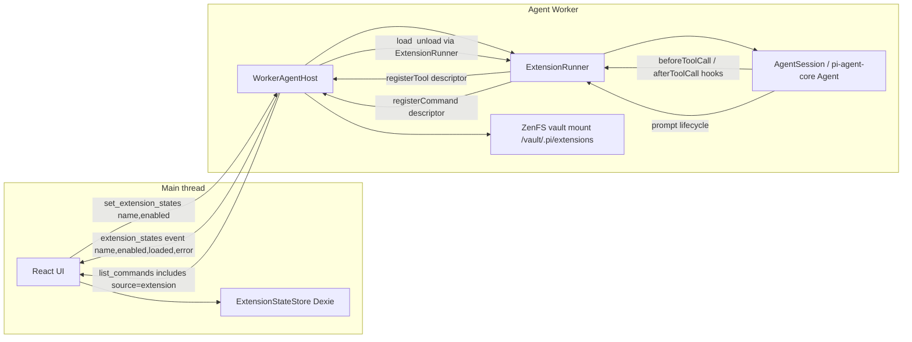

## Context

Prior ports (commands, prompt templates, skills) established the playbook: worker owns the domain state, main thread is the UI host, RPC carries plain data, closures never cross `postMessage`. M8 extensions adds one new wrinkle — it ships **user-authored code** into the worker. The answers from the spike open-questions confirm: trust model = first-party/vault-authored, execution location = inline in the agent Worker, v1 scope = minimum viable four hooks.

Why inline-in-worker over main-thread or iframe-sandbox:

- **Main-thread execution** would require every hook to be an RPC round-trip (`extension_hook_request` / `extension_hook_response`), adding per-turn latency and a state-sync problem (extension closures capture state that must be kept coherent with the worker's agent loop). MCP handles this only for tool calls — far rarer than `before_agent_start` / `tool_result`.
- **Iframe+Worker sandbox** (skills-style) would mean re-expressing the entire `ExtensionAPI` as capability messages. Huge scope and unnecessary when the host application already trusts the vault's contents.
- **Inline-in-worker** mirrors coding-agent's semantics most closely. Each hook is a plain async call inside the existing `AgentSession` lifecycle. The only cross-thread surface is discovery/toggle (main → worker) and descriptor propagation for tools/commands (worker → main for palette). This is the [`03-unbiased-approach.md`](ai-docs/extension-spike/03-unbiased-approach.md) recommendation applied to the web-agent worker.

Worker has no DOM but it has `import()` with Blob URLs (structured-clone-safe across HMR), same-origin `fetch`, `postMessage`, ZenFS over the mounted vault. That is sufficient for the four Phase 1 hooks.

## Architecture



Extension lifecycle (simplified): vault mount → worker `ExtensionRunner.discover()` walks `/vault/.pi/extensions/*` → main thread reconciles enabled-state map against discovered names in IndexedDB → sends `set_extension_states` → worker loads each enabled extension via Blob-URL `import()` → extensions register hooks/tools/commands → agent session's existing subscriptions dispatch to the runner.

## Phase 1 scope

**In scope (four hook genres, minimal surface):**

- `pi.on('before_agent_start', handler)` — can mutate `systemPrompt` for the next turn. Matches coding-agent's `BeforeAgentStartEventResult.systemPrompt` shape.
- `pi.on('tool_result', handler)` — can transform `content` / `details` / `isError` of a tool result.
- `pi.registerTool(toolDefinition)` — LLM-callable tool. Descriptor (name, description, parameters) is propagated to the main thread's tool-list UI alongside MCP descriptors; execute closure stays in the worker.
- `pi.registerCommand(name, { description, handler })` — slash command with `source: 'extension'`. Added to `SlashCommandSource` union. Invocation from main thread via existing `prompt` path triggers runner-side handler (not the LLM).

**Supporting infrastructure:**

- Discovery: `<vault>/.pi/extensions/<name>/index.js` single-file, or `<vault>/.pi/extensions/<name>/package.json` with `{"pi": {"extensions": [path]}}` manifest. No recursion beyond one level.
- Loader: read bytes via ZenFS → `new Blob([code], { type: 'text/javascript' })` → `URL.createObjectURL` → `import(/* @vite-ignore */ url)` → invoke `default` export factory with `ExtensionAPI`. Revoke URL after import. Worker has no module resolver for external imports — extensions get `pi.Type` (re-export of `@sinclair/typebox`'s `Type`) and `pi.defineTool` on the API so they don't need external imports. Document in fixture READMEs.
- Registry: new `ExtensionRegistry` inside `core/extensions/` tracks loaded extensions, their handlers, tools, commands. On top of the scaffolded types already at [`core/extensions/types.ts`](packages/web-agent/src/worker-agent/core/extensions/types.ts).
- Runner: `ExtensionRunner` dispatches `before_agent_start` / `tool_result`. Installed on `AgentSession` via the existing `subscribe` surface + the agent-core `afterToolCall` hook. Error per-extension is caught and surfaced as an `extension_error` RPC event; one extension's throw cannot take down the agent.
- Enable/disable: main-thread Dexie store (`extension_enabled` table: name → boolean). A global "disable all" button sets all entries to false (satisfies M8 gate's trip-switch requirement even with per-extension toggles). Changes are flushed at `agent_end` boundaries, never mid-stream — ports the spike's `pendingExtensionChanges` pattern.
- Error surface: `extension_error` event carries `{ extensionPath, event, error, stack? }`. Main thread renders it as a transient message (same treatment as compaction errors).

**Out of scope (Phase 2+, see [`ai-docs/extension-impl/phase-2-prompt.md`](ai-docs/extension-impl/phase-2-prompt.md)):**

- `context` hook (mutate messages before LLM call).
- `tool_call` pre-execution (block/mutate) — needs back-pressure into every tool invocation.
- `registerProvider` — reshapes `LlmProvider`.
- `registerMessageRenderer`, widgets, shortcuts, flags, editor components — main-thread UI surface.
- `resources_discover` (skills/prompts/themes) — would let extensions contribute skill paths; deferred until we revisit skill discovery sources.
- `session_*` hooks, compaction hooks, `model_select`, `user_bash`, `input` transforms.
- UI methods (`ctx.ui.notify`, `confirm`, `setStatus`, etc.) — deferred until we build an extension-UI RPC channel (parallel to MCP upcall).
- Iframe sandbox hardening / untrusted extensions / marketplace.
- TypeScript source loading (tsc-in-browser, esbuild-wasm). Phase 1 = JS only.

## File map

**New:**

- [`packages/web-agent/src/worker-agent/core/extensions/types.ts`](packages/web-agent/src/worker-agent/core/extensions/types.ts) — expand from scaffolding. Add `ExtensionAPI` (with the four v1 surface methods), `ExtensionFactory`, `ExtensionContext` (worker-scoped: `isIdle`, `abort`, `cwd`), event types (`BeforeAgentStartEvent`, `ToolResultEvent`), `ToolDefinition`, `RegisteredCommand`, `ExtensionError`, `Extension` (loaded record), `ExtensionDescriptor` (plain-data manifest for the palette).
- `packages/web-agent/src/worker-agent/core/extensions/loader.ts` — `loadExtensionsFromVault(ops, vaultMount)` and `loadExtensionFromSource(code, name)`. Discovery + Blob-URL import + factory invocation + per-extension error capture. Structurally mirrors coding-agent's [`loader.ts`](packages/coding-agent/src/core/extensions/loader.ts) but with the node bits (`fs`, `jiti`, `createRequire`) replaced by ZenFS + Blob URL.
- `packages/web-agent/src/worker-agent/core/extensions/runner.ts` — `ExtensionRunner` with `emit('before_agent_start')`, `emitToolResult(event)`, `getAllRegisteredTools()`, `getRegisteredCommands()`, `setEnabledState(map)`, `hasHandlers(eventType)`, `onError(listener)`. Models coding-agent's [`runner.ts`](packages/coding-agent/src/core/extensions/runner.ts) trimmed to the Phase 1 events. `pendingEnabledChanges` flushed at `agent_end`.
- `packages/web-agent/src/worker-agent/core/extensions/wrapper.ts` — `wrapRegisteredTool` / `wrapRegisteredTools` produce `AgentTool` instances whose `execute` runs the extension's closure under the runner's context. Same shape as MCP proxy tools but with the closure in-worker.
- `packages/web-agent/src/worker-agent/core/extensions/index.ts` — barrel.
- `packages/web-agent/src/worker-agent/core/extensions/*.test.ts` — vitest co-located tests.
- `packages/web-agent/src/extension-store/ExtensionStore.ts` — Dexie-backed enable-state store on the main thread. (`src/extension-store/` parallels `src/sandbox/` — non-worker code the worker-agent doesn't see.)
- `packages/web-agent/src/hooks/useExtensionState.ts` — React hook exposing `{ extensions, toggleExtension, disableAll }` and pushing `set_extension_states` RPC to the worker.
- `packages/web-agent/src/components/extensions/ExtensionsPanel.tsx` — list + toggle + global "Disable all" action. Wired into `ChatDemo.tsx` alongside `useSkillSandbox`.
- `packages/web-agent/e2e/data/sample-with-extensions/.pi/extensions/fancy-prompt/index.js` — port of [`pirate.ts`](packages/coding-agent/examples/extensions/pirate.ts) as plain JS single-file (prompt shaping + command). README documents the adaptation.
- `packages/web-agent/e2e/data/sample-with-extensions/.pi/extensions/hello-tool/index.js` — port of [`hello.ts`](packages/coding-agent/examples/extensions/hello.ts) using `pi.Type` / `pi.defineTool`.
- `packages/web-agent/e2e/data/sample-with-extensions/.pi/extensions/broken/index.js` — syntax error, for malformed-extension error-path assertion.
- `packages/web-agent/e2e/data/sample-with-extensions/.pi/extensions/thrower/index.js` — throws in `before_agent_start`, for hook-error-path assertion.
- `packages/web-agent/e2e/extensions.spec.ts` — templates from [`e2e/skills.spec.ts`](packages/web-agent/e2e/skills.spec.ts).
- `ai-docs/specs/worker-agent/extensions.md` — new spec file templated on [`ai-docs/specs/worker-agent/skills.md`](ai-docs/specs/worker-agent/skills.md).
- `ai-docs/extension-impl/phase-1-report.md` — what Phase 1 landed, known gaps, decisions.
- `ai-docs/extension-impl/phase-2-prompt.md` — handoff prompt for the next iteration covering the deferred hooks.
- `ai-docs/extension-impl/phase-3-prompt.md` — optional further scope (iframe sandbox for untrusted, marketplace, renderers, TS source loading).

**Modified:**

- [`packages/web-agent/src/worker-agent/worker/worker-host.ts`](packages/web-agent/src/worker-agent/worker/worker-host.ts) — add `extensionRunner: ExtensionRunner`, wire `loadExtensionsFromVault` after `loadSkillsFromVault` in `mountVault` / `mountDevSeed` / `reloadCommands`, wire `extensionRunner.clear()` in `unmountVault`. Add `setExtensionStates(states)` method. Install the `tool_result` dispatcher via `session.subscribe` (`message_end` with `role === 'toolResult'` → `emitToolResult`) and the `before_agent_start` dispatcher inside `prompt()` (after skill/template expansion, before `session.prompt`). In `refreshTools()`, merge `extensionRunner.getAllRegisteredTools()` after `vaultTools` and `mcpTools`. Emit `extension_states` event via `hostEventSink` whenever the load set changes. Wire `extensionRunner.onError` → `hostEventSink({ type: 'extension_error', ... })`.
- [`packages/web-agent/src/worker-agent/core/commands/types.ts`](packages/web-agent/src/worker-agent/core/commands/types.ts) — add `'extension'` to `SlashCommandSource`.
- [`packages/web-agent/src/worker-agent/core/commands/registry.ts`](packages/web-agent/src/worker-agent/core/commands/registry.ts) — accept `extensionCommands: RegisteredCommand[]` setter, include them in `list()`, expose `findExtensionCommand(name)`.
- [`packages/web-agent/src/worker-agent/core/agent-session.ts`](packages/web-agent/src/worker-agent/core/agent-session.ts) — add `beforeToolCall` / `afterToolCall` pass-through hooks via `Agent`'s existing API (if not already), exposed to `WorkerAgentHost` so `tool_result` emission has a place to live. Check whether we need a thin extension point here or if `subscribe` on `message_end`-of-toolResult-role is enough.
- [`packages/web-agent/src/worker-agent/rpc/rpc-types.ts`](packages/web-agent/src/worker-agent/rpc/rpc-types.ts) — add commands `set_extension_states`, `list_extensions`; add events `extension_states`, `extension_error`. Add `ExtensionDescriptor`, `ExtensionState`, `RpcExtensionStatesEvent`, `RpcExtensionErrorEvent`.
- [`packages/web-agent/src/worker-agent/rpc/rpc-server.ts`](packages/web-agent/src/worker-agent/rpc/rpc-server.ts) — dispatch new commands.
- [`packages/web-agent/src/worker-agent/rpc/rpc-client.ts`](packages/web-agent/src/worker-agent/rpc/rpc-client.ts) — new client methods + event subscription surface for `onExtensionStates` / `onExtensionError`.
- [`packages/web-agent/src/hooks/useAgent.ts`](packages/web-agent/src/hooks/useAgent.ts) — subscribe to `extension_states` / `extension_error` events; expose them for `ExtensionsPanel.tsx` + transient-message rendering.
- [`packages/web-agent/src/ChatDemo.tsx`](packages/web-agent/src/ChatDemo.tsx) — mount `<ExtensionsPanel>` + wire `useExtensionState` alongside `useSkillSandbox`.
- [`ai-docs/specs/worker-agent/index.md`](ai-docs/specs/worker-agent/index.md) — add extensions row to the navigation table; update "Scope in" item about extension scaffolding.
- [`ai-docs/specs/coding-vs-web-agent/feature-gaps.md`](ai-docs/specs/coding-vs-web-agent/feature-gaps.md) — flip the "Extension runtime" row from "types only" to "Phase 1 runtime" + link to `extensions.md`.
- [`ai-docs/specs/coding-vs-web-agent/alignment.md`](ai-docs/specs/coding-vs-web-agent/alignment.md) / [`divergence.md`](ai-docs/specs/coding-vs-web-agent/divergence.md) / [`guidance.md`](ai-docs/specs/coding-vs-web-agent/guidance.md) — record inline-worker execution choice, Blob-URL loader, hook subset, and how this port diverges from coding-agent's jiti-based main-process loader.
- [`ai-docs/milestones/m8-extensions.md`](ai-docs/milestones/m8-extensions.md) — status flips from "spike complete, deferred" to "Phase 1 in progress / landed", with explicit Phase 2 pointer.
- [`ai-docs/milestones/index.md`](ai-docs/milestones/index.md) — update M8 status row.

## RPC additions

```ts
// commands (main → worker)
| { id; type: 'list_extensions' }
| { id; type: 'set_extension_states'; states: Record<string, boolean> }

// responses
| { id; type: 'response'; command: 'list_extensions'; success: true; data: ExtensionDescriptor[] }
| { id; type: 'response'; command: 'set_extension_states'; success: true; data: ExtensionDescriptor[] }

// unsolicited events (worker → main)
| { type: 'extension_states'; extensions: ExtensionDescriptor[] }
| { type: 'extension_error'; extensionPath: string; event: string; error: string; stack?: string }
```

`ExtensionDescriptor` = `{ name, description?, version?, enabled, loaded, error? }` — all plain data. Tools and commands contributed by an extension are merged into the existing `list_commands` + the main-thread tool list (same path MCP descriptors already use), not duplicated in the extension envelope.

## Unit test coverage (vitest, co-located)

- `loader.test.ts` — single-file discovery, manifest discovery, Blob-URL import, factory invocation, malformed JS → error captured, missing default export → error captured, extension with `pi.registerTool` + `pi.on` populates the `Extension` record.
- `runner.test.ts` — `emit('before_agent_start')` chains across multiple extensions; `emitToolResult` threads modifications; per-extension throw is caught and `onError` fires; disabled extensions are skipped; pending state changes applied at flush.
- `wrapper.test.ts` — `wrapRegisteredTool` invokes the extension's closure with the runner's context.
- `core/commands/registry.test.ts` (update) — extension commands surface with `source: 'extension'`, collision behaviour with builtin/prompt/skill, `findExtensionCommand`.
- `worker-host.test.ts` (update) — mount/reload/unmount lifecycle loads + clears extensions; `set_extension_states` toggles at turn boundaries; `extension_states` event emits.

## e2e coverage (Playwright, `extensions.spec.ts`)

Single long test, structured like [`skills.spec.ts`](packages/web-agent/e2e/skills.spec.ts), covering:

1. Install `sample-with-extensions` vault fixture, authenticate, select model.
2. **Palette**: `/fan` surfaces `/fancy-prompt` with `data-command-source="extension"`.
3. **Prompt shaping (before_agent_start)**: run `/fancy-prompt` command to flip toggle; send message; assert response includes the fancy marker; toggle off; assert normal response.
4. **Tool registration (registerTool)**: ask model to call `hello`; assert `data-testid="tool-call-hello"` visible; assistant text contains the greeting.
5. **Per-extension toggle UI**: open `ExtensionsPanel`; disable `hello-tool`; verify tool no longer in descriptor list (server side observable via palette or tool renderer absence); re-enable.
6. **Global disable all**: click "Disable all extensions"; all toggles flip off; prompt-shaping no longer fires; tools removed.
7. **Error path — malformed extension**: `broken/index.js` has syntax error; assert transient error surfaces once on mount, agent still works for other extensions.
8. **Error path — throwing hook**: enable `thrower`; send message; assert extension_error transient; assistant still replies (hook error isolated).

## Deliverables

1. Plan file (this file).
2. Phase 1 code under [`packages/web-agent/src/worker-agent/core/extensions/`](packages/web-agent/src/worker-agent/core/extensions/) + RPC wiring + main-thread glue.
3. Fixtures under [`packages/web-agent/e2e/data/sample-with-extensions/`](packages/web-agent/e2e/data/sample-with-extensions/).
4. e2e spec `extensions.spec.ts` + unit tests co-located.
5. Spec `ai-docs/specs/worker-agent/extensions.md`.
6. Spec cross-link updates (index, feature-gaps, alignment, divergence, guidance, milestones/m8-extensions, milestones/index).
7. `ai-docs/extension-impl/phase-1-report.md` + `phase-2-prompt.md` + `phase-3-prompt.md`.
8. `npm run check` green at repo root; `npx vitest run` green in `packages/web-agent/`; Playwright `extensions.spec.ts` green.

## Guardrails

- No `packages/coding-agent` imports (hard rule, enforced at review by grep).
- No functions across `postMessage` — only descriptors and ids flow over RPC.
- Every extension failure surfaces as a transient message or UI-visible error.
- Mount/unmount/reload rebuild the extension set cleanly — no leaked Blob URLs, no orphan handlers.
- RPC shape is forward-compatible: deferred hooks land as new command/event variants, not as modifications to Phase 1 shapes.