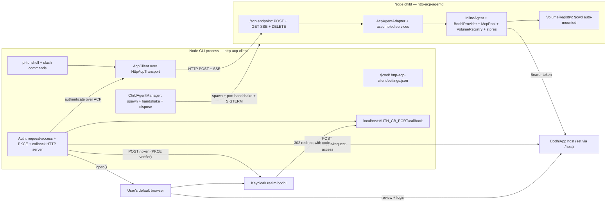

# HTTP ACP Client + Agent (`packages/http-acp-client/` + `packages/http-acp-agent/`)

## 1. Goals and non-goals

**Goal.** Prove `@bodhiapp/web-acp-agent` works cleanly over a real network transport, not just the in-memory duplex [packages/cli-acp-client/src/acp/duplex.ts](packages/cli-acp-client/src/acp/duplex.ts) uses. The CLI process no longer hosts the agent; it spawns a Node child (`http-acp-agentd`), negotiates a port, and issues ACP JSON-RPC over HTTP POST with SSE streaming for agent-initiated messages, following the ACP draft RFD [Streamable HTTP & WebSocket Transport](/Users/amir36/Documents/workspace/src/github.com/agentclientprotocol/agent-client-protocol/docs/rfds/streamable-http-websocket-transport.mdx).

UX target: identical to [packages/cli-acp-client/](packages/cli-acp-client/) — same slash commands, same pi-tui shell, same OAuth flow, same `$cwd` auto-mount, same `$cwd/.http-acp-client/settings.json` layout. A user swapping `cli-acp` for `http-acp` should not feel the difference apart from a longer boot due to child spawn.

**Non-goals (v0).**
- **No WebSocket profile** — the RFD says clients MUST support both, but for v0 we ship only Streamable HTTP (POST + SSE GET + DELETE). WebSocket is a follow-up.
- **No remote agent.** The child is always spawned on localhost by the CLI. No `--attach <url>` escape hatch in v0.
- **No cross-user isolation on the loopback port.** A per-launch shared bearer token (see §4) is the only local guard.
- **No multi-session per connection.** Agent adapter is single-session today; the transport supports multi-session but we don't exercise it.
- **No fake/stub BodhiApp or Keycloak** — same posture as `cli-acp-client`: real `@bodhiapp/app-bindings` BodhiServer for e2e.
- **Not batch JSON-RPC.** The RFD explicitly returns 501 for batch; we match that.
- **No resumability (`Last-Event-ID`).** Out of scope.

## 2. Architecture (three-process, localhost HTTP)



Two orthogonal HTTP listeners live on the CLI host: the ephemeral OAuth callback at `localhost:AUTH_CB_PORT` (unchanged from `cli-acp-client`), and the child agent's ACP endpoint at `localhost:AGENT_PORT/acp`. They are unrelated.

## 3. Startup behavior and child-process lifecycle

Boot sequence (mirrors `cli-acp-client` §3 with a child-spawn step inserted before the embedded-host step):

1. Read `$cwd/.http-acp-client/settings.json` if present.
2. Generate a random 32-byte `HTTP_ACP_LOCAL_TOKEN` (base64url) — the loopback guard.
3. `ChildAgentManager.spawn()`:
   - `node dist/agentd.js` from `@bodhiapp/http-acp-agent`, stdio `[ignore, pipe, pipe]`.
   - Pass config via env: `HTTP_ACP_PORT=0` (ask for ephemeral), `HTTP_ACP_LOCAL_TOKEN=<token>`, `HTTP_ACP_CWD=<cwd>`.
   - Wait for a single JSON line on stdout: `{"ready": true, "port": N, "pid": P}`. This is the port handshake. Stderr is tee'd to a log file under `$cwd/.http-acp-client/logs/agentd-<pid>.log` so the CLI stdout stays clean.
   - On handshake timeout (10s), kill the child and render `disconnected` with a readable error.
4. Construct `HttpAcpTransport` targeting `http://127.0.0.1:N/acp` with `Authorization: Bearer <HTTP_ACP_LOCAL_TOKEN>`. Open `POST /acp` with `initialize` — server returns `Acp-Connection-Id`. Open a `GET /acp` SSE listener for server-to-client notifications once the first `session/new` lands (§4).
5. Auto-mount `$cwd` as the volume `cwd` inside the child's `ZenfsVolumeRegistry`. The mount happens inside the child's `assembleNodeServices()`, not the CLI — `HTTP_ACP_CWD` env is the only thing the CLI tells the child about the user's directory.
6. Render the TUI shell. If `settings.host` exists, attempt token refresh + `client.authenticate(...)` over the HTTP transport. Status lifecycle matches `cli-acp-client`.
7. User runs `/host <url>` → same flow as `cli-acp-client`.

Shutdown: `/quit` sends `DELETE /acp` with `Acp-Connection-Id`, waits up to 1s for a clean 202, then `SIGTERM` the child, then `SIGKILL` after another 2s. `process.on("exit")` + `SIGINT`/`SIGTERM` handlers ensure the child is always killed on CLI crash.

If the child dies unexpectedly (EOF on the SSE listener or on any POST), the CLI renders `disconnected` with reason `agent process exited`, prints the last 20 lines of the child's stderr log, and offers `/restart` (manual respawn). No auto-restart in v0 — we want failures to be loud.

## 4. ACP Streamable HTTP transport

### 4.1 What the TS SDK gives us

`@agentclientprotocol/sdk` exposes `AgentSideConnection`, `ClientSideConnection`, and `ndJsonStream` ([node_modules/@agentclientprotocol/sdk/dist/stream.d.ts](node_modules/@agentclientprotocol/sdk/dist/stream.d.ts)). `Stream` is `{writable: WritableStream<AnyMessage>, readable: ReadableStream<AnyMessage>}`. The SDK does **not** ship HTTP. Our job is to produce a `Stream` whose bytes flow over HTTP and SSE, without changing the SDK.

### 4.2 Server-side (`http-acp-agent`)

Single `/acp` endpoint on a Node `http.Server`. Implements the RFD's Streamable HTTP subset:

- **`POST /acp`** (JSON-RPC request, notification, or response from client)
  - `Content-Type: application/json` required (415 otherwise).
  - `Accept` must include both `application/json` and `text/event-stream` (406 otherwise).
  - First POST (no `Acp-Connection-Id`) must carry an `initialize` request — create a new `Connection` + agent adapter pair, generate `Acp-Connection-Id`, respond via SSE (single event = the `initialize` result).
  - Subsequent POSTs require `Acp-Connection-Id` (404 on unknown).
  - JSON-RPC **requests** get an SSE response that holds open until the request resolves, interleaved with server-side `sessionUpdate` notifications scoped to that session. When the response is written, the stream closes.
  - JSON-RPC **notifications** (client→server) and **responses** (to server→client requests like `requestPermission`) return `202 Accepted` with empty body.
- **`GET /acp`** (session-scoped SSE listener for server-initiated messages)
  - Requires both `Acp-Connection-Id` and `Acp-Session-Id` (400 otherwise per RFD).
  - Opens an SSE stream that only delivers events tagged with that `sessionId`.
- **`DELETE /acp`** — tear down connection and its adapter, close all SSE listeners, `adapter.dispose()`.
- **Batch / resumability** — respond `501 Not Implemented` (per RFD's documented deviation).

Implementation: the `Connection` object bridges ACP's `Stream` to HTTP. Outbound (agent→client) `AnyMessage`s are tagged with session id (derived from the JSON-RPC `params.sessionId` or the method convention), then fanned out to the right SSE listener. Inbound POST bodies are pushed into the `ReadableStream<AnyMessage>` that `AgentSideConnection` consumes. No MessagePort, no duplex pair — just one `TransformStream<AnyMessage>` wired to the HTTP handlers.

File layout (new package `packages/http-acp-agent/`):

```
packages/http-acp-agent/
├── package.json              # bin: "http-acp-agentd" -> dist/agentd.js
├── tsconfig.json
├── README.md
├── src/
│   ├── index.ts              # library exports: startHttpAcpServer(...)
│   ├── agentd.ts             # bin entry: read env, assembleNodeServices, start server, print {ready,port,pid}
│   ├── server/
│   │   ├── http-acp-server.ts  # http.Server wiring POST/GET/DELETE
│   │   ├── connection.ts       # per-connection state (id, adapter, sse listeners, outbound router)
│   │   ├── sse.ts              # SSE writer + heartbeat (15s ping to keep proxies happy)
│   │   ├── router.ts           # outbound AnyMessage -> (connection, session) -> SSE target
│   │   └── auth-guard.ts       # Authorization: Bearer check, constant-time compare
│   ├── services/
│   │   ├── assemble.ts         # assembleNodeServices (LIFTED from cli-acp-client — see §6)
│   │   ├── cwd-volume.ts
│   │   └── stores.ts
│   └── types.ts              # HttpAcpServerOptions, ReadyMessage, etc.
└── test/
    ├── http-acp-server.test.ts  # unit: POST initialize -> SSE -> 200 result
    ├── session-scope.test.ts    # two sessions, each SSE stream gets only its own updates
    └── teardown.test.ts         # DELETE, child-exit cleanup
```

### 4.3 Client-side (`http-acp-client`)

Produces a `Stream` that satisfies `ClientSideConnection`'s contract by posting to the server and consuming the combined POST-response SSE + GET-listener SSE.

```
packages/http-acp-client/src/acp/
├── client.ts                # UNCHANGED clone of packages/cli-acp-client/src/acp/client.ts
├── http-transport.ts        # the new part: createHttpAcpTransport(opts) -> {stream, dispose}
├── sse-reader.ts            # SSE frame parser (we bring our own; eventsource-parser is a 2kB dep option)
└── http-host.ts             # mirrors embedded-host.ts — spawns child via ChildAgentManager, returns AcpClient
```

`http-transport.ts`:
- Maintains ONE outbound queue. Each JSON-RPC request is POSTed; the SSE body of that POST is multiplexed back into the shared `ReadableStream<AnyMessage>` the SDK consumes.
- Notifications and responses are POSTed with `Accept: application/json` and a 202 is treated as success (no SSE body).
- A single `GET /acp` listener is opened per session (on `session/new` response), matching the RFD's session-scoped GET stream model. The CLI currently uses one session at a time so this stays simple.
- Cookie jar (tough-cookie or a hand-rolled 20-line one) — RFD requires clients to handle cookies. On localhost there are none in practice, but we implement it so the transport stays spec-ish.
- On transport error (ECONNRESET, 404 on unknown connection id, child crash), the stream is errored, which cascades to `AcpClient.closed` rejecting, which the shell surfaces as `disconnected`.

`http-host.ts` replaces [packages/cli-acp-client/src/acp/embedded-host.ts](packages/cli-acp-client/src/acp/embedded-host.ts):
- Spawns `http-acp-agentd` via `ChildAgentManager`.
- Builds `HttpAcpTransport` pointed at the child, constructs `ClientSideConnection`, wraps in `AcpClient`.
- `dispose()` = `client.cancel()` pending, `DELETE /acp`, `child.kill()`.

### 4.4 Loopback auth guard

The RFD is silent on local auth because that's the deployment's problem. On a single-user laptop the loopback interface is still shared with every process in the user's session, so a naive `127.0.0.1:N/acp` would let any local script drive the agent and exfiltrate the BodhiApp token.

Mitigation: the CLI generates a 32-byte random token at launch, passes it to the child via `HTTP_ACP_LOCAL_TOKEN` env var, and every CLI request carries `Authorization: Bearer <token>`. The child rejects requests without it with `401 Unauthorized`. Compare constant-time. The token never hits disk. Callback browser has no reason to reach the ACP endpoint so no CORS holes.

## 5. OAuth + access-request flow

**Unchanged** from `cli-acp-client` §4. [packages/cli-acp-client/src/auth/](packages/cli-acp-client/src/auth/) is lifted wholesale: `pkce.ts`, `access-request.ts`, `callback-server.ts`, `browser-opener.ts`, `token-exchange.ts`, `login-flow.ts`, `config.ts`. Scopes remain `openid email profile scope_user_user access_request:<request_id>`. `APP_CLIENT_ID` stays hardcoded at [src/auth/config.ts](packages/http-acp-client/src/auth/config.ts).

The only interaction with the transport change: the final step of the login flow is `client.authenticate({ token, baseUrl })`, which now travels as a `POST /acp` → SSE to the child, which calls `AcpAgentAdapter.authenticate(...)` which hands the Bearer to `BodhiProvider` inside the child process. The token never leaves the CLI→child boundary except when the child itself calls out to BodhiApp with it.

## 6. Code reuse strategy

No shared package refactor in v0 (per your answer). Instead, we copy-and-adapt from `cli-acp-client`:

| Module | Source | Fate |
|---|---|---|
| `src/auth/**` | `packages/cli-acp-client/src/auth/*` | Verbatim copy. Zero changes. Future: extract to `@bodhiapp/cli-acp-auth`. |
| `src/settings/**` | `packages/cli-acp-client/src/settings/*` | Verbatim copy; change directory name to `.http-acp-client`. |
| `src/shell/**` | `packages/cli-acp-client/src/shell/*` | Verbatim copy. `AppContext.host` type is now `HttpAgentHost` not `EmbeddedHost` but its surface (`{ client, provider, dispose }`) is identical. |
| `src/tui/**` | `packages/cli-acp-client/src/tui/*` | Verbatim copy. |
| `src/commands/**` | `packages/cli-acp-client/src/commands/*` | Verbatim copy. |
| `src/acp/client.ts` | `packages/cli-acp-client/src/acp/client.ts` | Verbatim copy. |
| `src/acp/embedded-host.ts` | n/a | Replaced by `src/acp/http-host.ts`. |
| `src/acp/duplex.ts` | n/a | Deleted. Replaced by `src/acp/http-transport.ts`. |
| `services/assemble.ts`, `services/cwd-volume.ts`, `services/stores.ts` | `packages/cli-acp-client/src/services/*` | Moved to `packages/http-acp-agent/src/services/` — the child owns them now. |

Follow-up issue after both CLIs are green: extract `packages/cli-acp-core/` with the shared auth/settings/shell/TUI/commands, then convert both `cli-acp-client` and `http-acp-client` into thin shells. Out of scope here to avoid doing a refactor and a new feature in the same PR.

## 7. Package layout

`packages/http-acp-agent/` — see §4.2.

`packages/http-acp-client/`:

```
packages/http-acp-client/
├── package.json              # bin: "http-acp" -> dist/cli.js; depends on @bodhiapp/http-acp-agent (for spawning)
├── tsconfig.json
├── README.md
├── src/
│   ├── cli.ts                # lifted from cli-acp-client, swaps createEmbeddedHost -> createHttpHost
│   ├── bootstrap.ts          # lifted, one-line change in host construction
│   ├── shell/                # lifted verbatim
│   ├── tui/                  # lifted verbatim
│   ├── acp/
│   │   ├── client.ts         # lifted verbatim
│   │   ├── http-transport.ts # NEW
│   │   ├── sse-reader.ts     # NEW
│   │   └── http-host.ts      # NEW (replaces embedded-host.ts)
│   ├── child/
│   │   ├── manager.ts        # ChildAgentManager: spawn, handshake, kill, tee stderr
│   │   └── ready-handshake.ts# parse {"ready":true,"port":N,"pid":P} from stdout
│   ├── auth/                 # lifted verbatim
│   ├── settings/             # lifted verbatim; directory name -> ".http-acp-client"
│   └── commands/             # lifted verbatim
│       └── restart.ts        # NEW — /restart spawns a fresh child after a crash
└── e2e/
    ├── tests/
    │   ├── global-setup.ts   # lifted from cli-acp-client (pending); same BodhiApp NAPI + admin model registration
    │   ├── pages/             # lifted from web-acp/e2e + cli-acp-client/e2e
    │   ├── harness/cli-driver.ts  # node-pty + xterm/headless for the CLI — reused
    │   ├── harness/agent-log.ts   # NEW — tails the child agentd log for assertions
    │   └── helpers/               # lifted
    ├── playwright.config.ts
    ├── .env.test.example
    └── *.spec.ts             # see §9
```

## 8. Slash commands (v0)

| Command | Behavior (HTTP-specific notes) |
|---|---|
| `/host <url>` | Same as cli-acp-client. Triggers `/login`. Settings write → `$cwd/.http-acp-client/settings.json`. |
| `/login` / `/logout` | Same PKCE flow; authenticate call travels over HTTP transport. |
| `/models` / `/model <id>` | Same ext-method calls, now served over HTTP. |
| `/mcp list/add/remove` | Same. On `add`, logout + login with updated `requestedMcps`. |
| `/session new/list/load/delete` | Same ACP methods. A `session/new` response triggers the CLI to open a session-scoped `GET /acp` SSE listener. |
| `/help` / `/quit` | Same. `/quit` runs `DELETE /acp` + SIGTERM to the child. |
| **`/restart`** (new) | Dispose current `HttpAgentHost`, re-spawn `http-acp-agentd`, re-run token-refresh flow if applicable. Useful when the child crashes and when bumping `$cwd`. |

Plain text input → `prompt` over HTTP → SSE streams notifications until `{id, result}` closes the stream.

## 9. E2E testing

Same philosophy as `cli-acp-client` §8: real `@bodhiapp/app-bindings` BodhiServer, real Keycloak, real Playwright chromium for `/access-requests/review`. No fakes. The new dimension is verifying the HTTP transport end-to-end.

`packages/http-acp-client/e2e/tests/global-setup.ts` is a near-copy of [packages/web-acp/e2e/tests/global-setup.ts](packages/web-acp/e2e/tests/global-setup.ts) — reuses `BodhiServerManager`, `LoginPage`, `AuthPage`, `ApiModelsPage`. `.env.test` contract unchanged. Binary fixture lives at `packages/http-acp-client/e2e/bin/<arch>/<os>/<variant>/` (same layout the other two packages use).

Each spec:
1. Spawn CLI under `node-pty` with `cwd` in a tmpdir. CLI spawns `http-acp-agentd` as a child. Tests assert the child is live by reading the agent log path printed to stderr.
2. Send `/host <bodhiServerUrl>` over stdin.
3. Side-channel JSON event log (same pattern planned for `cli-acp-client`) emits the authorize URL — tests never scrape the TUI.
4. Playwright chromium drives the authorize URL through `/ui/login` + Keycloak + `/access-requests/review`, lands back on the CLI's auth callback server.
5. Assert CLI status → `authenticated`. `/models` lists seeded models. `/prompt` round-trips streamed assistant text over the HTTP transport.

Specs (initial):
- `transport.spec.ts` (new vs cli-acp-client) — `/host`, `/login`, assert the child agent process is running (via pid), assert POST `/acp` returns SSE, assert `DELETE /acp` on `/quit`.
- `auth.spec.ts` — happy path + `/logout` + re-`/login`.
- `models.spec.ts` — `/models`, `/model <id>`, prompt round-trip.
- `mcp.spec.ts` — `/mcp add` → re-auth → tool call (the SSE of the prompt carries tool-call notifications; assert one is rendered).
- `session.spec.ts` — `/session new`, prompt, `/session list`, `/quit`, restart CLI, `/session load`, history replays (replay notifications arrive as SSE events on the session-scoped GET stream).
- `crash.spec.ts` (new) — kill the child mid-prompt; assert CLI renders `disconnected` with agent-exit reason and that `/restart` produces a working session without re-auth (since tokens are in settings, not in the child).

Unit tests (`vitest run`):
- `http-acp-agent/test/http-acp-server.test.ts` — initialize handshake, SSE correctness, 415/406/404/501 negatives.
- `http-acp-agent/test/session-scope.test.ts` — two sessions on one connection, each GET stream sees only its own notifications.
- `http-acp-client/test/http-transport.test.ts` — transport speaks to a minimal in-process server; full `initialize → session/new → prompt → sessionUpdate → result` round-trip.
- `http-acp-client/test/child-manager.test.ts` — spawn handshake, timeout, SIGTERM path, stderr tee.
- `http-acp-client/test/sse-reader.test.ts` — framing edge cases (chunked events, `\r\n\r\n` vs `\n\n`, comments).

## 10. Risks and known dirty spots

- **We're implementing a draft RFD, not a stable spec.** The Streamable HTTP profile is Phase 1 in the RFD ("in discussion"). We pin to the 2026-04-15 revision and write the URL into `http-acp-agent/README.md`. If the RFD shifts, we update.
- **SDK doesn't ship HTTP.** We wrap `ClientSideConnection` and `AgentSideConnection` manually. If the upstream SDK later ships an HTTP transport helper, we replace ours — this is expected follow-up work, not a risk to v0.
- **Long-lived SSE + Node HTTP server defaults.** Node's default `server.headersTimeout` and `server.requestTimeout` will kill idle SSE. We set both to 0 (unlimited) on the agent server and send a 15s SSE comment ping to keep proxies happy. E2E must verify the listener survives a >30s idle.
- **Response body backpressure.** `POST /acp` for a long prompt holds the response open while streaming SSE; the Node client must read continuously. `undici` fetch (Node's default) handles this, but `node-fetch` does not. Use the built-in `fetch`; add a test that pipes through `TransformStream` to confirm no buffering stalls.
- **Child stderr noise.** `BodhiProvider` + `pi-ai` occasionally log. Tee stderr to a file per-pid; the CLI shows a path, not the noise. On `/quit` with an abnormal exit, dump the last 20 lines.
- **Port collisions.** Always request port 0 (ephemeral). Never hardcode. Never accept a user-supplied port in v0.
- **Cross-user localhost risk.** Mitigated by the loopback bearer guard (§4.4), not perfect. Document in README.
- **Multiple CLIs, one child each.** Each CLI spawns its own child agent with its own port and token. No shared daemon. Users opening two CLIs in two terminals is fine.
- **Windows path semantics in `$cwd` passed as env var.** The child runs its own `assembleNodeServices({ cwd })` with the env-provided path; `ZenfsVolumeRegistry` already tolerates Windows paths in the browser worker, verify on Node Windows during e2e if CI runs it.
- **`@bodhiapp/web-acp-agent` Node compatibility.** Same caveats as the `cli-acp-client` plan §9 — bash tool is off by default, ZenFS backend needs a Node real-fs adapter. Since the child owns `assembleServices`, this debt lives in `http-acp-agent`, not the CLI.
- **Process leak.** If the CLI is `kill -9`'d, the child becomes an orphan. v0 accepts this and documents it; a future `setsid` + process-group strategy is worth a follow-up. On Unix we can open the child with `detached: false` and a `setpgid` trick, but that's hardening.

## 11. Touched files outside the new packages

- [package.json](package.json) `workspaces` already covers `packages/*`; add `http-acp-agent` and `http-acp-client` to the `build` pipeline after `tui`, with `http-acp-agent` strictly before `http-acp-client`.
- `npm run check` script: append `&& cd ../http-acp-agent && npm run check && cd ../http-acp-client && npm run check`.
- Optional `pi-http-acp-test.sh` at repo root, mirroring `pi-test.sh` for quick launches.

## 12. Relationship to `cli-acp-client`

Running side-by-side. `cli-acp-client` remains the "embedded" proof point; `http-acp-client` is the "transport-separated" proof point. Both depend on `@bodhiapp/web-acp-agent` and drive the same `AcpAgentAdapter`. The ambition is that after both are green, a future cleanup lands `cli-acp-core` extracting the shared shell/TUI/auth/settings/commands, and both CLIs shrink to `<200` lines of transport wiring each. That cleanup is a separate plan.
