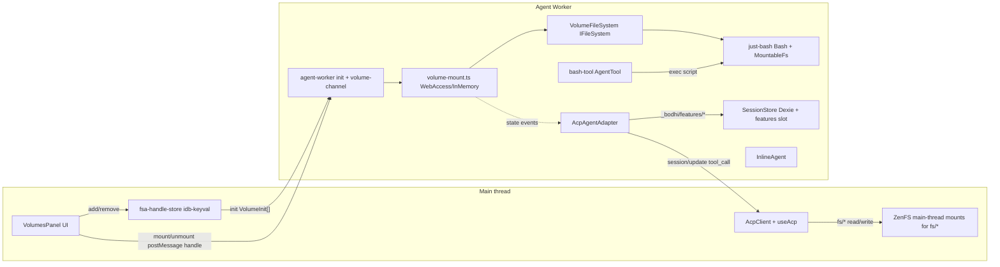

## High-level architecture



Two data channels between main thread and worker:

- **ACP wire** (existing `MessageChannel` + ndJson) for prompts, tool-call updates, feature toggles, session ops.
- **Worker control channel** (raw `worker.postMessage`) for init-time `VolumeInit[]` plus runtime `volumes/mount` / `volumes/unmount` messages carrying structured-cloned `FileSystemDirectoryHandle`s that JSON-RPC can't transport. The worker echoes state changes over the ACP wire via a new `session/update`-style `_bodhi/volumes/changed` notification so the UI `data-test-state` drives off observable ACP traffic.

---

## Phase A — M2.1 multi-volume mount (worker-side)

### Deps to add (commit with phase A)

- `@zenfs/core`, `@zenfs/dom`, `idb-keyval` in [`packages/web-acp/package.json`](packages/web-acp/package.json).

### New files

- **`packages/web-acp/src/vault/fsa-handle-store.ts`** — main-thread persistence of
  `VolumeHandleRecord[] = { handle: FileSystemDirectoryHandle; mountName: string; description?: string }`
  under `idb-keyval` key `web-acp:volumes`. Re-derived from
  [`packages/web-agent/src/hooks/useDirectoryHandle.ts`](packages/web-agent/src/hooks/useDirectoryHandle.ts):
  ```ts
  export async function loadHandles(): Promise<VolumeHandleRecord[]>;
  export async function saveHandles(records: VolumeHandleRecord[]): Promise<void>;
  export async function requestPermissions(records: VolumeHandleRecord[]): Promise<{
    ready: VolumeHandleRecord[];
    prompt: VolumeHandleRecord[];
  }>;
  export function deriveUniqueMountName(baseName: string, existing: string[]): string;
  ```
  Collision suffix: `wiki`, `wiki-1`, `wiki-2` — re-use `wiki` when no live mount holds it (re-add policy confirmed in prompt open-question #2 recommendation).
- **`packages/web-acp/src/hooks/useVolumes.ts`** — React hook wrapping `fsa-handle-store`. Exposes:
  ```ts
  type VolumeState = 'idle' | 'mounting' | 'mounted' | 'error';
  interface VolumeEntry { mountName: string; description?: string; state: VolumeState; errorMessage?: string; }
  useVolumes(): {
    entries: VolumeEntry[];
    addVolume: (description?: string) => Promise<void>;   // triggers showDirectoryPicker
    removeVolume: (mountName: string) => Promise<void>;
    setDescription: (mountName: string, description: string) => Promise<void>;
    restoreAccess: (mountName: string) => Promise<void>;
  };
  ```
  Transitions: `idle` → `mounting` on FSA picker → `mounted` after worker confirms (see control channel below) → `error` on permission denial or worker mount failure.
- **`packages/web-acp/src/components/volumes/VolumesPanel.tsx`** + `VolumeRow.tsx` — renders list + "add volume" button + per-row delete.
  `data-testid="volumes-panel"` with `data-teststate="<volume-count>"` (gate-able via `[data-testid="volumes-panel"][data-teststate="2"]`). Each row:
  `data-testid="volume-row-<mountName>"` with `data-teststate="<state>"`.
  Add button: `data-testid="btn-add-volume"`.
  Description input: `data-testid="input-volume-description-<mountName>"`.
- **`packages/web-acp/src/agent/volume-mount.ts`** (worker) — maps `VolumeInit[]` to ZenFS mounts:
  ```ts
  import { configure, fs, vfs } from '@zenfs/core';
  import { WebAccess } from '@zenfs/dom';
  import { InMemory } from '@zenfs/core';

  export interface VolumeInit {
    handle?: FileSystemDirectoryHandle;  // real path
    seed?: VolumeSeed;                   // dev/test path
    mountName: string;
    description?: string;
  }
  export interface VolumeSeed { name: string; description?: string; files: Record<string, string>; }

  export class VolumeRegistry {
    async mountAll(initial: VolumeInit[]): Promise<void>;
    async mount(init: VolumeInit): Promise<void>;
    async unmount(mountName: string): Promise<void>;
    list(): Array<{ mountName: string; description?: string }>;
    firstMountName(): string | undefined;
    // Notifies listeners after every state transition so the adapter
    // can forward them as _bodhi/volumes/changed ACP notifications.
    onChange(cb: (snapshot: VolumeRegistry['list']) => void): () => void;
  }
  ```
  `mount()` calls `WebAccess.create({ handle })` for FSA volumes and `InMemory.create(...)` for seeds (pre-populating file contents per `VolumeSeed.files`); `vfs.mount('/mnt/<name>', backend)`. `unmount()` does `vfs.umount`.
- **`packages/web-acp/src/agent/volume-channel.ts`** (worker) — raw postMessage protocol on the worker global scope (not ACP wire). Messages:
  - `{ type: 'volume/mount', init: VolumeInit }` → returns `{ ok: true }` or `{ ok: false, error: string }` via `{ type: 'volume/mounted', mountName, ok, error? }` reply.
  - `{ type: 'volume/unmount', mountName }` → `{ type: 'volume/unmounted', mountName, ok, error? }`.
  Message IDs let the main thread correlate responses. Separate from the ACP agent port so structured-clone handle transfer works.
- **`packages/web-acp/src/transport/volume-control.ts`** (main) — main-thread side of the same protocol, wraps a single `Worker` instance's postMessage with transfer lists. Exposes:
  ```ts
  export function createVolumeControl(worker: Worker): {
    mount(init: VolumeInit): Promise<void>;
    unmount(mountName: string): Promise<void>;
    onMountedChange(cb: (list: Array<{ mountName: string }>) => void): () => void;
  };
  ```
- **`packages/web-acp/src/agent/system-prompt.ts`** (worker) — pure function that composes:
  ```ts
  export function composeSystemPrompt(volumes: Array<{ mountName: string; description?: string }>): string;
  ```
  Emits `You have access to the following volumes:\n- /mnt/wiki — Personal notes\n- /mnt/code\nUse the bash tool to explore them.` when volumes exist; empty string otherwise.
- **`packages/web-acp/e2e/helpers/install-volumes.ts`** — ports [`packages/web-agent/e2e/helpers/install-vault.ts`](packages/web-agent/e2e/helpers/install-vault.ts) for multi-volume.
  ```ts
  export interface VolumeSeedSpec { name: string; description?: string; dataDir?: string; files?: Record<string,string>; }
  export async function installVolumes(page: Page, seeds: VolumeSeedSpec[]): Promise<void>;
  ```
  Walks Node-side `e2e/data/<dataDir>/` when `files` omitted; builds `window.__zenfsSeed: VolumeSeed[]` via `page.addInitScript`.

### Edits

- **[`packages/web-acp/src/agent/agent-worker.ts`](packages/web-acp/src/agent/agent-worker.ts)** — init payload shape changes to:
  ```ts
  interface AgentWorkerInitMessage {
    type: 'init';
    agentPort: MessagePort;
    volumes: VolumeInit[];  // may be empty
  }
  ```
  After binding ACP, construct `VolumeRegistry`, call `mountAll(msg.volumes)`, wire `volume-channel` listener on `scope` for runtime mount/unmount messages, and pass the registry into `AcpAgentAdapter`.
- **[`packages/web-acp/src/acp/agent-adapter.ts`](packages/web-acp/src/acp/agent-adapter.ts)** — accept `VolumeRegistry` in constructor; hold reference for phase B's bash tool wiring and phase A's system-prompt injection.
  New `_bodhi/volumes/list` ext method that returns `{ volumes: Array<{ mountName, description? }> }`.
  On every `VolumeRegistry` change, emit `session/update` with `sessionUpdate: 'agent_message_chunk'` is not appropriate — instead we'd need a custom `_meta`-tagged notification. **Decision: use a dedicated ACP extension `_bodhi/volumes/changed` request** triggered from worker to client through `AgentSideConnection.extNotification` (if available; otherwise send a dedicated ACP method that the client polls on boot + after add/remove completes via the volume-control reply). To keep scope tight, the main-thread UI derives its `VolumeState` from the `volume-control` response directly, not from ACP notifications. That keeps principle 2 mostly intact because the ACP wire carries only agent ↔ session flow; volume mount is a bootstrap concern. Document the divergence in `vault.md`.
- **[`packages/web-acp/src/hooks/useAcp.ts`](packages/web-acp/src/hooks/useAcp.ts)** — `ensureRuntime()` boot path calls `loadHandles()` + `requestPermissions()` first, then posts init with `volumes: VolumeInit[]`. Exposes `volumeControl` and `volumes` from `useVolumes` downstream.
- **[`packages/web-acp/src/agent/inline-agent.ts`](packages/web-acp/src/agent/inline-agent.ts)** — extend `setModel(model)` signature: `setModel(model, opts?: { tools?: AgentTool<any>[]; systemPrompt?: string })`. Both default to the current behaviour (empty tools, empty prompt). This keeps M1 call sites compiling and prepares phase B.

### Spec updates (same commit)

- New **[`ai-docs/web-acp/specs/web-acp/vault.md`](ai-docs/web-acp/specs/web-acp/vault.md)** — multi-mount lifecycle, FSA persistence, dev-seed shape, volume-control channel rationale (why not ACP), `/mnt/<name>` naming + collision policy, system-prompt injection. Reference [`../../steering/02-architecture.md`](ai-docs/web-acp/steering/02-architecture.md) just-bash integration section.
- Edits to **[`startup-sequence.md`](ai-docs/web-acp/specs/web-acp/startup-sequence.md)** (init carries `VolumeInit[]`; volume-control post-init), **[`agent.md`](ai-docs/web-acp/specs/web-acp/agent.md)** (volume-mount + system-prompt modules), **[`index.md`](ai-docs/web-acp/specs/web-acp/index.md)** (add `vault.md` to nav).

### Tests (phase A)

- **Vitest** (`packages/web-acp/src/agent/system-prompt.test.ts`) — composer output with 0/1/2 volumes, with and without descriptions.
- **Vitest** (`packages/web-acp/src/vault/fsa-handle-store.test.ts`) — `deriveUniqueMountName` suffix logic; round-trip `save`+`load` with `fake-indexeddb`.
- **Vitest** (`packages/web-acp/src/agent/volume-mount.test.ts`) — `VolumeRegistry.mountAll([{ seed }, { seed }])` produces two mounts, `list()` returns both, `firstMountName()` returns first, re-mounting same name throws until `unmount`. Driven by `@zenfs/core` `InMemory` + `fake-indexeddb`.
- **Playwright** (`packages/web-acp/e2e/volumes.spec.ts`) — 4 steps:
  1. `installVolumes(page, [{name: 'wiki', description: 'Knowledge base', files: {...}}])` → panel shows `volume-row-wiki` with `data-teststate="mounted"` after login.
  2. Add a second seeded volume named `wiki` → second row appears as `volume-row-wiki-1`.
  3. Remove `wiki-1` → row disappears; panel `data-teststate="1"`.
  4. Reload → handles (seeds) persist via `__zenfsSeed` init script → panel reaches `mounted` again without re-picker.
  5. Send prompt: "what is in the knowledge base volume?" → assistant response mentions "knowledge base" (proves system-prompt description plumbing reached the LLM).

### Phase A gate

- `npm run check` + vitest + `chat.spec.ts`, `sessions-persist.spec.ts`, `sessions-resume.spec.ts`, `volumes.spec.ts` all green.
- Commit: `web-acp: M2 phase A — multi-volume mount (worker-side)`.

---

## Phase B — M2.2 just-bash integration + `bash` tool + feature toggles

### Deps

- `just-bash` (pinned version, import from `just-bash/browser`) in [`packages/web-acp/package.json`](packages/web-acp/package.json).

### New files

- **`packages/web-acp/src/agent/tools/volume-filesystem.ts`** (worker) — adapter class implementing just-bash `IFileSystem` over a single ZenFS mount root:
  ```ts
  import type { IFileSystem, FsStat, MkdirOptions, RmOptions, CpOptions, DirentEntry } from 'just-bash/browser';
  import { fs as zenfs } from '@zenfs/core';

  export class VolumeFileSystem implements IFileSystem {
    constructor(private readonly root: string) {}
    async readFile(path, options?) { /* utf8/binary branch */ }
    async readFileBuffer(path) { /* Uint8Array */ }
    async writeFile(path, content, options?) { /* ... */ }
    async appendFile(path, content, options?) { /* ... */ }
    async exists(path) { /* access catches */ }
    async stat(path): Promise<FsStat> { /* map zenfs stat */ }
    async mkdir(path, options?) { /* recursive flag */ }
    async readdir(path) { /* names only */ }
    async readdirWithFileTypes(path): Promise<DirentEntry[]> { /* withFileTypes */ }
    async rm(path, options?) { /* recursive/force */ }
    async cp(src, dest, options?) { /* manual walk */ }
    async mv(src, dest) { /* rename */ }
    resolvePath(base, path) { /* posix */ }
    getAllPaths(): string[] { return []; /* optional */ }
    async chmod(path, mode) { /* swallow ENOSYS where appropriate */ }
    async symlink(target, linkPath) { /* zenfs symlink */ }
    async link(existingPath, newPath) { /* zenfs link */ }
    async readlink(path) { /* zenfs readlink */ }
    async lstat(path) { /* same shape as stat */ }
    async realpath(path) { /* zenfs realpath */ }
    async utimes(path, atime, mtime) { /* zenfs utimes */ }
  }
  ```
  Paths are absolute (already `/mnt/<name>/...`). Root parameter exists only for error-message clarity; zenfs paths are absolute via vfs mount points.
- **`packages/web-acp/src/agent/tools/bash-tool.ts`** (worker) — builds an `AgentTool` matching pi-agent-core's shape:
  ```ts
  import { Bash, MountableFs, InMemoryFs } from 'just-bash/browser';
  import type { AgentTool } from '@mariozechner/pi-agent-core';
  import { Type } from '@sinclair/typebox';

  export const bashInputSchema = Type.Object({
    script: Type.String(),
    cwd: Type.Optional(Type.String()),
    timeout_ms: Type.Optional(Type.Number()),
    stdin: Type.Optional(Type.String()),
  });

  export interface BashToolDeps {
    registry: VolumeRegistry;
    emitUpdate: (update: { stdoutDelta?: string; stderrDelta?: string }) => void;
  }

  export function createBashTool(deps: BashToolDeps): AgentTool<typeof bashInputSchema, {stdout: string; stderr: string; exitCode: number; truncated: boolean}>;
  ```
  `execute(toolCallId, params, signal, onUpdate)` flow:
  1. Build `MountableFs` with each `VolumeFileSystem('/mnt/<name>')` at its mount point + `InMemoryFs()` at `/tmp` and `/home/user`.
  2. `new Bash({ fs: mountable, cwd: params.cwd ?? registry.firstMountName() prefixed with /mnt/ })`.
  3. `bash.exec(params.script, { signal, stdin: params.stdin, cwd: params.cwd })`.
  4. Collect `stdout` + `stderr`, apply 256 KB truncation, return `AgentToolResult<BashDetails>`:
     ```ts
     {
       content: [{ type: 'text', text: JSON.stringify({ stdout, stderr, exitCode, truncated }) }],
       details: { stdout, stderr, exitCode, truncated },
     }
     ```
  5. Timeout handled by AbortController timer when `params.timeout_ms` given.
- **`packages/web-acp/src/features/feature-store.ts`** (worker) — Dexie-backed per-session feature bag:
  ```ts
  export interface FeatureDefaults { bashEnabled: boolean; forceToolCall: boolean; }
  export const FEATURE_DEFAULTS: FeatureDefaults = { bashEnabled: true, forceToolCall: false };

  export interface FeatureStore {
    get(sessionId: string): Promise<Record<string, boolean>>;   // merged with defaults
    set(sessionId: string, key: string, value: boolean): Promise<void>;
    clear(sessionId: string): Promise<void>;
  }
  ```
  Persists as a new `features` Dexie table keyed by `sessionId` (extend `SessionStoreDb` version to 2 with `upgrade` adding the table; default bag created lazily on first access).
- **`packages/web-acp/src/components/settings/FeaturePanel.tsx`** (main) — renders toggles from `_bodhi/features/list`. Each:
  `data-testid="feature-toggle-<key>"` with `data-teststate="on|off"`. `forceToolCall` hidden when `import.meta.env.PROD`.
- **`packages/web-acp/src/components/tool-calls/BashToolCall.tsx`** (main) — a message-bubble variant for tool calls:
  `data-testid="tool-call-bash"` with `data-teststate="running|completed|failed"`, showing script + stdout + stderr + exitCode.
- **`packages/web-acp/src/acp/methods.ts`** (new) — single export barrel for method constants (existing `bodhi/*` constants re-exported from here; new `_bodhi/*` constants added):
  ```ts
  export { BODHI_AUTH_METHOD_ID, BODHI_GET_SESSION_METHOD, ... } from './index';
  export const BODHI_FEATURES_LIST_METHOD = '_bodhi/features/list';
  export const BODHI_FEATURES_SET_METHOD = '_bodhi/features/set';
  export const BODHI_VOLUMES_LIST_METHOD = '_bodhi/volumes/list';
  ```
  Existing `bodhi/*` methods (M0/M1) keep their non-underscore names for now to preserve the M1 e2e contract; raise the rename as a deferred-cleanup item in `decisions.md` at phase D.

### Edits

- **[`packages/web-acp/src/agent/inline-agent.ts`](packages/web-acp/src/agent/inline-agent.ts)** — `setModel(model, { tools, systemPrompt })` already added in phase A; phase B plumbs real values through from the adapter.
- **[`packages/web-acp/src/acp/agent-adapter.ts`](packages/web-acp/src/acp/agent-adapter.ts)** — substantial additions:
  - Holds `VolumeRegistry`, `FeatureStore`, and a lazy `createBashTool` factory.
  - `prompt()` pre-flight: load features for this session, decide whether to register `bash` on `InlineAgent` this turn.
    ```ts
    const features = await this.#features.get(sessionId);
    const tools: AgentTool[] = [];
    if (features.bashEnabled && this.#registry.list().length > 0) {
      tools.push(this.#createBashTool(sessionId));
    }
    const systemPrompt = composeSystemPrompt(this.#registry.list());
    this.#inline.setModel(model, { tools, systemPrompt });
    ```
  - Subscribe to `tool_execution_*` events from the inline agent and emit `session/update (tool_call)` + `tool_call_update` with `kind: 'execute'`:
    ```ts
    // tool_execution_start → tool_call with status: 'in_progress', rawInput: args
    // tool_execution_update → tool_call_update with content deltas
    // tool_execution_end → tool_call_update with status: 'completed'|'failed', rawOutput: result
    ```
    Use the ACP `ToolCall` / `ToolCallUpdate` types from `@agentclientprotocol/sdk`.
  - New `#abort: AbortController` per prompt; `cancel()` calls `this.#abort.abort()`, which is forwarded into `bash.exec({ signal })` via the `beforeToolCall` hook or an `AgentTool.execute` wrapper.
  - `extMethod` handles:
    - `_bodhi/features/list` → `{ features: store.get(sessionId), defaults: FEATURE_DEFAULTS }`.
    - `_bodhi/features/set` → validates key; if `forceToolCall` and not DEV, throws structured error `{ code: -32004, message: 'forceToolCall is DEV-only' }` (worker knows DEV via `self.__WEB_ACP_DEV__` flag injected at build time by vite env — add `define: { __WEB_ACP_DEV__: JSON.stringify(mode === 'development') }`).
    - `_bodhi/volumes/list` → delegates to `VolumeRegistry.list()`.
  - When `features.forceToolCall === true` (DEV), inject `tool_choice: 'required'` into the pi-ai prompt stream. The current `streamFn` factory in [`packages/web-acp/src/agent/stream-fn.ts`](packages/web-acp/src/agent/stream-fn.ts) needs a thin override — add per-turn options pass-through. Concretely: extend `InlineAgent.prompt(text, { toolChoice?: 'required' | 'auto' })` to plumb `toolChoice` down into the pi-agent-core `Agent` via its options, and wire from adapter.
- **[`packages/web-acp/src/agent/session-store.ts`](packages/web-acp/src/agent/session-store.ts)** — Dexie version bump to 2 adding `features: '&sessionId'` table; expose via `createFeatureStore(db)` factory co-located or in `features/feature-store.ts`.
- **[`packages/web-acp/src/hooks/useAcp.ts`](packages/web-acp/src/hooks/useAcp.ts)** — expose `features`, `toggleFeature(key, value)`, and a live `toolCalls: ToolCallState[]` stream (appended on `tool_call` / `tool_call_update` notifications), consumed by `ChatMessages` to render `BashToolCall` inline with assistant messages.
- **[`packages/web-acp/src/components/chat/ChatMessages.tsx`](packages/web-acp/src/components/chat/ChatMessages.tsx)** — render interleaved assistant-text chunks and tool-call bubbles keyed on `toolCallId`.
- **[`packages/web-acp/src/components/chat/ChatDemo.tsx`](packages/web-acp/src/components/chat/ChatDemo.tsx)** — host `VolumesPanel` and a settings drawer with `FeaturePanel`.

### Spec updates

- New **[`ai-docs/web-acp/specs/web-acp/tools.md`](ai-docs/web-acp/specs/web-acp/tools.md)** — `bash` tool input/output schema, `VolumeFileSystem` adapter contract, ACP tool-call streaming (status transitions, truncation, cancel).
- New **[`ai-docs/web-acp/specs/web-acp/features.md`](ai-docs/web-acp/specs/web-acp/features.md)** — `_bodhi/features/*` wire shape, defaults, DEV-only gating, session persistence.
- Edits to **[`acp.md`](ai-docs/web-acp/specs/web-acp/acp.md)** (tool-call emission, new method constants), **[`agent.md`](ai-docs/web-acp/specs/web-acp/agent.md)** (tool registry, feature store), **[`sessions.md`](ai-docs/web-acp/specs/web-acp/sessions.md)** (session record gains `features`), **[`index.md`](ai-docs/web-acp/specs/web-acp/index.md)** (nav).

### Tests (phase B)

- **Vitest** (`src/agent/tools/volume-filesystem.test.ts`) — against a mounted `@zenfs/core` `InMemory` at `/mnt/test`: round-trip readFile/writeFile/stat/mkdir/rm/cp/mv/readdirWithFileTypes; error mapping (ENOENT → throw shape just-bash expects).
- **Vitest** (`src/agent/tools/bash-tool.test.ts`) — seed registry with two in-memory volumes, build `createBashTool`, call `execute` with scripts:
  - `cat /mnt/a/readme.md` → stdout matches fixture.
  - `ls /mnt/a /mnt/b` → both mounts listed.
  - `echo hi > /tmp/out.txt && cat /tmp/out.txt` → demonstrates `/tmp` InMemoryFs.
  - `for i in $(seq 1 100); do echo $i; done | head -n 3` — pipe.
  - Abort: start long `for i in $(seq 1 1000); do echo $i; sleep 0.01; done`, call `signal.abort()` mid-execution, assert the promise resolves with non-zero exitCode within 100 ms.
  - Truncation: produce 300 KB of stdout; assert `truncated === true` and `stdout.length <= 256 * 1024`.
- **Vitest** (`src/features/feature-store.test.ts`) — defaults on fresh session; `set` persists; reload returns the persisted value; `_bodhi/features/set` with `forceToolCall` in non-DEV throws.
- **Vitest** (`src/acp/agent-adapter.tool-call.test.ts`) — stub inline agent, feed synthetic `tool_execution_*` events, assert `session/update` notifications match ACP `ToolCall` / `ToolCallUpdate` shapes (status transitions, `rawInput`/`rawOutput` payloads).
- **Playwright** (`packages/web-acp/e2e/bash-smoke.spec.ts`) — gated on `features.forceToolCall = true`:
  1. `installVolumes([{name: 'wiki', files: {'/mnt/wiki/hello.md': '# hi\nfrom wiki'}}])`.
  2. Toggle `forceToolCall` on via `FeaturePanel` (DEV-only surface; test runs with `npm run test:e2e` which uses Vite dev mode so the toggle is visible).
  3. Prompt: "print the contents of /mnt/wiki/hello.md". Assert:
     - `tool-call-bash` bubble appears with `data-teststate="running"` → `"completed"`.
     - Assistant's final text contains `from wiki`.
  4. Prompt `"ls /mnt/wiki"` → bubble → stdout contains `hello.md`.
  5. Cancel test: send a pathological prompt `"run for i in $(seq 1 100); do sleep 1; echo $i; done"` → as soon as the bubble is `running`, click a `btn-stop-chat` → bubble flips to `data-teststate="failed"` within 2 s, with exitCode ≠ 0.
- **Playwright** (`packages/web-acp/e2e/features.spec.ts`):
  1. Toggle `bashEnabled` off → reload → prompt "list /mnt/wiki" → assistant responds without a `tool-call-bash` bubble (tool not advertised; verify via absence of bubble and text like "I can't run shell commands" — use description-specific guidance in system prompt to force the behaviour).
  2. Toggle `bashEnabled` back on → prompt → bubble appears again.
  3. In production build (`npm run build && npm run preview` target — keep as a small `features.prod.spec.ts` variant using a production-mode project in `playwright.config.ts`), `feature-toggle-forceToolCall` is not present in DOM.

### Phase B gate

- `npm run check` + vitest + all previous e2e + `bash-smoke.spec.ts` + `features.spec.ts` green.
- Grep gate: `rg "request_permission|allow_always|bash-classifier" packages/web-acp/src/` returns empty.
- Commit: `web-acp: M2 phase B — just-bash integration + bash tool + feature toggles`.

---

## Phase C — M2.3 `fs/*` client handlers (advertised, unused by built-ins)

### Main-thread ZenFS duplicate mounts

The worker owns the "source of truth" ZenFS via `@zenfs/core` + `@zenfs/dom`. To let `fs/*` handlers read/write the same bytes without round-tripping through the worker, we mount the **same** FSA handles on the main thread (each `FileSystemDirectoryHandle` is cloneable; the underlying storage is shared by the OS). This keeps the handler simple and avoids a cross-worker read path that would reshape M2.

Caveat documented in `vault.md`: two backends holding the same handle means writes are not serialised between worker and main thread — since the built-in bash tool doesn't use `fs/*`, concurrent writes don't happen in practice; once an external ACP agent starts using `fs/*`, it should coordinate with the bash tool (future milestone).

### New files

- **`packages/web-acp/src/vault/main-zenfs.ts`** — initialise a main-thread ZenFS context that mounts each `/mnt/<name>` using the **same** stored `FileSystemDirectoryHandle`s. Called from `useAcp` after permissions resolve and before the worker init.
- **`packages/web-acp/src/acp/fs-handlers.ts`** — `buildFsHandlers(registry: VolumeRegistryView)` returns the ACP `Client.fs` methods:
  ```ts
  export interface VolumeRegistryView { list(): Array<{ mountName: string }>; }
  export function buildFsHandlers(view: VolumeRegistryView): Pick<Client, 'readTextFile' | 'writeTextFile'>;
  ```
  Path validation:
  1. `params.path` must be absolute (`startsWith('/mnt/')`).
  2. Split the first segment after `/mnt/` as the mount name; reject if not in `view.list()`.
  3. Use `path.posix.resolve` (polyfilled) to canonicalise; reject if result doesn't still start with `/mnt/<mountName>/` (catches `..` escapes).
  4. `fs.promises.realpath(canonical)` → assert `realpath.startsWith('/mnt/<mountName>')` (catches symlink escapes). Throw if symlink target leaves the mount.

### Edits

- **[`packages/web-acp/src/acp/client.ts`](packages/web-acp/src/acp/client.ts)** — `initialize()` flips:
  ```ts
  clientCapabilities: { fs: { readTextFile: true, writeTextFile: true } }
  ```
- **[`packages/web-acp/src/hooks/useAcp.ts`](packages/web-acp/src/hooks/useAcp.ts)** — the `Client` passed to `ClientSideConnection` gains `readTextFile` / `writeTextFile` built from `buildFsHandlers`.

### Spec updates

- **`vault.md`** gains an "IDE-integration seam" section explaining: built-in bash tool never calls `fs/*`; `fs/*` is reserved for external ACP agents or future editor-buffer bridges.
- Decision doc entry in `ai-docs/web-acp/decisions.md` (or inline in `vault.md`'s change log): "Main-thread ZenFS mounts the same FSA handles as the worker, trading a tiny write-coordination caveat for simplicity."

### Tests (phase C)

- **Vitest** (`src/acp/fs-handlers.test.ts`) with `fake-indexeddb` + mocked `fs.promises`:
  - Happy path `readTextFile('/mnt/wiki/hello.md')` returns seed content.
  - `writeTextFile('/mnt/wiki/out.txt', 'x')` then read back via the same handler.
  - `..` escape: `readTextFile('/mnt/wiki/../../etc/passwd')` rejects.
  - Cross-mount escape: `readTextFile('/mnt/wiki/foo')` for a mount that doesn't exist rejects.
  - Absolute outside `/mnt/*`: `readTextFile('/etc/passwd')` rejects.
  - Symlink escape: place a symlink `/mnt/wiki/evil → /etc/passwd` in a seed; `readTextFile('/mnt/wiki/evil')` rejects because `realpath` leaves the mount.
- **Vitest** (`src/acp/fs-handlers.integration.test.ts`) — double-mount equivalence: write from worker's `VolumeFileSystem`, read back via `fs-handlers` — assert same bytes (uses a shared `@zenfs/core` InMemory backend for the test setup).
- No new e2e spec required (existing suites don't drive `fs/*` directly; the advertisement is verified in unit tests).

### Phase C gate

- `npm run check` + vitest + full e2e suite (chat + sessions-persist + sessions-resume + volumes + bash-smoke + features) green.
- Grep gate: `rg "fs/read_text_file|fs/write_text_file" packages/web-acp/src/agent/tools/` returns empty (confirms bash doesn't use fs/*).
- Commit: `web-acp: M2 phase C — fs/* client handlers as IDE seam`.

---

## Phase D — M2.4 polish + M2 exit

### Audits

- **Import-direction grep**: `rg "^import.*@/components/|^import.*@/hooks/" packages/web-acp/src/{acp,agent,transport,vault,features}/` must return empty (agent/acp subtree never imports main-thread UI modules). Add this check to the phase D commit message as evidence.
- **Permission-bridge grep**: `rg "request_permission|allow_always|bash-classifier" packages/web-acp/src/` must return empty. Deferred entry in [`deferred.md`](ai-docs/web-acp/milestones/deferred.md) intact.
- **Worker-boundary grep**: `rg "new Dexie\(|WebAccess\.create|InMemory\.create" packages/web-acp/src/components/ packages/web-acp/src/hooks/` must return empty (main-thread surfaces Zenfs only via `main-zenfs.ts`, which ESLint can allow via explicit import).

### Docs + handoff

- **[`ai-docs/web-acp/milestones/m2-tools.md`](ai-docs/web-acp/milestones/m2-tools.md)** — change status header to `**shipped**`, fill the decision log (handle-transfer shape resolved to structured-clone; name-collision re-use policy; DEV-only `forceToolCall`; main-thread duplicate ZenFS), and tests inventory table.
- **[`ai-docs/web-acp/milestones/index.md`](ai-docs/web-acp/milestones/index.md)** — status-board row M2 → `**shipped**`.
- **`ai-docs/web-acp/prompts/004-m3-mcp-and-native-tools.md`** — skeleton per prior plan ([`.cursor/plans/m3_prompt_skeleton_4dcf9f69.plan.md`](.cursor/plans/m3_prompt_skeleton_4dcf9f69.plan.md)): purpose pointer, read-list, sub-milestone stubs, exit criteria checkbox block. Permissions stay deferred; align M3 milestone doc's M3.2 permission line + add a note in `deferred.md`.
- **Two-report compatibility analysis** (optional per prompt exit criteria — allowed to slip):
  - `ai-docs/web-acp/web-acp-vs-standard-acp/m2.md` — one-pager capturing the agent-owned FS divergence + `fs/*` seam.
  - `ai-docs/web-acp/web-acp-vs-coding-agent/m2.md` — contrast coding-agent's richer tool catalog vs web-acp's single-bash surface.

### Spec consistency sweep

- [`ai-docs/web-acp/specs/web-acp/index.md`](ai-docs/web-acp/specs/web-acp/index.md) nav lists `vault.md`, `tools.md`, `features.md` alongside existing entries; no dangling links.

### Phase D gate

- Full web-acp e2e suite green (chat + sessions-persist + sessions-resume + volumes + bash-smoke + features).
- All grep gates (import direction, permission bridge, no fs/* in bash) return empty.
- `npm run check` green.
- Commit: `web-acp: M2 phase D — M2 exit gate`.

---

## Cross-cutting conventions

1. **No `any`.** Every new type lands in `src/**/*.ts`; use `@sinclair/typebox` `Type.*` for tool-input schemas (bash-tool already fits this).
2. **2-space indent** per user rule + existing repo convention.
3. **`data-testid` / `data-teststate`** on every new interactive surface (VolumesPanel, FeaturePanel, BashToolCall). E2e must not use `page.waitForTimeout`.
4. **Same-commit spec updates** for each phase (prompt section "Hard constraints §1").
5. **DEV gating** uses Vite's `define: { __WEB_ACP_DEV__: JSON.stringify(mode === 'development') }` — surfaces as a worker-side constant and as `import.meta.env.DEV` on the main thread.
6. **No raw JSON in LLM-visible tool output.** The bash `AgentTool.execute` returns a single text content block with `JSON.stringify({stdout, stderr, exitCode, truncated})` so the LLM can parse structured results; the UI renders the richer `details` payload instead.
7. **256 KB truncation** applies separately to `stdout` and `stderr` so one stream doesn't starve the other.

---

## Open questions surfaced during planning (raise only if they change shape)

These mirror the prompt's "Open questions" section; recommended resolutions are in the plan above. Call out only during phase A if evidence contradicts them:

1. **Runtime mount/unmount channel.** Plan chooses raw `worker.postMessage` side channel outside ACP for handle transfer (JSON-RPC can't serialise FSA handles). Alternative: require reload for every mount change. Plan recommendation: side channel; verify no test hook uses `page.evaluate` to drive it.
2. **`bodhi/*` vs `_bodhi/*` naming for M0/M1 methods.** Rename deferred — new M2 methods use `_bodhi/*`; existing `bodhi/listSessions` / `bodhi/getSession` / `bodhi/listModels` stay to preserve M1 tests. Flag for M3 kickoff cleanup.
3. **Main-thread ZenFS mount lifecycle.** Plan mounts duplicate WebAccess-backed ZenFS on the main thread using the same handles; documents the write-coordination caveat.
4. **Tool input schema.** Plan uses typebox `Type.Object` matching pi-agent-core's `AgentTool<TSchema>`. Alternative Zod validation is rejected because pi-agent-core's tool type expects typebox.
5. **Prompt-time `tool_choice: 'required'` plumbing.** pi-agent-core's `Agent.prompt` doesn't natively expose `tool_choice`; plan extends the `streamFn` in [`packages/web-acp/src/agent/stream-fn.ts`](packages/web-acp/src/agent/stream-fn.ts) to inject the provider-format-specific field when `forceToolCall` is on. Fallback: omit the flag entirely and rely on the LLM picking up the tool (in which case `features.spec.ts`'s DEV test fails — confirm during phase B).