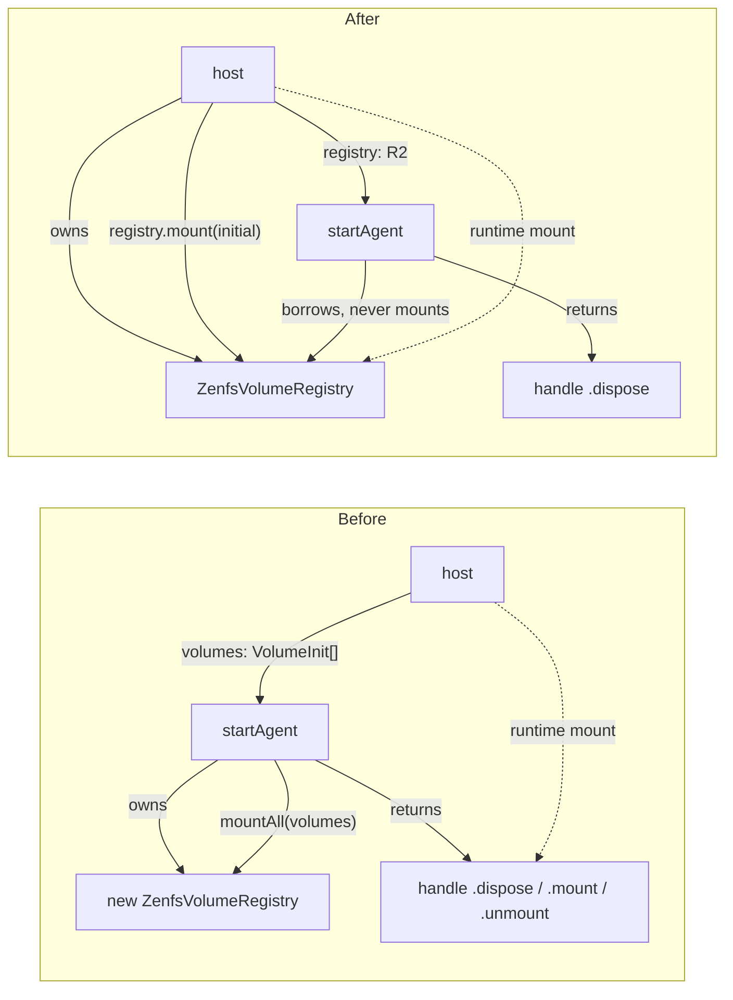

# `startAgent` registry-only API + ws-acp-client migration

## Context

The current `startAgent({ transport, provider, volumes? })` always news a fresh `ZenfsVolumeRegistry` and calls `registry.mountAll(volumes)` internally. ZenFS keeps a process-global `mounts` map (`@zenfs/core@2.5.6` — see [zen-fs/core#218](https://github.com/zen-fs/core/issues/218)), so two `startAgent` calls in the same process collide on `configure({ mounts: {} })` and on duplicate paths like `/mnt/cwd`. `ws-acp-client` worked around this by importing `AcpAgentAdapter`, `assembleServices`, `createInlineAgent`, `createStreamFn` from `@bodhiapp/web-acp-agent/test-utils` to share one externally-constructed registry across connections.

This plan flips the API: the host owns the registry and pre-mounts whatever it wants; `startAgent` accepts the registry but never owns or mounts. `volumes` is removed from `StartAgentOptions`. `handle.mount`/`handle.unmount` are removed (hosts call `registry.mount`/`registry.unmount` directly — `VolumeRegistry` already exposes the same shape). The cross-process isolation problem (two sessions seeing each other's mounts) is **not** solved here; it is recorded as tech debt because the only complete fix needs ZenFS-level support that does not exist today.

## Affected packages

- `packages/web-acp-agent/` — agent runtime (API surface change).
- `packages/ws-acp-client/` — drop `/test-utils` imports, switch to `startAgent`.
- `packages/web-acp/` — pass shared registry; rewire `attachVolumeChannel` target.
- `packages/tutorial-cli-client/` — no code changes (does not pass `volumes`).
- `packages/cli-acp-client/` — **out of scope** (slated for deletion; pre-existing breakage left as-is).
- `ai-docs/web-acp/specs/web-acp-agent/` — spec updates.
- `packages/web-acp-agent/TECHDEBT.md` — new file capturing session-namespacing.

## Mermaid: API shape before/after



## Step 1 — `web-acp-agent` API changes

**File:** [`packages/web-acp-agent/src/api/types.ts`](packages/web-acp-agent/src/api/types.ts)

- Drop `volumes?: VolumeInit[]` from `StartAgentOptions`.
- Promote `registry?: VolumeRegistry` (typed against the public `VolumeRegistry` interface, not `ZenfsVolumeRegistry`).
- Drop `mount(init)` and `unmount(mountName)` from `StartAgentHandle`. Keep only `dispose()`.
- Tighten the doc comment: borrowed-if-supplied, in-memory default otherwise; multi-connection hosts MUST pass a shared registry; `startAgent` never mounts/unmounts on a borrowed registry, never disposes it.

**File:** [`packages/web-acp-agent/src/api/start-agent.ts`](packages/web-acp-agent/src/api/start-agent.ts)

- Replace the body so it only resolves `registry = options.registry ?? new ZenfsVolumeRegistry()`, removes the `registry.mountAll(options.volumes ?? [])` call, removes the `mount`/`unmount` methods on the returned handle.
- `dispose()` stays as `await adapter?.dispose()` only — no registry teardown (host owns it).

**File:** [`packages/web-acp-agent/src/agent/volume-registry.ts`](packages/web-acp-agent/src/agent/volume-registry.ts)

- No interface changes. Add a module-level `let zenfsConfiguredGlobally = false` guard in `#ensureZenfs()` so a second `ZenfsVolumeRegistry` (e.g. accidental in tests) won't `configure({ mounts: {} })` and clobber the first registry's mounts. Belt-and-braces; expected callers will use one shared instance.

**File:** [`packages/web-acp-agent/src/index.ts`](packages/web-acp-agent/src/index.ts)

- Promote `VolumeRegistry`, `VolumeRegistryListener`, `VolumeSnapshot` from internal-doc to public exports (the index already re-exports them; just remove the "internal — agent owns the registry" comment in the spec). `ZenfsVolumeRegistry` is already a public export.

**Tests:** [`packages/web-acp-agent/src/agent/volume-registry.test.ts`](packages/web-acp-agent/src/agent/volume-registry.test.ts)

- Add a test: two `ZenfsVolumeRegistry` instances mount different names; both names remain visible in the global VFS (proves the global-config guard).
- No new test file for `start-agent.ts` — covered indirectly by host e2e.

## Step 2 — `ws-acp-client` migration to `startAgent`

**File:** [`packages/ws-acp-client/src/server.ts`](packages/ws-acp-client/src/server.ts)

Drop every `/test-utils` import. Replace the per-connection block (currently lines 103–129) with a single `startAgent` call:

```ts
import { BodhiProvider, startAgent, type StartAgentHandle } from "@bodhiapp/web-acp-agent";

interface ConnectionRecord {
  ws: WebSocket;
  pair: WsTransportPair;
  agent?: StartAgentHandle;
}

wss.on("connection", (ws, req) => {
  const pair = wsToTransport(ws);
  const record: ConnectionRecord = { ws, pair };
  connections.add(record);
  try {
    record.agent = startAgent({
      transport: pair.transport,
      provider: new BodhiProvider(),
      registry: opts.host.registry,    // borrowed: pre-mounted /mnt/cwd
      sessions,                        // borrowed: shared sqlite store
      preferences,                     // borrowed: shared sqlite store
      buildVersion,
    });
  } catch (err) {
    log.error("[ws-acp-client] startAgent failed:", err);
    try { ws.close(1011, "agent boot failed"); } catch {}
    connections.delete(record);
    return;
  }
  pair.closed.finally(() => {
    connections.delete(record);
    void record.agent?.dispose().catch(...);
  });
});
```

Drop `acpSdkVersion` from `WsAcpServerOptions` and the `DEFAULT_ACP_SDK_VERSION` constant — `startAgent` resolves it internally from `api/sdk-version.ts`.

**File:** [`packages/ws-acp-client/src/services/assemble.ts`](packages/ws-acp-client/src/services/assemble.ts)

- No interface changes. `createHostState` already pre-mounts `/mnt/cwd` into the shared registry. Comment update in the file header to reflect "host owns registry; `startAgent` borrows it" instead of the current "test-utils" rationale.

**File:** [`packages/ws-acp-client/README.md`](packages/ws-acp-client/README.md) and [`packages/ws-acp-client/CHANGELOG.md`](packages/ws-acp-client/CHANGELOG.md)

- README architecture section: remove the `/test-utils` justification; replace with "one shared registry pre-mounted in `HostState`, each connection calls `startAgent({ registry })`".
- CHANGELOG `[Unreleased] / Changed`: "Migrated server to public `startAgent` API; dropped all imports from `@bodhiapp/web-acp-agent/test-utils`."

**E2E:** Run `npm run test:e2e` from `packages/ws-acp-client/` after Steps 1+2 land. Existing four specs cover the full flow.

## Step 3 — `web-acp` migration to externally-owned registry

**File:** [`packages/web-acp/src/agent/agent-worker.ts`](packages/web-acp/src/agent/agent-worker.ts)

Construct the registry up front, pre-mount, then call `startAgent`:

```ts
import { BodhiProvider, startAgent, ZenfsVolumeRegistry, type VolumeInit } from '@bodhiapp/web-acp-agent';

async function boot(port: MessagePort, hostVolumes: HostVolumeInit[]): Promise<void> {
  const db = openSessionDb();
  const initial: VolumeInit[] = await Promise.all(hostVolumes.map(toAgentVolumeInit));

  const registry = new ZenfsVolumeRegistry();
  await registry.mountAll(initial);

  const handle = startAgent({
    transport: createMessagePortStream(port),
    provider: new BodhiProvider(),
    registry,
    sessions: createStoreFromDb(db),
    preferences: createPreferenceStore(db),
    buildVersion: BUILD_VERSION,
  });

  attachVolumeChannel(scope, registry);   // target is now the registry, not the handle
}
```

**File:** [`packages/web-acp/src/runtime/volumes-fsa/volume-channel.ts`](packages/web-acp/src/runtime/volumes-fsa/volume-channel.ts)

- Replace the local `MountTarget` interface with `import type { VolumeRegistry } from '@bodhiapp/web-acp-agent'` and use it in the `attachVolumeChannel` signature. Method shapes already match (`mount(init)`, `unmount(name)`). Update the file header comment ("target is `VolumeRegistry`, not `StartAgentHandle.mount`").

**E2E:** Run `npm run test:e2e` from `packages/web-acp/` after Step 3.

## Step 4 — Spec updates (`ai-docs/web-acp/specs/web-acp-agent/`)

**File:** [`ai-docs/web-acp/specs/web-acp-agent/volumes.md`](ai-docs/web-acp/specs/web-acp-agent/volumes.md)

Add a new top section before "Purpose":

> ## Why `startAgent` takes the registry, not volumes
>
> ZenFS keeps a process-global mount table (`@zenfs/core@2.5.6` — `dist/vfs/shared.js` `mounts: Map`; tracked upstream at [zen-fs/core#218](https://github.com/zen-fs/core/issues/218)). Two `ZenfsVolumeRegistry` instances in one process call `configure({ mounts: {} })` against the same global map, clobbering each other's mounts. The earlier `startAgent({ volumes })` shape always news a fresh registry, so multi-connection hosts (e.g. `ws-acp-client`) had to fall back to internal `assembleServices`/`AcpAgentAdapter` to share one registry.
>
> The current API takes `registry?: VolumeRegistry` instead. Hosts construct the registry, pre-mount, and pass it into every `startAgent` call. `startAgent` never mounts or disposes a borrowed registry; the host owns its lifecycle. Single-host runtimes that omit `registry` get a default `ZenfsVolumeRegistry` and behave as before.
>
> **Per-session isolation** (each session sees only its own `/mnt/<sid>/...`) is **not implemented**. Tracked at [`packages/web-acp-agent/TECHDEBT.md`](../../../packages/web-acp-agent/TECHDEBT.md).

Update the `VolumeRegistry` interface block (`:42–:51`) and method table (`:89–:96`) only if interface changes (they don't). Update the line citing `start-agent.ts` mount path.

**File:** [`ai-docs/web-acp/specs/web-acp-agent/index.md`](ai-docs/web-acp/specs/web-acp-agent/index.md)

- Public surface table (`:88–:90`): remove the parenthetical "(`VolumeRegistry`, `ZenfsVolumeRegistry`, `VolumeRegistryListener`, `VolumeSnapshot` are internal — agent owns the registry)" — these are now public so hosts can pre-mount.
- Folder layout note next to `volume-registry.ts` (`:216`): "VolumeInit + VolumeRegistry/ZenfsVolumeRegistry (public — host pre-mounts)".

**File:** [`ai-docs/web-acp/specs/web-acp-agent/startup-sequence.md`](ai-docs/web-acp/specs/web-acp-agent/startup-sequence.md)

- Phase 1 — Bootstrap (`:35–:77`): replace the legacy `startAcpAgent(transport, services, options)` snippet with the current `startAgent({ transport, provider, registry?, sessions?, preferences?, buildVersion? })` snippet. Note that `volumes` is **not** an option; hosts mount via `registry.mount(init)` before/after `startAgent`.
- The broader `startAcpAgent`-era language elsewhere in the file is pre-existing drift and out of scope for this plan; keep the edits localised to Phase 1 and any sentence that mentions `volumes` directly.

## Step 5 — `packages/web-acp-agent/TECHDEBT.md`

Create the file. Single section initially:

> # web-acp-agent — known tech debt
>
> ## Per-session volume namespacing (open)
>
> **Symptom.** All sessions handled by one `web-acp-agent` instance share the same `VolumeRegistry`. Every `_bodhi/volumes/list`, every `composeSystemPrompt`, every bash-tool `MountableFs` exposes the union of all mounts. A new mount via `registry.mount(init)` is visible to every active session.
>
> **Root cause.** `@zenfs/core@2.5.6` exposes a single process-global `mounts` map (`dist/vfs/shared.js`). `bindContext({ root })` gives a chrooted view but still shares the same mount table. Per-context isolated mount tables are tracked upstream at [zen-fs/core#218](https://github.com/zen-fs/core/issues/218); not shipped. We do not currently re-export the global VFS through a session-bound view inside `bash-tool.ts:VolumeFileSystem` or `commands/loader.ts:createZenfsCommandsFs`, so even adding `bindContext` would be a non-trivial change.
>
> **Impact today.** `ws-acp-client` runs one `cwd` mount shared across sessions in a single-tenant deployment — isolation problem is not exercised. `web-acp` is single-user. `tutorial-cli-client` mounts nothing.
>
> **Migration shape (when ready).**
> - `VolumeInit.fs: FileSystem` becomes `VolumeInit.createFs: () => Promise<FileSystem> | FileSystem` (factory; ZenFS mutates `fs._mountPoint` per `dist/vfs/shared.js:31`, so each session needs its own instance).
> - `VolumeRegistry.{mount,unmount,list,firstMountName,onChange}` become session-keyed (`mount(sessionId, init)`, etc.) plus `releaseSession(sessionId)`.
> - Mount path becomes `/mnt/<sessionId>/<mountName>`; `bash-tool.ts`, `commands/loader.ts`, `system-prompt.ts`, `volumes-list.ts` thread `sessionId` through.
> - `startAgent` gains `defaultVolumes?: VolumeInit[]` auto-mounted on `newSession`/`loadSession`, auto-released on `closeSession`.
>
> **Threat-model note.** Cooperative isolation through the agent's own tools is sufficient for our current first-party-tools deployment. A defense-in-depth `bindContext({ root: '/mnt/<sid>' })` wrapper around `VolumeFileSystem` is a follow-up.

## Step 6 — Lint/typecheck/e2e gates

After Steps 1–5:

- `npx biome check packages/web-acp-agent/src packages/ws-acp-client/src packages/web-acp/src` — fix.
- `npm run check` from each modified package root — must pass.
- `npm run test:e2e` from `packages/ws-acp-client/` — all four specs pass.
- `npm run test:e2e` from `packages/web-acp/` — must pass.
- CI guard (informal grep, can run in shell): `rg "@bodhiapp/web-acp-agent/test-utils" packages/ws-acp-client/src packages/web-acp/src packages/tutorial-cli-client/src` returns zero. Document this in CHANGELOG.

## Out of scope (for this plan)

- `cli-acp-client/` migration (slated for deletion).
- Per-session mount namespacing (recorded in TECHDEBT.md; separate plan when the upstream ZenFS feature lands or we decide to ship the factory + session-keyed registry refactor).
- Defense-in-depth `bindContext` wrapping inside `VolumeFileSystem` / `createZenfsCommandsFs` (follow-up to namespacing).
- Broader `startup-sequence.md` cleanup of `startAcpAgent`-era references that are unrelated to volumes.
