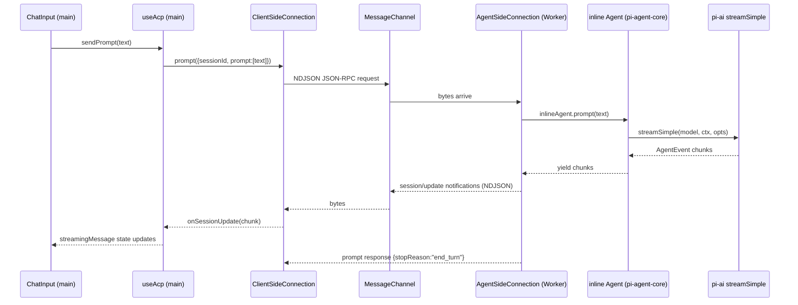

# M0 — Foundation (M0.a + M0.b) plan

## Context anchor

- Milestone: [ai-docs/web-acp/milestones/m0-foundation.md](ai-docs/web-acp/milestones/m0-foundation.md)
- Architecture: [ai-docs/web-acp/steering/02-architecture.md](ai-docs/web-acp/steering/02-architecture.md)
- Web-agent reference (do **not** copy files): [packages/web-agent/](packages/web-agent/)
- ACP TS SDK reference (clone): [claude-agent-acp](/Users/amir36/Documents/workspace/src/github.com/agentclientprotocol/claude-agent-acp/)
- Prior art ACP agent (clone): [pi-acp](/Users/amir36/Documents/workspace/src/github.com/svkozak/pi-acp/)

## Existing scaffold — what is already there

`packages/web-acp/` is **not empty**. It is the `create-bodhi-js` template, already wired with:

- [src/App.tsx](packages/web-acp/src/App.tsx) — `BodhiProvider` + `BodhiBadge` + `Layout`.
- [src/hooks/useAgent.ts](packages/web-acp/src/hooks/useAgent.ts) — **inline `Agent` from `@mariozechner/pi-agent-core`**, `streamSimple` from `@mariozechner/pi-ai`, Bodhi token passed via `Authorization` / `x-api-key` header.
- [src/components/chat/](packages/web-acp/src/components/chat/) — `ChatDemo`, `ChatInput`, `ChatMessages`, `MessageBubble`, `ModelCombobox`, `ToolCallMessage`, `McpPopover`.
- [src/hooks/useMcpAgentTools.ts](packages/web-acp/src/hooks/useMcpAgentTools.ts), `useMcpList.ts`, `useMcpSelection.ts` — MCP tool plumbing.
- [e2e/chat.spec.ts](packages/web-acp/e2e/chat.spec.ts), `e2e/tests/global-setup.ts`, `e2e/tests/pages/`, `e2e/.env.test`.
- [package.json](packages/web-acp/package.json) — `@bodhiapp/bodhi-js-react`, `@mariozechner/pi-agent-core`, `@mariozechner/pi-ai`, `@modelcontextprotocol/sdk` already declared.

**Implication.** M0.a is **"add the vault layer + gate the real-LLM e2e in CI"**, not "scaffold from zero". We keep the existing chat path; we layer the vault under it. MCP tool plumbing rides along unchanged (it's orthogonal to the M0 vault question).

## Decisions resolved (from pre-plan Q&A)

- **Scope:** single plan covering M0.a and M0.b.
- **LLM path:** Bodhi — keep existing `BodhiProvider` / `ChatPage.login` / `selectModel` shape.
- **ACP library:** use official **`@agentclientprotocol/sdk@^0.17.0`** directly. Verified its core (`dist/acp.js`, `dist/stream.js`) uses only Web streams (`ReadableStream<Uint8Array>` / `WritableStream<Uint8Array>`) + `TextEncoder`/`TextDecoder` + `AbortController` — zero `node:*` imports. Framing is NDJSON + JSON-RPC 2.0. `new AgentSideConnection(toAgent, stream)` / `new ClientSideConnection(toClient, stream)` both take a generic `Stream` of messages. **No patching needed** for MessageChannel; we only write a MessagePort ↔ byte-stream adapter.
- **Schema stability:** anchor on `schema.json` only (the stable methods we need at M0 — `initialize`, `session/new`, `session/prompt`, `session/update`, `session/cancel` — are all stable).
- **Permission defaults:** N/A for M0 (no destructive tools); defer explicit policy to M2.

## Directory layout under `packages/web-acp/src/`

Top-level split, introduced incrementally. M0.a only touches `fs/` and `providers/`; M0.b adds `acp/` and `transport/` and rearranges `agent/`.

```
src/
  client/            (M0.b rename target; stays flat at M0.a)
    components/      existing
    hooks/           existing useAgent.ts (renamed useAcp.ts at M0.b)
  agent/             (M0.b: extracted from hooks/useAgent.ts)
    bodhi-provider.ts  auth+models helper; moves from lib/ at M0.b
    stream-fn.ts       pi-ai streamSimple wrapper
    inline-agent.ts    pi-agent-core Agent loop, ephemeral session
  acp/               (M0.b only)
    client.ts        wraps ClientSideConnection
    agent-adapter.ts wraps AgentSideConnection; runs in Worker
    index.ts         re-exports from @agentclientprotocol/sdk
  transport/         (M0.b only)
    worker-stream.ts    MessagePort <-> {ReadableStream,WritableStream} pair
    memory-stream.ts    in-memory test double (pair of TransformStreams)
  fs/                (M0.a)
    zenfs-provider.ts     @zenfs/dom WebAccess mount at /vault
    in-memory-vault.ts    readDevSeed() from window.__zenfsSeed
    use-directory-handle.ts  idb-keyval persistence + requestPermission
    use-devseed-boot.ts   DEV-gated pre-mount
  providers/         (M0.a)
    VaultProvider.tsx    orchestrates mount state
  env.ts             existing
```

Rename `hooks/useAgent.ts` → `hooks/useAcp.ts` at M0.b (the rename costs nothing and signals the protocol pivot).

## M0.a — vault + real-LLM e2e

### A1. ZenFS `/vault` mount (main thread)

Port the **shape**, not the code, from web-agent's vault lifecycle. Re-derive each file. Files referenced for pattern only:
- `packages/web-agent/src/providers/VaultProvider.tsx`
- `packages/web-agent/src/hooks/useDirectoryHandle.ts`
- `packages/web-agent/src/hooks/useDevSeedBoot.ts`
- `packages/web-agent/src/fs/in-memory-vault.ts`
- `packages/web-agent/src/worker-agent/fs/zenfs-provider.ts` (the `VAULT_MOUNT = '/vault'` constant + mount helper)

New files:
- `src/fs/zenfs-provider.ts` — export `VAULT_MOUNT = '/vault'`, `mountVault(handle: FileSystemDirectoryHandle)`, `unmountVault()`. Uses `@zenfs/core` + `@zenfs/dom` `WebAccess` backend.
- `src/fs/use-directory-handle.ts` — `get/set/del` via `idb-keyval` under key `dirHandle`; `requestPermission({ mode: 'readwrite' })` re-grant on every load.
- `src/fs/in-memory-vault.ts` — `readDevSeed()` returns `window.__zenfsSeed | undefined`; helper to mount an `InMemory` backend pre-populated from the seed.
- `src/fs/use-devseed-boot.ts` — DEV-only hook that blocks vault `ready` until a seed is mounted (production dead-codes via `import.meta.env.DEV`).
- `src/providers/VaultProvider.tsx` — state machine: `{ tag: 'picking' | 'mounting' | 'mounted' | 'error' }`; exposes `{ mountState, pickAndMount(), unmount() }` via context; integrates `useDevSeedBoot`.

### A2. Layout integration

- Extend [src/components/Layout.tsx](packages/web-acp/src/components/Layout.tsx) to wrap `ChatDemo` with `<VaultProvider>` and add a compact **`VaultStatus`** indicator in the `Header` (or adjacent). Keep it minimal — no file tree panel, no FileViewer (those are M2).
- `VaultStatus` exposes `data-testid="vault-status"` and `data-teststate="picking" | "mounted" | "error"` for e2e assertions.

### A3. E2E vault seeding + CI gate

- `e2e/helpers/install-vault.ts` — walk `e2e/data/<name>/`, build `Record<'/vault/...', utf8>`, `page.addInitScript(({ files, name }) => { (window as any).__zenfsSeed = { files, name }; }, { files, name })` before `page.goto('/')`.
- `e2e/data/sample-basic/` — a tiny fixture (e.g. one `README.md`) so mount has content; **not** read by the agent at M0.
- Extend [e2e/chat.spec.ts](packages/web-acp/e2e/chat.spec.ts) to:
  1. Call `installVault(page, 'sample-basic')` before `page.goto`.
  2. Assert `vault-status` reaches `data-teststate="mounted"` before sending the prompt.
  3. Keep the existing "what day comes after monday? ... tuesday" assertion.
- `e2e/tests/global-setup.ts` — verify it already boots a Bodhi server on its own port; if it collides with `packages/web-agent/`'s `BODHI_SERVER_PORT=21135`, change to `21136` and document. Confirm `.env.test` keys match web-agent's schema.
- Add `packages/web-acp` to the root `npm run check` composite (check how root does it — likely `turbo run` or `workspaces` fan-out); if not already included, add it.

### A4. Deps to add at M0.a

- `@zenfs/core`, `@zenfs/dom` — vault mount.
- `idb-keyval` — FSA handle persistence.
- `@agentclientprotocol/sdk@^0.17.0` — add **now** so M0.b is a shallow change; unused in M0.a runtime paths (tree-shaken).

### A5. What stays untouched at M0.a

- `src/hooks/useAgent.ts` — inline `Agent` loop. No Worker, no ACP.
- MCP tool wiring (`useMcpAgentTools`, `McpPopover`) — stays as-is. The M0 milestone doesn't exercise it; we don't remove it.
- All `src/components/chat/*` — same `data-testid` / `data-test-state` attributes; `ChatPage` selectors keep working.

### M0.a gate

- `npm run check` clean at `packages/web-acp/` and root.
- `npm run test:e2e` green in CI with `.env.test` credentials.
- DOM-witness assertions only; no LLM-text equality beyond the "tuesday" token presence check already in the spec.

## M0.b — Worker boundary + ACP framing

### B1. Extract agent into `src/agent/`

Move the agent construction out of [src/hooks/useAgent.ts](packages/web-acp/src/hooks/useAgent.ts) into:
- `src/agent/bodhi-provider.ts` — an `LlmProvider`-shaped module: `setAuthToken`, `getApiKeyAndHeaders(model)`, `getAvailableModels()`. Calls Bodhi `/bodhi/v1/models`. Mirrors `packages/web-agent/src/worker-bodhi/bodhi-provider.ts` in shape.
- `src/agent/stream-fn.ts` — `createStreamFn(provider)` returns `StreamFn` wrapping `streamSimple`.
- `src/agent/inline-agent.ts` — constructs `Agent` from `pi-agent-core` and exposes a small, transport-agnostic interface: `{ prompt(input): AsyncIterable<AgentEvent>; cancel(): void }`.

### B2. Worker entry

- `src/agent/agent-worker.ts` — module worker. On `message` with `AgentWorkerInit { agentPort: MessagePort }`, builds the byte-stream pair from `agentPort`, calls `ndJsonStream`, then `new AgentSideConnection(conn => new AcpAgentAdapter(conn, inlineAgent), stream)`.
- Spawned from main thread via `new Worker(new URL('./agent-worker.ts', import.meta.url), { type: 'module' })`.

### B3. ACP adapters (`src/acp/`)

- `src/acp/agent-adapter.ts` — implements the SDK's `Agent` interface. Pattern cribbed from [pi-acp/src/acp/agent.ts](file:///Users/amir36/Documents/workspace/src/github.com/svkozak/pi-acp/src/acp/agent.ts):
  - `initialize(req)` — return `{ protocolVersion: 1, agentCapabilities: {}, agentInfo: { name: 'web-acp', version: <pkg> } }`.
  - `newSession(req)` — mint a UUID, store `{ sessionId, cwd }` in an in-memory map. `cwd` at M0.b is advisory; we don't resolve it yet.
  - `prompt(req)` — call `inlineAgent.prompt` with the user content; for each `AgentEvent`, emit `conn.sessionUpdate({ sessionId, update })` mapping `message_update` → `agent_message_chunk`, `agent_end` → `agent_message_end`. Return `{ stopReason: 'end_turn' }`.
  - `cancel(notif)` — call `inlineAgent.cancel(sessionId)`.
- `src/acp/client.ts` — wraps `ClientSideConnection`. Public methods: `initialize`, `newSession`, `prompt`, `cancel`. Notification handlers for `session/update` push into a subscriber callback. No DOM, no Worker refs.
- `src/acp/index.ts` — re-exports SDK types (`AgentSideConnection`, `ClientSideConnection`, `Agent`, `Client`, `ndJsonStream`, `Stream`, `AnyMessage`).

### B4. Transport adapters (`src/transport/`)

Interface expected by `ndJsonStream`:
```ts
function ndJsonStream(
  output: WritableStream<Uint8Array>,
  input: ReadableStream<Uint8Array>
): Stream /* ReadableStream<AnyMessage> + WritableStream<AnyMessage> */
```

Two implementations, both returning `{ output, input }` (byte-stream pair):

- `src/transport/worker-stream.ts` — `createMessagePortStream(port: MessagePort): { output, input }`. The `output` is a `WritableStream<Uint8Array>` whose `write(chunk)` does `port.postMessage(chunk, [chunk.buffer])`. The `input` is a `ReadableStream<Uint8Array>` fed by `port.onmessage`. Symmetric on both ends.
- `src/transport/memory-stream.ts` — `createMemoryPair(): { client, agent }` where each side is `{ output, input }` with a pair of `TransformStream`s wired crosswise. Used in vitest.

**Constraint (gate item):** `packages/web-acp/src/acp/` imports nothing from `transport/`, `Worker`, `MessagePort`, or `DOM`. Verified by ripgrep gate.

### B5. Rewire `useAcp`

- Rename `src/hooks/useAgent.ts` → `src/hooks/useAcp.ts`.
- Body now: spawn worker → create `MessagePort` pair → adapt port → `ndJsonStream` → `new ClientSideConnection(c => new NotificationHandler(c), stream)` → call `initialize` → `newSession` → expose `sendPrompt` which calls `prompt` and streams updates into React state.
- `ChatDemo` / `ChatInput` / `ChatMessages` untouched. Public signature of `useAcp` matches M0.a's `useAgent` so the UI components keep compiling.

### B6. Tests

- Vitest: `src/acp/__tests__/framing.test.ts` — uses `memory-stream.ts`; spins up a minimal `AgentSideConnection` (fake agent that echoes) and a `ClientSideConnection`; asserts round-trip of `initialize` → `newSession` → `prompt` → `session/update` notification → `prompt` result. Proves framing doesn't depend on the worker transport.
- Playwright: extend [e2e/chat.spec.ts](packages/web-acp/e2e/chat.spec.ts) with one `test.step` asserting the Worker boundary — e.g. `page.evaluate(() => (window as any).__agentInlined === undefined)` after setting a main-thread sentinel only in the inline path (or assert absence of an agent-only global on `window`).
- Grep gate: `rg "MessagePort|new Worker|self\\.postMessage" packages/web-acp/src/acp/` returns empty.

### M0.b gate

- All M0.a e2e still passes.
- Grep returns zero.
- Vitest framing round-trip green.
- Worker-boundary Playwright step green.
- `npm run check` clean.

## Data flow — M0.b



## Risks + mitigations

- **Bodhi server port collision** with `packages/web-agent/e2e/` when running in parallel CI or locally. Mitigate by picking a distinct `BODHI_SERVER_PORT` (e.g. `21136`) in web-acp's `global-setup.ts`; document in `e2e/README`.
- **SDK version drift**: pin `@agentclientprotocol/sdk@0.17.0` (exact), don't use caret until M1 validates semver behaviour. Align `zod` peer dep with the SDK's requirement.
- **pi-agent-core browser bundling**: already proven in web-agent worker; should work equally on main thread. Verify with a minimal `vitest run` on `inline-agent.ts`.
- **MCP plumbing during ACP pivot**: MCP tools currently flow inline to the `Agent`. At M0.b, the agent moves to the worker; MCP tools need to be *either* evaluated in the worker, or passed through ACP. **Decision for M0.b:** keep MCP tools inline in the worker (they're pure JS, no main-thread API). If bundling issues surface, stub them out for M0.b and re-enable at M2 with the `fs/*` work. Call out in the M0.b commit message.
- **Vault not yet used by agent**: at M0.a and M0.b the agent answers without vault I/O. The mount is proven by DOM state only. This is the milestone's intent and not a gap.

## Exit checklist

- [ ] M0.a files created + deps added
- [ ] Vault mount + dev-seed working locally
- [ ] `npm run check` clean
- [ ] `npm run test:e2e` green locally and in CI with `.env.test`
- [ ] Commit M0.a
- [ ] M0.b worker + ACP + transport adapters created
- [ ] `useAgent` → `useAcp` rename
- [ ] Vitest framing round-trip green
- [ ] Grep gate zero
- [ ] Playwright worker-boundary step green
- [ ] Commit M0.b

## Follow-ups explicitly deferred

- Session persistence, fork/branch, slash commands — M1+.
- `fs/*` delegation — M2.
- Permission / confirmation UI — M2 (when first destructive tool lands).
- HTTP/SSE transport — post-M0.
- `schema.unstable.json` adoption — revisit per-milestone.
- Library extraction as `@bodhiapp/bodhi-web-acp` — M7.