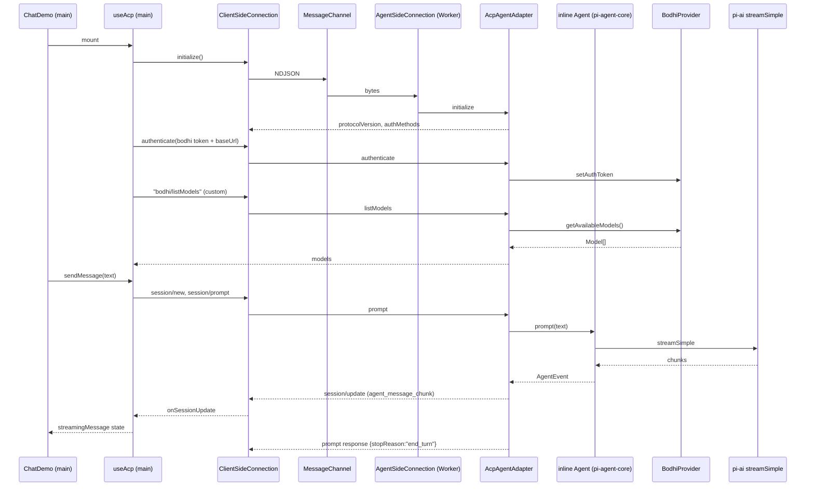

## Scope changes vs. the previous plan

- **Drop** the ZenFS `/vault` mount + dev-seed + `VaultProvider` work from M0. Deferred to M2 where `fs/*` tools land.
- **Drop** MCP plumbing from web-acp in phase A. Reintroduced in a later milestone when tool-calling over ACP lands.
- **Keep** "agent behind a Worker + ACP over `MessageChannel`" as the one protocol pivot, done in a single phase (no bespoke intermediate IPC).
- **Invariant:** [packages/web-acp/e2e/chat.spec.ts](packages/web-acp/e2e/chat.spec.ts) and [packages/web-acp/e2e/tests/pages/ChatPage.ts](packages/web-acp/e2e/tests/pages/ChatPage.ts) are **not modified**. Every commit keeps `npm run check` clean and `npm run test:e2e` green.

## Target architecture after phase D



## Phase A — Remove the MCP surface

**Goal:** flatten web-acp down to a single inline-agent chat path. No vault, no MCP, no worker. Still fully functional.

**Files deleted:**
- [packages/web-acp/src/hooks/useMcpAgentTools.ts](packages/web-acp/src/hooks/useMcpAgentTools.ts)
- [packages/web-acp/src/hooks/useMcpList.ts](packages/web-acp/src/hooks/useMcpList.ts)
- [packages/web-acp/src/hooks/useMcpSelection.ts](packages/web-acp/src/hooks/useMcpSelection.ts)
- [packages/web-acp/src/lib/mcp-tools.ts](packages/web-acp/src/lib/mcp-tools.ts)
- [packages/web-acp/src/components/chat/McpPopover.tsx](packages/web-acp/src/components/chat/McpPopover.tsx)
- [packages/web-acp/src/components/chat/ToolCallMessage.tsx](packages/web-acp/src/components/chat/ToolCallMessage.tsx) (depends on `decodeMcpToolName`; no tool-calls at M0, no reason to keep a broken shim)

**Files edited:**
- [packages/web-acp/src/components/chat/ChatDemo.tsx](packages/web-acp/src/components/chat/ChatDemo.tsx) — drop `useMcpList` / `useMcpSelection` / `useMcpAgentTools`, call `useAgent()` with no args (see Phase B for the signature change; for A, pass `[]`).
- [packages/web-acp/src/components/chat/ChatInput.tsx](packages/web-acp/src/components/chat/ChatInput.tsx) — remove the `mcps` / `toolsByMcpId` / `enabledMcpTools` / `onToggleMcp` / `onToggleTool` / `getCheckboxState` / `enabledToolCount` / `isMcpsLoading` props and the `<McpPopover>` render.
- [packages/web-acp/src/components/chat/ChatMessages.tsx](packages/web-acp/src/components/chat/ChatMessages.tsx) — remove any `<ToolCallMessage>` renderers (tool-result sub-rendering).
- [packages/web-acp/src/hooks/useAgent.ts](packages/web-acp/src/hooks/useAgent.ts) — `useAgent()` (no `tools` param); `agent.state.tools` set to `[]`.
- [packages/web-acp/package.json](packages/web-acp/package.json) — remove `@modelcontextprotocol/sdk`.

**Gate & commit:**
- `npm run check` clean in `packages/web-acp/`.
- `npm run test:e2e` green (unchanged spec asks "monday → tuesday"; no MCP assertions).
- Commit: `web-acp: remove MCP surface (M0 phase A)`.

## Phase B — Extract the agent runtime into `src/agent/`

**Goal:** move LLM + provider + agent-loop construction out of the hook. Still inline on the main thread, no ACP, no worker. Pure refactor — no behavior change.

**New files under `packages/web-acp/src/agent/`:**
- `bodhi-provider.ts` — port the *shape* of [packages/web-agent/src/worker-bodhi/bodhi-provider.ts](packages/web-agent/src/worker-bodhi/bodhi-provider.ts): `setAuthToken({ token, baseUrl })`, `getApiKeyAndHeaders(model)`, `getAvailableModels(): Promise<Model<Api>[]>`. Internally calls `/bodhi/v1/models?page_size=100` via `fetch` (not `UIClient`; the worker will use this verbatim in phase D).
- `stream-fn.ts` — `createStreamFn(provider): StreamFn` mirroring [packages/web-agent/src/worker-agent/llm/stream.ts](packages/web-agent/src/worker-agent/llm/stream.ts).
- `inline-agent.ts` — constructs `new Agent({ streamFn, getApiKey })` from `pi-agent-core` and exposes a small, transport-agnostic interface:

```typescript
export interface InlineAgent {
  setAuth(token: string | null, baseUrl: string | undefined): void;
  listModels(): Promise<Model<Api>[]>;
  setModel(model: Model<Api>): void;
  subscribe(cb: (event: AgentEvent) => void): () => void;
  prompt(text: string): Promise<void>;
  cancel(): void;
  clearMessages(): void;
}
```

**Files edited:**
- [packages/web-acp/src/hooks/useAgent.ts](packages/web-acp/src/hooks/useAgent.ts) — rewrite as a thin adapter over `InlineAgent`. React state (messages, streaming, models, error) stays in the hook; construction moves to `src/agent/`. `lib/agent-model.ts` + `lib/bodhi-models.ts` are still imported by the hook only for the `BodhiModelInfo` display type; the real list comes from `bodhiProvider.getAvailableModels()` and is flattened into the existing `BodhiModelInfo[]` shape the `ModelCombobox` expects.
- No changes to component files, `ChatPage.ts`, `chat.spec.ts`.

**Gate & commit:**
- `npm run check` clean.
- `npm run test:e2e` green.
- Commit: `web-acp: extract agent runtime into src/agent/ (M0 phase B)`.

## Phase C — Add the ACP SDK + scaffolding (no runtime change)

**Goal:** land the dependency and the directory shape that phase D will fill in. Zero runtime behavior change; every new module is unused by the hook at end of phase C.

**Deps:**
- Add `@agentclientprotocol/sdk@0.17.0` to [packages/web-acp/package.json](packages/web-acp/package.json) (exact pin; align `zod` peer if SDK requires).

**New files (stubs with real type surface, no runtime wiring yet):**
- `packages/web-acp/src/acp/index.ts` — re-exports SDK: `AgentSideConnection`, `ClientSideConnection`, `Agent`, `Client`, `ndJsonStream`, plus relevant request/response types.
- `packages/web-acp/src/acp/client.ts` — skeleton wrapper around `ClientSideConnection` exposing `initialize`, `authenticate`, `listModels` (custom method), `newSession`, `prompt`, `cancel`, and a `subscribe(onUpdate)` channel. Not yet called by any hook.
- `packages/web-acp/src/acp/agent-adapter.ts` — skeleton implementing SDK's `Agent` interface, constructed with `(conn, inlineAgent, bodhiProvider)`. Methods wired but not yet exercised.
- `packages/web-acp/src/transport/worker-stream.ts` — `createMessagePortStream(port: MessagePort): { input: ReadableStream<Uint8Array>; output: WritableStream<Uint8Array> }`. Used by both ends.
- `packages/web-acp/src/agent/agent-worker.ts` — module worker entry stub. Listens for init message; on receipt, builds byte-stream pair via `createMessagePortStream`, calls `ndJsonStream`, instantiates `new AgentSideConnection(conn => new AcpAgentAdapter(conn, inline, bodhi), stream)`. The file **exists** and **type-checks**, but no `new Worker(...)` is spawned yet — hooks still use the inline path from phase B.

**Gate & commit:**
- `npm run check` clean (typecheck validates that all the ACP wiring compiles, even though it's orphaned).
- `npm run test:e2e` green.
- Commit: `web-acp: scaffold ACP SDK + transport + worker entry (M0 phase C)`.

## Phase D — Worker + ACP pivot (the one protocol step)

**Goal:** flip the hook from inline to Worker + ACP in a single coherent change. This is the phase the user called out as "worker and ACP together". The e2e spec does **not** change and must pass.

**ACP methods used:**
- `initialize` — standard, returns `protocolVersion: 1`, empty `agentCapabilities`, `authMethods: [{ id: 'bodhi-token', name: 'Bodhi token', description: 'Push access token from main thread' }]`.
- `authenticate({ methodId: 'bodhi-token', _meta: { token, baseUrl } })` — main thread pushes Bodhi token + server URL via `_meta`; adapter calls `bodhiProvider.setAuthToken`.
- **Custom method** `bodhi/listModels` — registered on the `AgentSideConnection` via the SDK's extension-method hook (or, if the SDK's dispatch doesn't allow arbitrary methods, we pack the model list into the `authenticate` response's `_meta.models`; decide during implementation, behind the `AcpClient.listModels()` surface).
- `session/new` — returns `{ sessionId }`; adapter stores `{ sessionId, model }` in an in-memory map.
- `session/prompt({ sessionId, prompt: [{ type: 'text', text }] })` — adapter calls `inlineAgent.prompt(text)`; translates `AgentEvent` → `session/update` notifications with `agent_message_chunk` / `agent_message_end`. Returns `{ stopReason: 'end_turn' }`.
- `session/cancel` — adapter calls `inlineAgent.cancel()`.

**Files edited:**
- `packages/web-acp/src/acp/agent-adapter.ts` — fill in real dispatch from stubs (phase C).
- `packages/web-acp/src/acp/client.ts` — fill in real wrapper; exposes `onSessionUpdate(cb)` for streaming.
- `packages/web-acp/src/agent/agent-worker.ts` — fill in: construct `BodhiProvider` + `createStreamFn` + `InlineAgent` + `AcpAgentAdapter`; drive `AgentSideConnection`.
- Rename [packages/web-acp/src/hooks/useAgent.ts](packages/web-acp/src/hooks/useAgent.ts) → `packages/web-acp/src/hooks/useAcp.ts`. New body:
  1. On mount: `new Worker(new URL('../agent/agent-worker.ts', import.meta.url), { type: 'module' })` + `new MessageChannel()`; transfer one port to worker via `postMessage({ type: 'init', agentPort }, [agentPort])`.
  2. Wrap the main-side port via `createMessagePortStream` → `ndJsonStream` → `new ClientSideConnection(...)`. Store as `acpClient`.
  3. `await acpClient.initialize()`.
  4. When `useBodhi().auth.accessToken` flips to non-null, `await acpClient.authenticate({ methodId: 'bodhi-token', token, baseUrl })`.
  5. After authenticate, call `acpClient.listModels()` and feed the result into existing `models` state.
  6. On `sendMessage(text)`: create a session lazily on first send; route to `acpClient.prompt`. Map `session/update` notifications into `streamingMessage` / `messages` React state (preserves the shape `ChatMessages` already renders).
  7. On `clearMessages` / unmount: `acpClient.cancel()` + tear down the worker.
- [packages/web-acp/src/components/chat/ChatDemo.tsx](packages/web-acp/src/components/chat/ChatDemo.tsx) — update the import path: `useAgent` → `useAcp`. Hook's returned shape is unchanged.

**Files deleted at end of phase D:**
- `packages/web-acp/src/agent/inline-agent.ts` is **kept** — it now runs inside the worker, not on the main thread.
- Nothing else deleted; `src/lib/agent-model.ts` is still used for `buildModel` inside the worker.

**Gate & commit (M0 exit gate):**
- Grep gate: `rg "MessagePort|new Worker|self\.postMessage" packages/web-acp/src/acp/` returns zero hits (framing doesn't leak transport). Verified manually.
- `npm run check` clean.
- `npm run test:e2e` green with the **unchanged** [packages/web-acp/e2e/chat.spec.ts](packages/web-acp/e2e/chat.spec.ts) ("monday → tuesday" still works end-to-end over the Worker + ACP path).
- Commit: `web-acp: pivot to Worker + ACP framing (M0 phase D)`.

## Risks / things to confirm during phase D

- **Custom ACP methods**: need to verify `@agentclientprotocol/sdk@0.17.0` dispatch accepts unknown methods on `AgentSideConnection`. If not, `bodhi/listModels` is carried via `authenticate` response's `_meta.models`. This is an implementation detail, not a protocol change — `AcpClient.listModels()` hides the choice.
- **pi-agent-core in a worker**: already proven by `packages/web-agent/src/worker-agent/`, so low-risk. `vitest run` on `inline-agent.ts` (main-thread) in phase B catches any bundling issue early.
- **Worker URL with Vite**: `new Worker(new URL('./foo.ts', import.meta.url), { type: 'module' })` is the Vite-supported form; the same pattern is used in web-agent.
- **Auth token rotation**: `useBodhi()` can re-issue tokens; `useAcp` re-calls `authenticate` on token change to keep the worker's `BodhiProvider` fresh.
