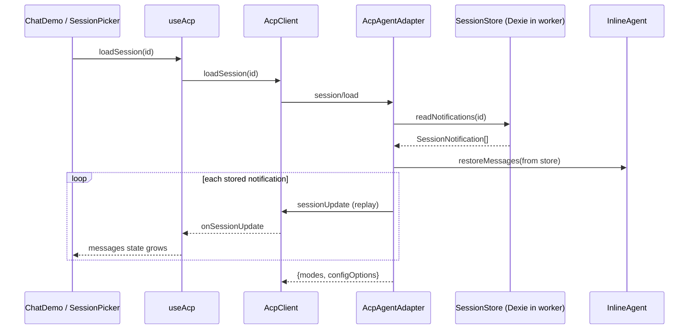

# web-acp M1 — ACP Sessions

## Decision log (settled before plan time)

- **Resume path:** ACP stable `session/load`. Advertised via `agentCapabilities.loadSession: true` at Phase C entry. Justification: principle 6 (ACP extensibility before sub-protocols); `session/load` is in `schema.json`, not `schema.unstable.json`; pi-acp (`/Users/amir36/Documents/workspace/src/github.com/svkozak/pi-acp/src/acp/agent.ts:796`) implements it identically; remote-agent transport later requires agent-authoritative state.
- **Store owner:** Worker (`AcpAgentAdapter`). Main-thread stays a presenter. Matches `bodhi/listModels` pattern in `packages/web-acp/src/acp/agent-adapter.ts:148`. Alternatives (client-authoritative / stateless coordinator) rejected — see trade-off analysis shared with the user; both require bespoke `_meta` extensions that violate principle 2.
- **Listing surface:** Bodhi ext method `bodhi/listSessions`. Upstream `session/list` exists (`ClientSideConnection.listSessions`) but lands only in `schema.unstable.json`; M0 committed to stable. When upstream stabilises, we rename the method id and keep the response shape compatible.
- **Replay shape:** Verbatim re-emission of stored `SessionNotification`s. Matches ACP's "stream the entire conversation history back to the client via notifications" text in `schema.json` § `LoadSessionRequest`. Migration risk: if `pi-agent-core`'s message shape drifts, old rows replay with stale fields. Mitigation: `schemaVersion` column per row; the adapter refuses to replay a row whose `schemaVersion > CURRENT` and skips (with a warning) rows whose `schemaVersion < CURRENT` when a dedicated migrator is not yet written.
- **M0 hardening items** (second transport, worker-boundary e2e) — **deferred** per user decision. Not in this plan.

## What ships end-to-end

- A user who refreshes the page while a session is active finds it in a picker, opens it, and the transcript re-renders exactly as it was.
- The picker lists all past sessions newest-first with a truncated title (derived from the first user prompt).
- "New chat" leaves the active session in the list and starts a fresh one.
- The existing `chat.spec.ts` remains untouched and green at every commit.
- Three new e2e specs cover persist, list, and switch.

## Architecture at Phase D exit

## Phase A — Worker-side session store (no UI surface)

**Goal:** persistence lands without main-thread changes; existing e2e stays green because there is no new surface yet. Every emitted notification is recorded; turn boundaries update the session row.

### Files

- **New** [`packages/web-acp/src/agent/session-store.ts`](packages/web-acp/src/agent/session-store.ts) — Dexie schema + `SessionStore` class:
  - Dep add: `dexie@^4` to `packages/web-acp/package.json`.
  - DB name: `web-acp` (distinct from web-agent's `web-agent`).
  - Table `sessions`: `{id: string (pk), createdAt: number, updatedAt: number, title: string | null, turnCount: number, schemaVersion: number}`.
  - Table `entries`: compound pk `[sessionId+seq]`, indexed on `[sessionId+seq]`, fields `{sessionId, seq, at: number, kind: 'notification' | 'turn', payload, schemaVersion}`. `payload` is the raw `SessionNotification` for `kind: 'notification'` and `{userText: string, finalMessages: AgentMessage[]}` for `kind: 'turn'` (captured from `InlineAgent.getMessages()` after the turn resolves — used to rehydrate `InlineAgent.state.messages` on load without re-deriving from chunks).
  - CRUD: `createSession(id)`, `recordNotification(id, notification)`, `recordTurn(id, userText, finalMessages)`, `listSummaries()`, `readEntries(id)`, `setTitle(id, title)`, `deleteSession(id)`.
  - All appends inside a Dexie transaction; `seq` allocated inside the transaction to guarantee monotonic ordering.
- **Edit** [`packages/web-acp/src/acp/agent-adapter.ts`](packages/web-acp/src/acp/agent-adapter.ts):
  - Constructor accepts an optional `SessionStore` (falsy in unit tests means memory-only fallback so unit tests can stay fast; production always passes one).
  - `newSession` calls `store.createSession(sessionId)` after generating the id; failure throws.
  - `#forwardEvent` (and the future tool-call emitters) now wrap `this.#conn.sessionUpdate(notification)` in a helper `#emit(sessionId, notification)` that also calls `store.recordNotification(sessionId, notification)` on the same path. Keeps "what we stored" bit-identical to "what we emitted".
  - `prompt` on clean `end_turn` calls `store.recordTurn(sessionId, text, this.#inline.getMessages())` — captures the full `AgentMessage[]` for restore.
- **Edit** [`packages/web-acp/src/agent/agent-worker.ts`](packages/web-acp/src/agent/agent-worker.ts): instantiates `new SessionStore()` lazily inside `startAgent` (top-level dynamic import to keep the store off the main thread's bundle graph); passes it to `new AcpAgentAdapter(...)`.
- **Edit** [`packages/web-acp/src/agent/inline-agent.ts`](packages/web-acp/src/agent/inline-agent.ts): add `restoreMessages(messages: AgentMessage[]): void` — assigns `agent.state.messages = [...messages]`. Used by Phase C's `loadSession`. Doesn't fire events (parallel to `web-agent`'s `AgentSession.restoreMessages` in [`ai-docs/specs/worker-agent/agent-session.md`](ai-docs/specs/worker-agent/agent-session.md)).
- **New** [`packages/web-acp/src/agent/session-store.test.ts`](packages/web-acp/src/agent/session-store.test.ts) — vitest. Uses `fake-indexeddb` for jsdom. Covers: create → append notifications → append turn → read-back order preserved; `seq` monotonic under concurrent appends; schemaVersion filtering.

### Spec update (same commit)

- **New** [`ai-docs/web-acp/specs/web-acp/sessions.md`](ai-docs/web-acp/specs/web-acp/sessions.md) — full topic spec for the store. Covers schema, CRUD, invariants, what Phase A does vs Phase B/C additions.
- **Edit** [`ai-docs/web-acp/specs/web-acp/index.md`](ai-docs/web-acp/specs/web-acp/index.md) — add `sessions.md` to the navigation table; add the new folder `src/agent/session-store.ts` to "Folder layout".
- **Edit** [`ai-docs/web-acp/specs/web-acp/agent.md`](ai-docs/web-acp/specs/web-acp/agent.md) — add the `restoreMessages` method to the `InlineAgent` shape; note the session-store hand-off.
- **Edit** [`ai-docs/web-acp/specs/web-acp/acp.md`](ai-docs/web-acp/specs/web-acp/acp.md) — note that `#forwardEvent` now persists alongside emission; `prompt` calls `recordTurn` on `end_turn`.

### Gate

- `npm run check` clean at package root.
- `npm run test:e2e` green — `chat.spec.ts` unchanged.
- Vitest covers `session-store.test.ts`.

### Commit

- Single commit: `web-acp: M1 phase A — worker-side session store`.

## Phase B — List past sessions (`bodhi/listSessions` + picker UI)

**Goal:** the user can see and select a past session. Selection does not yet resume it (picker is read-only for this phase); Phase C wires the click.

### Files

- **Edit** [`packages/web-acp/src/acp/index.ts`](packages/web-acp/src/acp/index.ts): add constant `BODHI_LIST_SESSIONS_METHOD = 'bodhi/listSessions'`; add `BodhiSessionSummary { id: string; title: string | null; createdAt: number; updatedAt: number; turnCount: number }` and `BodhiListSessionsResponse { sessions: BodhiSessionSummary[] }`.
- **Edit** [`packages/web-acp/src/acp/agent-adapter.ts`](packages/web-acp/src/acp/agent-adapter.ts): extend `extMethod` to handle `BODHI_LIST_SESSIONS_METHOD`; returns `{ sessions: await store.listSummaries() }`.
- **Edit** [`packages/web-acp/src/acp/client.ts`](packages/web-acp/src/acp/client.ts): add `listSessions(): Promise<BodhiSessionSummary[]>` — wraps the ext method.
- **Edit** [`packages/web-acp/src/hooks/useAcp.ts`](packages/web-acp/src/hooks/useAcp.ts):
  - New module-scope `_sessions: BodhiSessionSummary[]`, React state `sessions`, and `refreshSessions()` callback.
  - Auth effect (existing) additionally triggers `refreshSessions()` after `listModels` resolves; turn completion triggers `refreshSessions()` (best-effort, fire-and-forget).
  - Hook return shape grows: `sessions`, `refreshSessions`. No `loadSession`, no `currentSessionId` yet.
- **New** [`packages/web-acp/src/components/chat/SessionPicker.tsx`](packages/web-acp/src/components/chat/SessionPicker.tsx): minimal shadcn popover/list; shows sessions by `updatedAt DESC`; renders `title ?? fallback`. Click does nothing in Phase B (record the ref; wire in Phase C). `data-testid="session-picker"` + `data-testid="session-item"` for e2e.
- **Edit** [`packages/web-acp/src/components/chat/ChatDemo.tsx`](packages/web-acp/src/components/chat/ChatDemo.tsx): renders `<SessionPicker>` next to the existing model combobox.
- **Edit** [`packages/web-acp/src/agent/session-store.ts`](packages/web-acp/src/agent/session-store.ts): add derived title — when `recordTurn` runs with `turnCount === 0`, derive a truncated title from `userText.slice(0, 60)` and save via `setTitle`. Keeps title work out of the UI.

### New e2e

- **New** [`packages/web-acp/e2e/sessions-persist.spec.ts`](packages/web-acp/e2e/sessions-persist.spec.ts) — mirrors `chat.spec.ts` setup, adds steps:
  - `test.step('a prompt creates a session entry', …)` — open `SessionPicker`, assert ≥1 session item with the truncated title.
  - `test.step('session survives page reload', …)` — reload, assert the picker still shows the entry with matching title.
  - Uses real LLM round-trip (same `.env.test`).

### Spec update (same commit)

- **Edit** [`ai-docs/web-acp/specs/web-acp/sessions.md`](ai-docs/web-acp/specs/web-acp/sessions.md) — document `bodhi/listSessions` wire shape and title derivation.
- **Edit** [`ai-docs/web-acp/specs/web-acp/acp.md`](ai-docs/web-acp/specs/web-acp/acp.md) — add the ext method under "Methods" + note the stable/unstable rationale for not using upstream `session/list`.
- **Edit** [`ai-docs/web-acp/specs/web-acp/hook.md`](ai-docs/web-acp/specs/web-acp/hook.md) — add `sessions`/`refreshSessions` to the state and return shape.
- **Edit** [`ai-docs/web-acp/specs/web-acp/startup-sequence.md`](ai-docs/web-acp/specs/web-acp/startup-sequence.md) — Phase 2 (auth/catalog) concludes with `refreshSessions()`; add a note.

### Gate

- `npm run check` clean.
- `npm run test:e2e` green — both `chat.spec.ts` and the new `sessions-persist.spec.ts`.

### Commit

- `web-acp: M1 phase B — list sessions via bodhi/listSessions`.

## Phase C — Resume sessions (`session/load` + switcher)

**Goal:** selecting a session in the picker re-renders its transcript, with the worker's `InlineAgent` restored so follow-up prompts are coherent.

### Files

- **Edit** [`packages/web-acp/src/acp/agent-adapter.ts`](packages/web-acp/src/acp/agent-adapter.ts):
  - `initialize` now returns `agentCapabilities.loadSession: true`.
  - Implement `async loadSession(params: LoadSessionRequest): Promise<LoadSessionResponse>` — reads entries via `store.readEntries`; for each `kind: 'notification'` entry, calls `this.#conn.sessionUpdate(entry.payload)` in order; for the latest `kind: 'turn'` entry, calls `this.#inline.restoreMessages(entry.payload.finalMessages)`. `this.#sessions.set(sessionId, {id})`. Returns `{ modes: null, configOptions: null }` (stable schema allows both-null). Rejects unknown `sessionId` with `Error('Unknown session: …')`.
  - `clearMessages` inside `authenticate` becomes conditional on no restored session — we shouldn't wipe `InlineAgent` messages mid-replay. Auth changes still clear the catalog cache.
- **Edit** [`packages/web-acp/src/acp/client.ts`](packages/web-acp/src/acp/client.ts): add `loadSession(sessionId: string): Promise<void>` — wraps `#conn.loadSession({sessionId, cwd: '/', mcpServers: []})`.
- **Edit** [`packages/web-acp/src/hooks/useAcp.ts`](packages/web-acp/src/hooks/useAcp.ts):
  - Module-scope `_session` becomes the "current session id"; an additional `_sessionReplayId` ref tracks in-flight replays so the `onSessionUpdate` listener knows whether incoming updates are for the live turn or a replay (affects how we finalise per-turn messages — replay finalises on each new `messageId`, live keeps the streaming buffer).
  - New callback `loadSession(id: string)`: cancels any in-flight turn (as in `clearMessages`); sets `_sessionReplayId = id`; clears React `messages`; `await client.loadSession(id)`; on resolve, flushes any buffered replay message into `messages` and sets `_session = id`; `_sessionReplayId = null`.
  - `ensureSession` keeps its behaviour for the "no current session" path; `loadSession` simply short-circuits it.
  - Return shape gains `loadSession` and `currentSessionId`.
- **Edit** [`packages/web-acp/src/components/chat/SessionPicker.tsx`](packages/web-acp/src/components/chat/SessionPicker.tsx): click handler calls `loadSession(session.id)`; active item highlighted via `currentSessionId`.
- **Edit** [`packages/web-acp/src/agent/session-store.ts`](packages/web-acp/src/agent/session-store.ts): no schema changes; add `readEntries(sessionId)` if not already exposed (Phase A added a private `readEntries`, Phase C exposes it).

### New e2e

- **New** [`packages/web-acp/e2e/sessions-resume.spec.ts`](packages/web-acp/e2e/sessions-resume.spec.ts):
  - `test.step('send initial prompt', …)` — runs the "monday" prompt, waits for assistant turn, asserts `tuesday`.
  - `test.step('reload and restore session', …)` — `page.reload()`, opens `SessionPicker`, clicks the entry, waits for `ChatMessages` to show two DOM witnesses (the user prompt + an assistant reply containing `tuesday`).
  - `test.step('follow-up prompt uses restored context', …)` — sends `"and which day comes after that? one word"`, expects assistant reply containing `wednesday`. This is the DOM-witness that `InlineAgent.state.messages` really was restored.

### Spec update (same commit)

- **Edit** [`ai-docs/web-acp/specs/web-acp/sessions.md`](ai-docs/web-acp/specs/web-acp/sessions.md) — `session/load` replay algorithm + migration-risk note.
- **Edit** [`ai-docs/web-acp/specs/web-acp/acp.md`](ai-docs/web-acp/specs/web-acp/acp.md) — add `loadSession` method doc; update the `initialize` response example to show `loadSession: true`.
- **Edit** [`ai-docs/web-acp/specs/web-acp/hook.md`](ai-docs/web-acp/specs/web-acp/hook.md) — `loadSession`, `currentSessionId`, and replay semantics in the accumulator.
- **Edit** [`ai-docs/web-acp/specs/web-acp/startup-sequence.md`](ai-docs/web-acp/specs/web-acp/startup-sequence.md) — new Phase 2.5 "Resume a session" between Phase 2 and Phase 3, with the full replay sequence.

### Gate

- `npm run check` clean.
- All three e2e specs green (`chat.spec.ts`, `sessions-persist.spec.ts`, `sessions-resume.spec.ts`).
- Grep gate: `rg "bodhi/listSessions|session/load" packages/web-acp/src/` hits only `acp/*.ts` + the hook's consumer (no leakage into `components/` or `lib/`).

### Commit

- `web-acp: M1 phase C — resume sessions via session/load`.

## Phase D — Polish + exit gate

**Goal:** tighten the UX; close M1 with clean docs and a single-spec run that exercises persist + list + switch together.

### Files

- **Edit** [`packages/web-acp/src/hooks/useAcp.ts`](packages/web-acp/src/hooks/useAcp.ts):
  - `clearMessages` renamed conceptually to "New chat": cancels the current session (already does), leaves it in the store (already does), nulls `_session` (already does). No behavioural change — name audit only.
  - Expose `renameSession(id, title)` wired to `store.setTitle` via a new `bodhi/renameSession` ext method. Stretch scope; cut cleanly if we hit gate pressure.
  - Expose `deleteSession(id)` wired to `store.deleteSession` via a new `bodhi/deleteSession` ext method. Same stretch-scope note.
- **Edit** [`packages/web-acp/src/components/chat/SessionPicker.tsx`](packages/web-acp/src/components/chat/SessionPicker.tsx): per-row rename/delete affordances (stretch).
- **New** [`packages/web-acp/e2e/sessions-lifecycle.spec.ts`](packages/web-acp/e2e/sessions-lifecycle.spec.ts): one "rich" spec per principle 8. Runs the full cycle — send → reload → list → switch → follow-up → new chat → list shows two → switch back → assert restored. Replaces the thin persist/resume specs only if Phase D stretch lands; otherwise all three coexist.

### Spec update (same commit)

- **Edit** [`ai-docs/web-acp/specs/web-acp/sessions.md`](ai-docs/web-acp/specs/web-acp/sessions.md) — document rename/delete ext methods (if shipped).
- **Edit** [`ai-docs/web-acp/milestones/m1-sessions.md`](ai-docs/web-acp/milestones/m1-sessions.md) — mark status as shipped; link to this plan; close the `session/load` open question with the decision rationale.

### Gate (M1 exit)

- `npm run check` clean.
- `npm run ci:test:e2e` green in CI with real-LLM traffic.
- All four e2e specs pass (three new + one unchanged).
- `ai-docs/web-acp/specs/web-acp/` is internally consistent: no dangling references, `index.md` navigation table includes `sessions.md`, change-procedure checklist satisfied on every commit.
- `rg "_sessions\\|_session\\b" packages/web-acp/src/hooks/useAcp.ts | wc -l` shows module-scope state is still a small, named set (guards against accidental state sprawl).

### Commit

- `web-acp: M1 phase D — session polish + M1 exit gate`.

## Next-milestone kickoff (final task)

Per user instruction, drop the kickoff prompt before the M1 gate commit closes:

- **New** [`ai-docs/web-acp/prompts/002-m1-sessions.md`](ai-docs/web-acp/prompts/002-m1-sessions.md) — the equivalent of `001-explore.md` for this milestone: cites this plan, lists the deliverables per phase, pre-approved decisions (worker-owned, `session/load`, Bodhi ext for listing, verbatim replay), hard constraints (don't edit `chat.spec.ts`; ZenFS integration out of scope), exit criteria matching the Phase D gate.
- **New** [`ai-docs/web-acp/prompts/003-m2-tools.md`](ai-docs/web-acp/prompts/003-m2-tools.md) — **skeleton only** — one-paragraph framing for the next milestone pointing at [`ai-docs/web-acp/milestones/m2-tools.md`](ai-docs/web-acp/milestones/m2-tools.md) and noting M1's output it can rely on (worker-owned store, ACP replay, session picker).

## Risks and mitigations

- **pi-agent-core message drift.** Mitigated by `schemaVersion` per row + explicit refusal to replay unknown-future versions. Documented in `sessions.md`.
- **Dexie bundle cost.** Worker-only; adds to the worker chunk, not the main chunk. Measured at Phase A completion; if the worker chunk grows >150 KB gzipped, reconsider tree-shaking or a custom thin IndexedDB wrapper.
- **Replay ordering vs messageId cursor.** The hook's `streamingMessageIdRef` logic already keys on `messageId` transitions, which are preserved in stored notifications. Verified manually in Phase C.
- **Concurrent second tab.** Dexie IndexedDB is multi-tab safe (principle 4). A second tab will see appends from the first on its next `refreshSessions()`. No cross-tab liveQuery needed for M1; punt to a later milestone if the UX warrants it.
- **`loadSession` advertised vs implemented.** We flip `loadSession: true` only at Phase C entry. Phase A/B commits still advertise `false`; M1's Phase C commit is the atomic flip.

## Out of scope (M1) — explicit

- Fork / branch / navigate — M3.
- Compaction entries — M4.
- Cross-tab live session-list updates.
- Encryption at rest.
- LLM-generated titles (truncated-prefix title is sufficient).
- Upstream `session/list` adoption — revisit when it stabilises; migration is a renamed constant + unchanged response shape.
- Second (test-double) transport + worker-boundary e2e assertion — still an M0 follow-up, not bundled here per user decision.