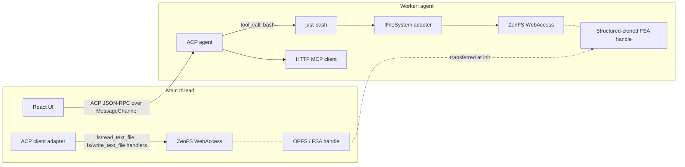

# web-acp roadmap revision: just-bash + agent-owned FS

## Core decision

Adopt **just-bash** ([vercel-labs/just-bash](https://github.com/vercel-labs/just-bash)) as the LLM-facing tool surface for workspace operations. This forces one architectural choice:

- **Filesystem owned by the agent (worker), not the client.**

Reason: ACP `fs/*` exposes only `fs/read_text_file` and `fs/write_text_file` (editor-buffer bridge — see [agent-client-protocol/docs/protocol/file-system.mdx](../../../../agentclientprotocol/agent-client-protocol/docs/protocol/file-system.mdx)). just-bash's [`IFileSystem`](../../../../vercel-labs/just-bash/src/fs/interface.ts) needs ~25 methods (`readdir`, `stat`, `mkdir`, `rm`, `cp`, `mv`, `symlink`, `chmod`, `lstat`, `realpath`, `utimes`, …). Piping just-bash through ACP `fs/*` would require ~12 custom `_bodhi/fs/*` extension methods — a bigger, uglier non-ACP surface than just mounting the vault in the worker.

## Architectural posture (revised)

- Worker owns the vault via a structured-cloned FSA handle → ZenFS → just-bash `IFileSystem` adapter (likely `MountableFs` with `/vault` mounted over a thin ZenFS wrapper, plus `InMemoryFs` base for `/tmp` etc.).
- Tools surface to the LLM: **one tool, `bash`**. Pipes, redirection, scripting, `jq`, `rg` — all free.
- Permission gating: just-bash transform plugin intercepts destructive commands (`rm`, `mv`, redirect-write) and routes to ACP `session/request_permission`. Read-only (`cat`, `ls`, `grep`, `find`, `rg`, `stat`, `wc`, `diff`) auto-allowed.
- Tool-call reporting: ACP `session/update (tool_call)` with `kind: 'execute'` for each `bash.exec`; sub-commands exposed via CommandCollector metadata when useful.
- `fs/*` advertised (`fs.readTextFile = true`, `fs.writeTextFile = true`) with client handlers implemented against the same ZenFS store. Built-in bash tools do **not** use them; they're the future IDE-integration seam for unsaved buffer state or when a non-web ACP client connects.
- Network: just-bash `network` disabled by default; enable `curl` with explicit allow-lists when a session requests web access (M4/M5 concern).

### Compliance statement (explicit divergence)

| Concern | ACP canonical | web-acp (post just-bash) | Why the divergence |
|---|---|---|---|
| Filesystem | Client-delegated via `fs/read_text_file` / `fs/write_text_file` | Agent-owned (worker-mounted ZenFS + just-bash VFS) | just-bash needs ~25 FS methods; ACP `fs/*` has 2. Forcing would require ~12 non-standard extension methods. |
| Tool execution | Agent | Agent | Compliant |
| Tool reporting | `session/update (tool_call)` | `session/update (tool_call)` | Compliant |
| Permission | `session/request_permission` | `session/request_permission` (bridged from just-bash transform plugin) | Compliant |
| MCP | Agent is MCP client | Agent is MCP client (HTTP) | Compliant |
| `fs/*` handlers | Implemented by client | Implemented by client; advertised but not used by built-ins | Compliant (method surface), unused by default |

Replace bullet lists above with markdown tables only in the plan doc — actual steering docs should use bullet lists per workspace rules.

## Files to create / edit

### Milestones

- **[ai-docs/web-acp/milestones/index.md](ai-docs/web-acp/milestones/index.md)** — rewrite status board to M2–M8; add "ACP compliance at a glance" subsection and a "Scope adjustments: just-bash adoption + agent-owned FS" paragraph.
- **[ai-docs/web-acp/milestones/m2-tools.md](ai-docs/web-acp/milestones/m2-tools.md)** — rename/retitle to **"Vault mount + just-bash shell tool"**. Scope:
  - M2.1: Vault FSA handle transfer (main → worker) + ZenFS WebAccess mount.
  - M2.2: just-bash integration; `MountableFs` with `/vault` + `/tmp`; single `bash` tool registration with the LLM.
  - M2.3: Permission bridge (just-bash transform → `session/request_permission`) with default allow-list (read-only) and confirm-list (destructive).
  - M2.4: ACP `fs/read_text_file` + `fs/write_text_file` client handlers against the same ZenFS store (future-facing; not used by bash).
  - Exit criteria: LLM can `cat`, `ls`, `grep`, `find`, `rg`, `sed`, `jq` over the vault; destructive ops prompt; tool_call updates stream correctly.
- **[ai-docs/web-acp/milestones/m3-mcp-and-native-tools.md](ai-docs/web-acp/milestones/m3-mcp-and-native-tools.md)** (new) — agent-side HTTP MCP client + provider-native tool passthrough (OpenAI `web_search`, etc.). Cite [session-setup.mdx](../../../../agentclientprotocol/agent-client-protocol/docs/protocol/session-setup.mdx) and [claude-agent-acp/src/acp-agent.ts](../../../../agentclientprotocol/claude-agent-acp/src/acp-agent.ts).
- Rename **m5-resources.md → m4-commands-and-skills.md**; restructure around slash commands, prompt templates, skills.
- Rename **m6-extensions.md → m5-extensions.md**; tighten to vault-sourced runtime only.
- Rename **m3-session-tree.md → m6-session-tree.md**; rewrite around `session/fork` (unstable, behind flag) + `session/list` (stable).
- Rename **m4-compaction.md → m7-compaction.md** (content unchanged).
- Rename **m7-polish-and-extract.md → m8-polish-and-extract.md**.

### Steering

- **[ai-docs/web-acp/steering/02-architecture.md](ai-docs/web-acp/steering/02-architecture.md)** — add "ACP architectural postures" section with the 4-variation matrix; add **"just-bash integration"** subsection explaining the FS-ownership flip; mark chosen posture as **Variation B (agent-owned FS)** with explicit rationale tied to just-bash's `IFileSystem` interface.
- **[ai-docs/web-acp/steering/04-principles.md](ai-docs/web-acp/steering/04-principles.md)** — add:
  - "Extension methods must be prefixed with `_` and namespaced (`_bodhi/…`)"
  - "Agent owns all tool surfaces"
  - "Filesystem ownership follows the richest tool's interface needs — document the divergence if `fs/*` alone is insufficient"

### Specs

- **[ai-docs/web-acp/specs/web-acp/index.md](ai-docs/web-acp/specs/web-acp/index.md)** — update "Scope out (deferred)" to the new M2–M8 lineup; add a one-line note on just-bash adoption.

### Next-phase prompt

- **ai-docs/web-acp/prompts/003-m2-vault-and-shell.md** (new) — executable prompt for the rescoped M2. Include: vault mount plan, just-bash worker integration, permission bridge, `fs/*` handler stubs, exit criteria, gate-check list, commit instructions.
- **[ai-docs/web-acp/prompts/003-m2-tools.md](ai-docs/web-acp/prompts/003-m2-tools.md)** — convert to a one-line pointer stub redirecting to `003-m2-vault-and-shell.md`.

## Out of scope for this turn

- No runtime code edits (this is a planning turn).
- No compatibility reports yet (`web-acp-vs-standard-acp` and `web-acp-vs-coding-agent` remain as M2-exit tasks).
- Remote-agent deployment modality is documented as a future concern in `02-architecture.md` but not designed here.
