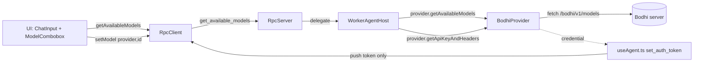

# Worker-owned model catalog (web-agent)

## Goal

Move the `/bodhi/v1/models` fetch from the main thread into the Worker's Bodhi provider. Re-frame the concrete provider as a Bodhi **gateway** that owns both auth and a multi-format catalog; the `worker-agent` interface grows to cover both. Treat the existing `e2e/model-switch.spec.ts` as the behaviour-preserving gate.

## Architecture after the change

The main thread pushes **only** the rotating credential. Everything about the catalog (fetch, mapping, baseUrl selection per format) lives worker-side.

## Key design decisions (from clarifications)

- **Unified `LlmProvider` interface** (rename from `LlmAuthProvider`) with both `getApiKeyAndHeaders` and `getAvailableModels` as required methods. Class renames: `BodhiAuthProvider` -> `BodhiProvider`.
- **On-demand fetch, no cache.** Every `get_available_models` hits the Bodhi endpoint. Internal worker-side operations that need to resolve a model identifier (setModel, session restore) also call `provider.getAvailableModels()`.
- **UI consumes `Model<Api>[]` directly.** Drop the `BodhiModelInfo` projection on the main thread. Kill `lib/bodhi-models.ts` and most of `lib/agent-model.ts`.

## Endpoint contract + metadata extraction

Worker calls `GET {baseUrl}/bodhi/v1/models?page_size=100` with `Authorization: Bearer <token>`. Maps `PaginatedAliasResponse.data` → `Model<Api>[]` with real upstream metadata instead of today's hardcoded `contextWindow: 128000 / maxTokens: 4096`:

- `UserAliasResponse` / `ModelAliasResponse` (local) -> `{ api: 'openai-completions', provider: 'openai', baseUrl: `${root}/v1`, id: alias, contextWindow: metadata?.context.max_input_tokens ?? 128000, maxTokens: metadata?.context.max_output_tokens ?? 4096 }`.
- `ApiAliasResponse` -> iterate `.models[]`, dispatch on `api_format` + per-variant metadata:
  - `openai` / `openai_responses` -> OpenAI `Model` variant has only `id/owned_by/created`; fall back to defaults for context/max.
  - `anthropic` / `anthropic_oauth` -> `AnthropicModel.max_input_tokens` / `max_tokens`. `baseUrl = `${root}/anthropic/v1`` (matches today's `getBaseUrl`).
  - `gemini` -> `GeminiModel.inputTokenLimit` / `outputTokenLimit`. `id` is `name.replace(/^models\//, '')`. `baseUrl = `${root}/v1beta``.
- `prefix` on `ApiAliasResponse` is prepended to the id (preserves today's behaviour in `flattenAlias`).

Mapping tables for `api_format -> pi-ai Api` and `api_format -> provider` move verbatim from `lib/agent-model.ts` into the new worker-side file.

## Files to change

### New / rewrites

- `packages/web-agent/src/worker-agent/llm/types.ts` -> rename `LlmAuthProvider` -> `LlmProvider`, add required `getAvailableModels(): Promise<Model<Api>[]>`. Keep `LlmAuthCredential` as-is (still auth-shaped).
- `packages/web-agent/src/worker-agent/llm/stream.ts` -> update `createStreamFn(provider: LlmProvider)` type annotation only; logic unchanged.
- `packages/web-agent/src/worker-bodhi/bodhi-provider.ts` (renamed from `bodhi-auth-provider.ts`) -> class `BodhiProvider implements LlmProvider`. Adds:
  - A private `fetchCatalog(): Promise<Model<Api>[]>` implementing the endpoint call + alias flattening + per-format mapping described above.
  - `getAvailableModels()` returning `fetchCatalog()` (on-demand, no cache).
  - Continues holding `token`/`baseUrl` state; tag filter unchanged.
  - Throws a clear error when called without a `token`/`baseUrl`.
- `packages/web-agent/src/worker-bodhi/index.ts` -> re-export `BodhiProvider`, `BODHI_PROVIDER_TAG`.
- `packages/web-agent/src/worker-bodhi/bodhi-provider.test.ts` (renamed) -> add tests for:
  - Mapping each alias/model variant (User, Model, Api-openai, Api-openai_responses, Api-anthropic, Api-gemini) with and without upstream metadata.
  - Fetch failure when token is null.
  - Uses a `fetch` mock (no real network).

### Worker-agent RPC surface

- `packages/web-agent/src/worker-agent/rpc/rpc-types.ts`:
  - Remove `set_available_models` from `RpcCommand` + matching `RpcResponse` row.
  - Extend `RpcSessionLoadedEvent` with `model: { provider: string; id: string } | null` so the main thread applies the restored identifier without a follow-up `getState()` round trip. Drops the drain effect.
- `packages/web-agent/src/worker-agent/rpc/rpc-server.ts`:
  - Remove `set_available_models` from `KNOWN_COMMANDS` and the `handleCommand` switch.
  - Remove the interface member on `AgentSessionHost`.
- `packages/web-agent/src/worker-agent/rpc/rpc-client.ts`:
  - Delete `setAvailableModels(models)`.
  - Keep `getAvailableModels()` (unchanged payload).
  - (No change needed for `onSessionLoaded` consumers — the new `model` field is additive.)

### WorkerAgentHost

`packages/web-agent/src/worker-agent/worker/worker-host.ts`:

- Take `LlmProvider` in the constructor instead of `LlmAuthProvider`.
- Delete `availableModels` field, `setAvailableModels`, `findModel` (local lookup). Delete the boot-race-recovery branch.
- `getAvailableModels()` -> `return this.provider.getAvailableModels()`.
- `setModel(provider, modelId)` -> fetch via `provider.getAvailableModels()`, find match, call `session.setModel(resolved)`, then run the existing `appendModelChange` dedupe path. Behavior identical; just the list source changed.
- `restoreModelFromContext(ctxModel)` -> when `ctxModel` non-null, await `provider.getAvailableModels()`, find match, set on session. If no match, leave session model undefined and let the main thread fall back.
- `emitSessionLoaded()` -> populate the new `model: ctx.model` field on the envelope from `buildSessionContext().model` (already a `{ provider, modelId } | null`; remap key `modelId` -> `id` for consistency with `Model<Api>.id`).

### Boot shims

- `packages/web-agent/src/worker-agent/worker/agent-worker.ts` and `worker/boot.ts`: swap `BodhiAuthProvider` -> `BodhiProvider`. Constructor signature to `WorkerAgentHost` is unchanged (just the type name).

### Main-thread plumbing deletions

- `packages/web-agent/src/lib/bodhi-models.ts` -> delete (moved into worker-bodhi).
- `packages/web-agent/src/lib/agent-model.ts` -> delete. `apiFormatToPiApi`, `apiFormatToProvider`, `getBaseUrl`, `buildModel`, `getServerUrlOrThrow` move into the worker-bodhi file (private helpers). If any UI spot still needs a helper it should derive from `Model<Api>.provider`/`.api` directly.
- `packages/web-agent/src/hooks/useAgent.ts`:
  - `models` becomes `Model<Api>[]`.
  - Delete `pendingRestoredModelRef`, `applyRestoredModelIdentifier`, `modelsRef`, and the drain effect on `[models]`.
  - `loadModels` -> `setModels(await rpcClient.getAvailableModels())`. No `setAvailableModels` push. No mapping. No `buildModel`.
  - `session_loaded` handler: derive the selected-model combobox state from `event.model` directly; drop the `rpcClient.getState()` follow-up.
  - `sendMessage`: look up `const match = models.find(m => m.id === selectedModel)` and call `rpcClient.setModel(match.provider, match.id)`.
  - `selectedApiFormat` state likely disappears (no longer needed to derive provider).
- `packages/web-agent/src/components/chat/ChatInput.tsx` + `ModelCombobox.tsx`:
  - Accept `Model<Api>[]` (or a narrow `{ id: string; provider: string; name?: string }` projection built inline in `useAgent`).
  - `onSelect(id: string)` — drop the `ApiFormat` arg; `useAgent` resolves provider from the list.
- `packages/web-agent/src/worker-agent/worker/worker-host.test.ts` and `rpc/rpc.test.ts`:
  - Update fakes (`LlmAuthProvider` -> `LlmProvider`, stub `getAvailableModels`).
  - Remove `set_available_models` coverage; extend `get_available_models` coverage to assert it delegates to the provider.

### Specs (MANDATORY per `CLAUDE.md § Functional specs`)

All in the same PR as the code change:

- `ai-docs/specs/worker-agent/index.md`: Scope-in / actors: model registry is no longer "seeded from main thread"; update to "fetched by the injected `LlmProvider`". Public surface: rename `LlmAuthProvider` -> `LlmProvider`.
- Rename `ai-docs/specs/worker-agent/llm-auth.md` -> `llm-provider.md`; update contents for the unified interface + `getAvailableModels` contract; update the nav entry in `index.md`.
- `ai-docs/specs/worker-agent/rpc.md`: delete the `set_available_models` row; add the new `model` field to the `RpcSessionLoadedEvent` description. Note in the `get_available_models` row that the handler is now provider-backed.
- `ai-docs/specs/worker-bodhi/index.md`, `bodhi-auth-provider.md` (rename file -> `bodhi-provider.md`), `integration.md`: rename the class, document `getAvailableModels`, document the fetch contract (endpoint, headers, metadata mapping), update the "Scope out" note (catalog fetching is now IN scope).

## What gets deleted (inventory)

- RPC command `set_available_models` + response row; client method `setAvailableModels`; server handler; `AgentSessionHost.setAvailableModels` member.
- `WorkerAgentHost.availableModels` field, `findModel`, boot-race recovery block.
- `lib/bodhi-models.ts` (entire file).
- `lib/agent-model.ts` (entire file; helpers folded into `worker-bodhi/bodhi-provider.ts`).
- In `useAgent.ts`: `pendingRestoredModelRef`, `applyRestoredModelIdentifier`, `modelsRef`, drain effect, the post-session_loaded `getState` round trip, `selectedApiFormat` state (unless still needed elsewhere).

## Risks / follow-ups

- **Repeated fetches.** "On demand always" means `setModel` + session restore each trigger an extra fetch on top of the UI's `getAvailableModels`. Acceptable for now; a transient last-fetched list or a short TTL can be added later if latency shows up.
- **Token-not-set errors.** `getAvailableModels` called before `set_auth_token` will throw. The UI already gates on `isAuthenticated`, so this should not fire in normal flows; we add a descriptive error.
- **Structured-clone safety on `Model<Api>[]`.** pi-ai `Model<Api>` is plain data (matches today's `setAvailableModels` wire shape in reverse); no change to RPC invariants.

## Validation

- Unit: new provider tests for catalog mapping (all variants + missing metadata), updated RPC tests.
- Integration: updated `worker-host.test.ts` + `rpc.test.ts`.
- e2e: `packages/web-agent/e2e/model-switch.spec.ts` passes unchanged — behaviour-preserving gate per the exploratory prompt.
