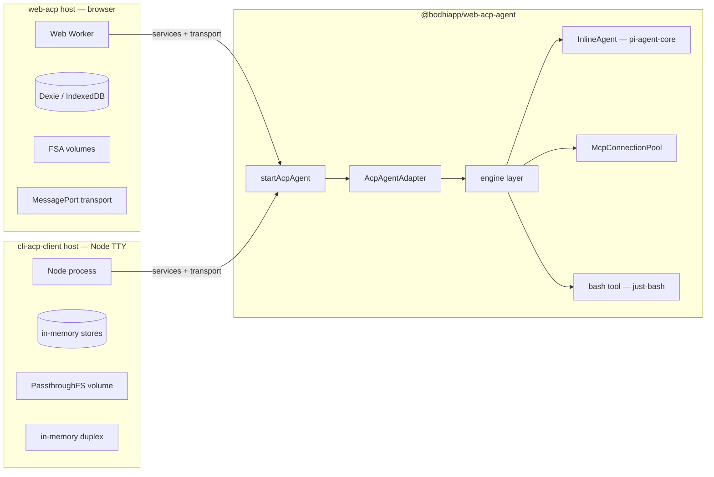
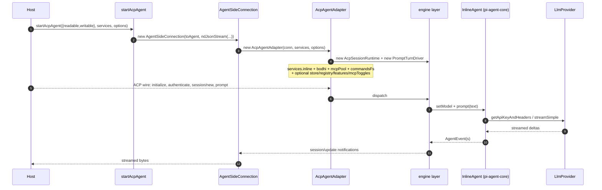

# Chapter 1 — Package shape & seams

> Goal of this chapter: understand **what `@bodhiapp/web-acp-agent` is**,
> **what it owns vs. delegates**, and **why the seams are where they are**.
> Subsequent chapters dive into the wire surface, the engine, the
> pi-agent-core embedding, the BodhiApp auth/catalog plumbing, and a full
> turn trace.

## 1.1 The one-line claim

`@bodhiapp/web-acp-agent` is a **transport-agnostic, runtime-neutral ACP
agent runtime**. It owns everything from the JSON-RPC wire shim down to
the `pi-agent-core` `Agent` instance, the MCP client pool, the bash tool,
and the slash-command loader. It owns **none** of the runtime services
those need: persistence, filesystem backends, transports, or auth flow.
Hosts (browser worker, Node CLI, future HTTP-SSE backend) supply those
through five injectable interfaces and a byte-stream pair.

The package was extracted post-M4 phase B specifically to validate that
the agent code runs unchanged across two materially different hosts:



Same agent bytes, different host bytes above the transport. That is the
load-bearing claim the package's design exists to make true.

## 1.2 Public surface — one function, several types

`packages/web-acp-agent/src/index.ts` re-exports two layers:

- **The boot API.** `startAcpAgent` plus `AcpTransport` /
  `StartAcpAgentOptions`. This is what 99% of hosts call.
- **The toolkit.** Wire constants (`wire/`), the engine pieces
  (`AcpAgentAdapter`, `assembleServices`, `AcpSessionRuntime`), the
  service interfaces (`SessionStore`, `FeatureStore`, `McpToggleStore`,
  `VolumeRegistry`, `LlmProvider`), the concrete `BodhiProvider`,
  `InlineAgent` factory, MCP types, command types, bash-tool factory.
  Hosts use these directly when they need to stand up the runtime in a
  non-standard way (test harnesses, advanced bootstraps).

The boot function — see `bootstrap.ts:startAcpAgent`:

```ts
function startAcpAgent(
  transport: AcpTransport,                 // { readable, writable }
  services: AcpAdapterServices,            // assembled bag
  options: StartAcpAgentOptions            // { isDev, buildVersion, acpSdkVersion, onAdapter? }
): AgentSideConnection
```

Internally it wraps the two byte streams in `ndJsonStream`, constructs an
`AgentSideConnection`, and inside its `toAgent` factory builds an
`AcpAgentAdapter` over the supplied services. `onAdapter` callback
returns the live adapter so the host can call `dispose()` later.

### Why a byte-stream pair, not a `MessagePort`

`MessagePort` is browser-only. `WHATWG ReadableStream` /
`WritableStream<Uint8Array>` is universal — it has implementations in
Node (`stream/web`), Deno, Bun, the browser, and any test harness that
implements `TransformStream`. The two host types this package targets
already have it:

- `web-acp` wraps `MessagePort` into a stream pair via
  `runtime/transport/worker-stream.ts:createMessagePortStream`.
- `cli-acp-client` builds two `TransformStream`s and crosses them
  head-to-tail via `acp/duplex.ts:createInMemoryDuplex`.

A future HTTP-SSE host plugs in the same way — only the streams change.

## 1.3 The five seams

Every dependency the agent has on the host runtime sits behind a typed
interface. The seams aren't accidental — each one is the boundary
between code that has to be portable and code that is necessarily
host-specific.

### Seam 1 — `LlmProvider` (auth + model catalog)

File: `agent/bodhi-provider.ts`. Interface:

```ts
interface LlmProvider {
  getApiKeyAndHeaders(model: Model<Api>): Promise<{ apiKey: string; headers?: Record<string,string> }>
  getAvailableModels(): Promise<Model<Api>[]>
  setAuthToken?(credential: LlmAuthCredential | null): void
}
```

The agent is otherwise auth-agnostic. `BodhiProvider` is the concrete
shipped implementation — it talks to the BodhiApp `/bodhi/v1/models`
endpoint (paginated `AliasResponse`s flattened into `pi-ai`'s
`Model<Api>` shape) and forwards the bearer token from
`setAuthToken`. Anything that implements the three methods above can
back the agent: a direct OpenAI client, a Vercel AI Gateway, a stub for
tests. Chapter 4 dives into this.

### Seam 2 — `SessionStore` (persistence)

File: `storage/session-store.ts`. The store persists three entry kinds
(`'notification' | 'turn' | 'builtin'`) keyed by `[sessionId, seq]` —
turn entries are the canonical replay source for `inline.restoreMessages`
on `session/load`; notification entries replay the streamed
`session/update` events for the UI; builtin entries persist
`/help`-style command exchanges without polluting the LLM context. The
agent package ships only the interface plus `deriveTitle()`; hosts ship
the concrete impl (Dexie/IndexedDB in the browser, in-memory `Map`s in
the CLI).

### Seam 3 — `FeatureStore` (per-session flags)

File: `storage/feature-store.ts`. Tiny key/value bag scoped to one ACP
session. Today's keys: `bashEnabled` (gates bash-tool registration) and
`forceToolCall` (DEV-only: pushes `tool_choice: 'required'` so e2e tests
can force tool calls). `FEATURE_DEFAULTS` plus a layered merge means new
keys roll out without a migration.

### Seam 4 — `McpToggleStore` (per-session MCP enable/disable)

File: `storage/mcp-toggle-store.ts`. Two-level toggles: per-server slug
and per-tool. Defaults are **on** — absent keys mean "not explicitly
disabled" — so a newly-discovered server/tool opts in automatically.
The store interface is independent of the MCP catalog itself; the
catalog comes from upstream Bodhi or a host-side fetch and is composed
with the toggles via `wire-utils.ts:filterHttpServers`.

### Seam 5 — `VolumeRegistry` (filesystem mounts)

File: `agent/volume-registry.ts`. The registry maps `mountName →
ZenFS FileSystem` and mounts each at `/mnt/<mountName>`. **The agent
does not import `@zenfs/dom`**; it accepts a pre-constructed
`FileSystem` from the host. That's what makes the same registry work
behind:

- a `WebAccess`-wrapped `FileSystemDirectoryHandle` (browser), or
- a `PassthroughFS` over `node:fs` rooted at `$cwd` (CLI), or
- an `InMemory` ZenFS backend (tests).

`ZenfsVolumeRegistry` is the shipped implementation — listeners fire
on every `mount` / `unmount` so the adapter can refresh the system
prompt and emit ACP notifications. Chapter 5 covers volumes + bash in
detail.

## 1.4 What the agent owns

Everything below the five seams. Concretely:

| Folder                           | Responsibility                                                                          |
| -------------------------------- | --------------------------------------------------------------------------------------- |
| `acp/agent-adapter.ts`           | ACP `Agent` implementation (wire shim — dispatches to engine, no business logic)        |
| `acp/engine/session-runtime.ts`  | Per-session lifecycle, MCP pool wiring, command loading                                 |
| `acp/engine/prompt-driver.ts`    | One prompt-turn end-to-end (built-in dispatch → LLM stream → tool calls → finalisation) |
| `acp/engine/builtin-dispatch.ts` | `/help` `/version` `/copy` `/session` `/mcp` handlers                                   |
| `acp/engine/ext-methods/`        | Per-file `_bodhi/*` extension method handlers                                           |
| `acp/engine/services.ts`         | `assembleServices()` factory — the deps bag the adapter consumes                        |
| `acp/wire-utils.ts`              | Pure helpers (`extractSessionMeta`, `filterHttpServers`, builtin envelope builders)     |
| `wire/`                          | `_bodhi/*` method-name constants + typed request/response shapes                        |
| `agent/inline-agent.ts`          | Thin `Agent` wrapper from `pi-agent-core` (set/get/prompt/cancel/restoreMessages)       |
| `agent/bodhi-provider.ts`        | `LlmProvider` impl for BodhiApp + catalog flattening                                    |
| `agent/stream-fn.ts`             | `createStreamFn(provider)` — bridges pi-agent-core → pi-ai's `streamSimple`             |
| `agent/system-prompt.ts`         | Composes the system prompt (volume descriptors, etc.)                                   |
| `agent/commands/`                | Vault-sourced slash commands + built-ins surface                                        |
| `agent/mcp/`                     | `McpConnectionPool`, `createMcpClient`, MCP-tool-to-AgentTool adapter                   |
| `agent/tools/bash-tool.ts`       | `just-bash`-backed `bash` AgentTool                                                     |
| `agent/volume-registry.ts`       | Multi-mount ZenFS registry                                                              |
| `mcp/url-canonical.ts`           | Shared MCP URL canonicalisation (also used by hosts)                                    |

The package's hard constraints (verified by grep in CI) are:

- Zero imports from `packages/web-agent/` or `packages/coding-agent/`.
- No browser-only deps: `@zenfs/dom`, `dexie`, `idb-keyval`,
  `MessagePort`, `Worker`, `FileSystemDirectoryHandle`,
  `navigator.storage`, `window.*` — all must be absent.

## 1.5 Boot, drawn

Same wire / same agent / different hosts:



The host's job stops at "supply the streams + the services bag". Nothing
on the agent side cares whether the streams are backed by a worker, a
TCP socket, or two arrays.

## 1.6 Concrete bootstraps (cheat sheet)

Both hosts import everything below the transport boundary from
`@bodhiapp/web-acp-agent` — `BodhiProvider`, `createInlineAgent`,
`createStreamFn`, `assembleServices`, `ZenfsVolumeRegistry`,
`startAcpAgent`. The host-specific code is the services-bag wiring
plus the transport adapter, nothing else.

### Browser — `web-acp` worker

`web-acp/src/agent/agent-worker.ts:startAgent` (the entire
`web-acp/src/agent/` folder is now this **one file**) builds:

- `BodhiProvider` (the `LlmProvider`)
- `InlineAgent` over `createStreamFn(provider, consumeOverrides)`
- Dexie-backed `SessionStore`, `FeatureStore`, `McpToggleStore` from
  `web-acp/src/runtime/storage-dexie/`
- `ZenfsVolumeRegistry` + an FSA-handle volume-control side-channel
  (`web-acp/src/runtime/volumes-fsa/`). Volumes arrive as
  `HostVolumeInit` (FSA handle | dev seed) and are converted to the
  agent's transport-agnostic `VolumeInit` (constructed `FileSystem`)
  via `toAgentVolumeInit` before mounting.
- `MessagePort` ↔ stream pair via
  `web-acp/src/runtime/transport/worker-stream.ts:createMessagePortStream`

…then `assembleServices(...)` and `startAcpAgent(transport, services,
{ isDev, buildVersion, acpSdkVersion })`. The build constants come
from Vite `define` globals on the host side and are forwarded across
the package boundary as plain options — the agent package never sees
Vite.

### Node TTY — `cli-acp-client`

`cli-acp-client/src/acp/embedded-host.ts:createEmbeddedHost` builds:

- `BodhiProvider` (same class) + `InlineAgent` (same factory)
- In-memory `Map`-backed `SessionStore`, `FeatureStore`, `McpToggleStore`
- `ZenfsVolumeRegistry` seeded with a `PassthroughFS` over `node:fs` at
  `$cwd` (mounted at `/mnt/cwd`)
- `createInMemoryDuplex()` returning two `TransformStream` pairs

…then `startAcpAgent(duplex.agent, services, options)`. The client
half of the duplex is wrapped by a `ClientSideConnection` inside the
same Node process — same bytes on both ends.

The diff between the two hosts is about 200 LoC of services-bag wiring
plus the transport adapter.

## 1.7 Reading order from here

| Chapter | Topic                                                                                                               |
| ------- | ------------------------------------------------------------------------------------------------------------------- |
| 2       | ACP wire surface — `AcpAgentAdapter` ↔ engine split, what each ACP method does                                      |
| 3       | Engine internals — `AcpSessionRuntime`, `PromptTurnDriver`, builtin + ext-method dispatch                           |
| 4       | `InlineAgent` + `BodhiProvider` + `createStreamFn` — how `pi-agent-core` is embedded and how BodhiApp auth flows in |
| 5       | Volumes + bash + MCP — the tool surface and its host-supplied backends                                              |
| 6       | A full prompt turn, traced end-to-end with timings and notifications                                                |
| 7       | Tests, e2e seams, and how the two hosts validate transport-neutrality                                               |

---

### Notes / questions surfaced while drafting

- **Extraction is now complete on both hosts** (commit `f6fd1859`,
  "clean up/decoupling of web-acp agent/client"). The browser worker's
  duplicate copies of `acp/{agent-adapter,engine/*,wire-utils}`,
  `agent/{bodhi-provider,inline-agent,stream-fn,system-prompt,
  session-store,commands,mcp,tools,volume-mount,volume-channel}`, plus
  `features/`, `mcp/toggle-store`, `transport/{worker-stream,
  volume-control}` are deleted. Everything below the transport now
  lives only in `@bodhiapp/web-acp-agent`. `web-acp/src/agent/`
  contains exactly one file — `agent-worker.ts` — and it calls
  `startAcpAgent(...)` directly, same as `cli-acp-client`.
- The volume seam in the browser host has a small **two-layer twist**:
  `web-acp/src/runtime/volumes-fsa/` defines `HostVolumeInit` (FSA
  handle | dev seed) that travels across the worker `init` postMessage
  in cloneable form; the worker's `agent-worker.ts:startAgent` then
  maps each via `toAgentVolumeInit` into the agent package's
  `VolumeInit` (which carries a fully-constructed ZenFS `FileSystem`).
  This keeps `@zenfs/dom` out of the agent package — the host
  constructs the `FileSystem`, the agent only mounts it.
- `LlmProvider` is the only seam **without** an "interface in the agent
  package, impl in the host" split — the concrete `BodhiProvider`
  ships inside the agent package itself. That's because the catalog-
  flattening logic is BodhiApp-specific and there's no other provider
  yet to motivate the split. A future OpenAI/Anthropic-direct provider
  would live alongside `BodhiProvider` in the agent package, not in a
  host.
