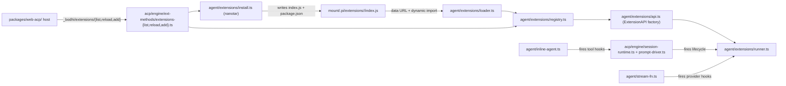

# M6 — Extensions

**Status:** shipped (Phases 0 → 13). Exit gate (Phase 14) closes
M6. Phase plan is captured at
[`../plans/m6-extensions.md`](../plans/m6-extensions.md); the
canonical agent-side spec lives at
[`../specs/web-acp-agent/extensions.md`](../specs/web-acp-agent/extensions.md).

**Host scope.** Agent-primary. The browser host
(`packages/web-acp/`) carries only the Extensions panel hook
(`useExtensions`), the read-only `ExtensionsPanel` component,
volume-tag chips, the `agent-wd` tag wiring on the FSA volume,
and the agent-worker boot path that reads
`extensions:disabled` before `loadAll`.

## ACP compliance

Wire-canonical with one tightly-scoped `_bodhi/extensions/*`
extension namespace (per principle § 15). Extension-registered
tools ride normal `session/update (tool_call)`; extension
commands merge into normal `available_commands_update`. The
agent reaches outside ACP only when stock ACP cannot carry the
surface:

- `_bodhi/extensions/list` (agent → host).
- `_bodhi/extensions/reload` (host → agent, accepts optional
  `disabled?: string[]`).
- `_bodhi/extensions/add` (host → agent, npm install).
- `_bodhi/extensions/state` (agent → host notification —
  broadcast on every registry change so hosts refresh without
  polling).

No new client-facing ACP method was introduced for any
lifecycle hook, custom-provider model, or persistence concern.

## What shipped

A third party can drop a JavaScript module into
`<mount>/.pi/extensions/<name>/index.js` (or install one via
`/extension add npm:<pkg>`) and on next boot have it extend the
agent:

- **System-prompt mutators.** `session_start` and
  `before_agent_start` chain `systemPrompt` patches (Phase 3 —
  `pirate`, `claude-rules`).
- **Input transforms.** `input` callback rewrites or
  short-circuits a user prompt before the LLM sees it (Phase 4 —
  `input-transform`).
- **Custom LLM tools.** `pi.registerTool({ ... })` registers an
  `AgentTool<TSchema>` that the LLM can call (Phase 5 —
  `hello-tool`). Schema declared via `pi.types` (TypeBox
  singleton).
- **Tool gates and result rewrites.** `tool_call` (in-place
  `event.input` mutation, first `block: true` wins) and
  `tool_result` (partial-patch merge) (Phase 6 —
  `protected-paths`, `redact-secrets`).
- **Slash commands.** `pi.registerCommand(name, definition)`
  text-only commands merge into the normal
  `available_commands_update`; the agent dispatches them with
  the same muted-reply + persistence path as built-ins
  (Phase 7 — `commands`).
- **Session state.** `pi.session` exposes
  `{ getId, appendEntry, setName/getName, setLabel,
  sendMessage, sendUserMessage }` so extensions can write
  their own typed `'extension'` `SessionEntry` rows that
  survive reload via `reconstructMessages` (Phase 8 —
  `session-name`, `bookmark`, `session-counter`).
- **Provider observability.** `before_provider_request`
  (replacement payload chain) and `after_provider_response`
  (status + headers) ride `pi-ai`'s `onPayload` / `onResponse`
  hooks (Phase 9 — `provider-payload`, `rate-limit-watch`).
- **Inter-extension events.** `pi.events.on(name, handler)` /
  `pi.events.emit(name, payload)` is an in-memory pub/sub
  (Phase 10 — `event-bus-ping`, `event-bus-pong`).
- **Custom providers + models.** `pi.registerProvider(name,
  config)` contributes provider metadata + per-model entries to
  the agent's catalog. The session model picker selects them
  with no special-casing; the stream-fn resolves the right
  `apiKey` / headers / optional `streamSimple` per turn
  (Phase 11 — `custom-provider-anthropic`).
- **Toggle + reload + persisted disabled list.** `/extension
  list|on|off` plus `_bodhi/extensions/reload`; persistence in
  `PreferenceStore` under `extensions:disabled` applied on
  agent-worker boot (Phase 12).
- **npm install.** `/extension add <pkg>[@<version>]
  [--registry <url>]` plus `_bodhi/extensions/add`. Browser-
  native: direct `fetch()` against `registry.npmjs.org` (CORS-
  permissive since 2022) + `nanotar` (~1 KB ESM, Web Standard
  `DecompressionStream`-based gzip) for tar/gzip. Writes under
  `<agent-wd>/.pi/extensions/<safe>@<version>/` (Phase 13 —
  `pi-greet-fixture` e2e).

**Trust model:** fully trusted, unchanged. Installing an
extension means the user put it in the vault (or accepted the
install via the chat). Rationale at
[`../../web-agent/milestones/deferred.md`](../../web-agent/milestones/deferred.md) §
Extension sandboxing.

## Architecture (as shipped)

## Phase log (as shipped)

Phase commits land in `git log --oneline --grep 'M6 phase'`.
Phases 3–12 batched as a single commit per the user's request;
Phases 0, 1, 2, 13, and 14 are individual commits.

| Phase | Slug | Deliverable | Example extension(s) |
| --- | --- | --- | --- |
| 0 | research + plan | Phase plan + skeleton spec at `extensions.md`; reconcile stale `acp.md` ext-method table. | — |
| 1 | volume tags | `tags?: string[]` on `VolumeInit`/`VolumeSnapshot`; `WELL_KNOWN_VOLUME_TAGS` (`AGENT_WD`, `CWD`, `DATA`); `findByTag`; host tag chips. | — |
| 2 | loader + discovery | `agent/extensions/{loader,registry,api,runner,types}.ts`; `_bodhi/extensions/list`; `resources_discover` placeholder reserved. | `hello-passive` (no-op) |
| 3 | system prompt mutators | `session_start` + `before_agent_start` chained `systemPrompt` patch. | `pirate`, `claude-rules` |
| 4 | input transform | `input` callback (transform chain + `handled` short-circuit). | `input-transform` |
| 5 | custom tools | `pi.registerTool` end-to-end through `inline.setModel({ tools })`; `pi.types` TypeBox singleton. | `hello-tool` |
| 6 | tool gates | `tool_call` (in-place mutation, first `block: true` wins) + `tool_result` (partial-patch merge). | `protected-paths`, `redact-secrets` |
| 7 | slash commands | `pi.registerCommand` text-only; merges into `available_commands_update`. | `commands` |
| 8 | session metadata | `pi.session.{appendEntry, setName, setLabel, sendMessage, sendUserMessage}` + `'extension'` `SessionEntry` kind + replay seam. | `session-name`, `bookmark`, `session-counter` |
| 9 | provider observability | `before_provider_request` (replacement payload chain) + `after_provider_response` (status/headers); `pi-ai` `onPayload` / `onResponse` hooks. | `provider-payload`, `rate-limit-watch` |
| 10 | inter-extension events | `pi.events.on` / `pi.events.emit` typed pub/sub. | `event-bus-ping`, `event-bus-pong` |
| 11 (X) | custom providers | `pi.registerProvider` apiKey path; `oauth` field typed but not e2e'd; provider catalog merge. | `custom-provider-anthropic` |
| 12 (Y) | toggles + reload | `/extension list\|on\|off` + `_bodhi/extensions/reload` + `_bodhi/extensions/state` + `extensions:disabled` persistence. | (re-uses existing) |
| 13 (Z) | npm install | `/extension add <pkg>` + `_bodhi/extensions/add`; `nanotar` tar/gzip; writes under `<agent-wd>/.pi/extensions/<safe>@<version>/`. | `pi-greet-fixture` |
| 14 | exit gate | This re-shape + `prompts/007-m7-templates-and-skills.md` skeleton + exit-audit greps. | — |

## Locked architectural decisions (settled in Phase 0)

These survived contact with the implementation; revisiting any
of them is a milestone-level call, not a per-phase call.

- **Module identity: factory-arg only.** Extensions receive
  `pi: ExtensionAPI` and nothing else. No shared imports across
  extensions. `pi.types` (TypeBox) exposed for tool schemas. No
  `es-module-shims`, no jiti, no `@bodhiapp/web-acp-agent`
  imports inside `<extension>/index.js`.
- **Loader: data URL + dynamic import.** Mirrors the shipped
  pattern. Data URLs (vs blob URLs) so the loader runs in both
  browser/worker hosts and Node test environments. Trade-off:
  no relative imports inside the entry — `import './util.js'`
  has no resolution base. Phase 13 install honours this by
  copying the entry's contents verbatim to `index.js`.
- **OAuth in `pi.registerProvider`: scaffolded surface, no e2e
  in M6.** Phase 11 ships the apiKey-only path. The `oauth`
  field is fully typed and host-bridge-shaped in
  `extensions.md`. OAuth e2e is post-M6.
- **Conflict resolution.** Tools: last-write-wins. Commands:
  load-order suffix. Documented in `extensions.md`.
- **Persistence: `PreferenceStore` keys.** Disabled-extension
  list at `extensions:disabled` (JSON-encoded `string[]`,
  `'__global__'` sentinel scope). Avoids extending the strict
  `FeatureKey` registry.
- **Discovery cadence.** Boot + explicit
  `_bodhi/extensions/reload` (or `/extension on|off|add`,
  which call reload internally). No fs watcher.
- **Reload granularity: per-extension.** Disposable
  `Extension.dispose()` contract; reload tears down every
  active extension and re-instantiates the still-enabled set
  against the same mounts.
- **Wire surface lives at `_bodhi/extensions/{list,reload,
  add}` + `_bodhi/extensions/state`.** Constants in
  `wire/index.ts`, handlers under
  `acp/engine/ext-methods/`, schemas in
  `ext-methods/schemas.ts`.
- **Per-host scope: `packages/web-acp/` only.** Loader and
  `agent/extensions/` import zero browser-only modules
  (`@zenfs/dom`, `node:*`, DOM globals). Phase 14 grep audit
  verifies. Browser fetch / Blob / URL stays in
  `packages/web-acp/src/`.

## Out of scope (M6 milestone-wide)

The following carve-outs are documented as deferred — many
land in M7 (templates + skills), M9 (compaction), or as
post-M6 follow-ups:

- **Multi-file packages.** Phase 13 installs only the package's
  declared entry as a single `index.js`. Multi-file packages
  with relative imports require a loader rewrite (blob URL +
  base, or proper bundling). Tracked in `deferred.md`.
- **Extension sandboxing.** Trust model is fully trusted; no
  permissions / capability gates. Cross-reference
  `web-agent/milestones/deferred.md` § Extension sandboxing.
- **Marketplace / discovery UI.** Manual install via
  `/extension add npm:<pkg>` only. No registry browser, no
  package search.
- **Visual capability editor.** Read-only Extensions panel.
  The user enables / disables via `/extension on|off`; the
  host renders what `_bodhi/extensions/list` says.
- **OAuth provider dance.** Phase 11 ships the apiKey path
  only; the OAuth surface is typed but not e2e'd.
- **Compaction hooks.** Lands with M9 compaction —
  `before_compact` / `after_compact` payload shape will hang
  off the same registry pattern.
- **Skill manifests.** Lands with M7 skills.
  `resources_discover` is reserved in `ExtensionEvent` (Phase 2)
  but not yet fired by any consumer.
- **Backwards-compatible loading of frozen `web-agent`
  extensions.** Different runtime shape. Authors re-port; we
  do not maintain compatibility shims.
- **Auto-reload on file edit.** No fs watcher. Editing an
  extension file at runtime requires either a page reload or
  `_bodhi/extensions/reload`.
- **Toast notifications for per-extension activation errors.**
  Errors surface inline in the panel + console.

See [`deferred.md`](deferred.md) for the running carve-out
register and [`../specs/web-acp-agent/extensions.md`](../specs/web-acp-agent/extensions.md)
for callback-by-callback contract details.

## Browser host addendum (`packages/web-acp/`) — as shipped

1. **`useExtensions` hook** at `src/hooks/useExtensions.ts`
   calls `_bodhi/extensions/list` after auth and subscribes to
   `_bodhi/extensions/state` notifications so the panel
   refreshes when `/extension on|off|add` mutates the
   registry. No polling.
2. **`ExtensionsPanel` component** renders Active + Disabled +
   Discovered sections with `data-testid` hooks for
   Playwright. Read-only — actions are user-driven via the
   chat (`/extension ...`).
3. **Volume tag chips** on the existing `VolumeRow` render the
   tag set (`agent-wd`, `cwd`, `data`) so the user can see
   which volume a future install will land on.
4. **Agent-worker boot wiring.** `agent-worker.ts` reads
   `extensions:disabled` via `readDisabledExtensions(prefs)`
   and applies it to `ExtensionRegistry.setDisabled(...)`
   *before* `loadAll(...)`. Hosts that want
   `_bodhi/extensions/add` additionally pass
   `extensionsWriteFs: createZenfsExtensionsWriteFs()` into
   `startAgent({ ... })`.

The host's hard constraint holds: discovery / instantiation /
reload all live agent-side. The host renders state and
forwards user gestures.

## Risks (closed)

- **ACP extensibility gap.** Resolved without a sibling
  protocol. The `_bodhi/extensions/*` namespace plus the
  `_bodhi/extensions/state` notification proved sufficient.
- **Blob/data URL import compatibility.** Resolved by picking
  data URLs over blob URLs — works in browser, worker, and
  Node. Trade-off (no relative imports) is documented in the
  spec and handled by Phase 13 entry resolution.
- **npm registry CORS.** Resolved — `registry.npmjs.org` has
  served `Access-Control-Allow-Origin: *` on metadata and
  tarball endpoints since April 2022. No host-side proxy
  required.

## Cross-references

- Plan (per-phase scratch + research outcomes):
  [`../plans/m6-extensions.md`](../plans/m6-extensions.md).
- Spec (callback-by-callback contract, wire methods, install
  flow, reload semantics):
  [`../specs/web-acp-agent/extensions.md`](../specs/web-acp-agent/extensions.md).
- Built-in commands surface (incl. `/extension`):
  [`../specs/web-acp-agent/commands.md`](../specs/web-acp-agent/commands.md).
- Volume tag taxonomy:
  [`../specs/web-acp-agent/volumes.md`](../specs/web-acp-agent/volumes.md).
- Frozen-archive reference (`web-agent` Phase 3 extensions):
  [`../../web-agent/milestones/`](../../web-agent/milestones/).
- Principles touched (§ 9 pluggable interfaces, § 11 built-ins
  win on conflict, § 15 extension method naming):
  [`../steering/04-principles.md`](../steering/04-principles.md).
- Next milestone (templates + skills):
  [`../prompts/007-m7-templates-and-skills.md`](../prompts/007-m7-templates-and-skills.md).
