# web-acp — M6 Extensions — delivery plan

Status: **in progress** — Phase 0 (this commit). Phases 1-14 follow as
separate commits per the per-phase loop.

Milestone: [`../milestones/m6-extensions.md`](../milestones/m6-extensions.md)
(older hypothesis; re-shaped at exit Phase 14).
Kickoff prompt set:
- [`../prompts/006-m6-extensions.md`](../prompts/006-m6-extensions.md)
- [`../prompts/006-m6-extensions-phases.md`](../prompts/006-m6-extensions-phases.md)
- [`../prompts/006-m6-extensions-callbacks.md`](../prompts/006-m6-extensions-callbacks.md)
- [`../prompts/006-m6-extensions-research.md`](../prompts/006-m6-extensions-research.md)

## Overview

Vault-sourced, callback-driven extension runtime in
`@bodhiapp/web-acp-agent`. A user drops a JS module at
`<mount>/.pi/extensions/<name>/index.js`; on next session boot the
agent loads it, calls its default-export factory with a `pi:
ExtensionAPI` argument, and dispatches lifecycle / tool / provider /
command callbacks against the registered handlers.

`packages/web-acp/` is the host. Extension-registered tools,
commands, and providers ride canonical ACP surfaces
(`session/update (tool_call)`, `available_commands_update`,
`unstable_setSessionModel`). New `_bodhi/extensions/{list, reload,
add}` ext-methods cover the discovery/management gestures ACP does
not own.

## Locked architectural decisions (Phase 0 memo)

These collapse the prompt's locked decisions and the open items
delegated to the exploration agent into one place.

1. **File shape: single ES module entry point.**
   `<mount>/.pi/extensions/<name>/index.js` (top-level `index.js`
   only at this path; sibling files allowed via relative imports).
   No `package.json`, no `node_modules`, no TypeScript, no jiti.
   Multi-file extensions ship sibling `.js` files alongside
   `index.js`.
2. **Module identity: factory-arg only.** Extensions receive
   `pi: ExtensionAPI` as the only argument to their default export
   factory and do **not** import anything from
   `@bodhiapp/web-acp-agent`. Anything an extension would need
   (`typebox`, `zod`) is exposed via `pi.types` / `pi.zod` if a
   real port requires it. Eliminates the import-map shim path.
3. **Loader: blob URL + dynamic import.** Read bytes via the
   `commandsFs` pattern from
   [`packages/web-acp-agent/src/agent/commands/loader.ts`](../../../packages/web-acp-agent/src/agent/commands/loader.ts);
   wrap in `Blob`, `URL.createObjectURL`, `await import(url)`,
   `URL.revokeObjectURL` in `finally`. Cross-read of the frozen
   spike at
   `packages/web-agent/src/worker-agent/core/extensions/loader.ts`
   only — never imported.
4. **OAuth in `pi.registerProvider`: scaffolded, no e2e in M6.**
   Phase 11 ships apiKey-only e2e against a ported
   `custom-provider-anthropic`. The `oauth` field on
   `ProviderConfig` is fully typed and design-doc'd
   (host-bridge over `_bodhi/auth/*`) but not exercised
   end-to-end. OAuth e2e is a post-M6 follow-up.
5. **Conflict resolution.** Tools: last-write-wins (mirror
   coding-agent). Commands: load-order suffix (mirror
   coding-agent). Documented in `extensions.md`.
6. **Persistence.** New `PreferenceStore` key prefix
   `extensions:disabled` (a JSON-encoded `string[]`). Avoids
   extending the strict `FeatureKey` registry in
   [`storage/feature-defaults.ts`](../../../packages/web-acp-agent/src/storage/feature-defaults.ts).
7. **Discovery cadence.** Boot + explicit
   `_bodhi/extensions/reload`. No fs watcher in M6.
8. **Reload granularity: per-extension.** Each `Extension`
   exposes a `dispose()` contract; `reload` tears down disabled,
   brings up newly-enabled.
9. **Wire surface.** `_bodhi/extensions/{list, reload, add}` in
   [`packages/web-acp-agent/src/wire/index.ts`](../../../packages/web-acp-agent/src/wire/index.ts);
   handlers in
   `packages/web-acp-agent/src/acp/engine/ext-methods/`.
10. **Per-host scope: `packages/web-acp/` only.** Loader stays
    host-neutral. `agent/extensions/` MUST NOT import
    `@zenfs/dom`, `node:*`, or any browser/Node-specific module.
    Browser fetch / Blob / URL access stays in
    `packages/web-acp/src/`.
11. **Trust model: fully trusted.** A misbehaving extension can
    take the agent down. Sandboxing is post-v1.
12. **Slash commands: text-only.** `pi.registerCommand("foo",
    { handler })` may transform/inject text or mutate session
    state. **No `ctx.ui.*` access from any callback.**
13. **Volume tags: free-form `string[]` plus well-known constants.**
    `WELL_KNOWN_VOLUME_TAGS = { AGENT_WD: "agent-wd", CWD:
    "cwd", DATA: "data" }`. Loader, install path, and skill code
    refer to constants; users add private tags freely.

## Per-phase loop (every phase)

1. Research the listed files (read-only).
2. Update `specs/web-acp-agent/extensions.md` (and host spec when
   host changes).
3. Implement the smallest diff for the deliverable.
4. Port one example extension into
   `packages/web-acp-agent/examples/extensions/<name>/` with a
   co-located `README.md` capturing origin + diff vs original +
   what it demonstrates.
5. Add one or more `await test.step(...)` calls to
   `packages/web-acp/e2e/extensions.spec.ts` (single growing
   `test()` with progressive assertions).
6. Gate-check: `npm run check` + `npm test` (both packages) +
   `npm run test:e2e` (web-acp).
7. Commit: `web-acp: M6 phase <N> — <slug>`. Update
   `m6-extensions.md` planned → shipped in the same commit.

## Architecture at exit

```mermaid
flowchart LR
  Vault["mount/.pi/extensions/&lt;name&gt;/index.js"]
  Loader["agent/extensions/loader.ts"]
  Registry["agent/extensions/registry.ts"]
  Runner["agent/extensions/runner.ts"]
  API["agent/extensions/api.ts"]
  Runtime["acp/engine session-runtime + prompt-driver"]
  StreamFn["agent/stream-fn.ts"]
  Inline["agent/inline-agent.ts"]
  ExtMethods["acp/engine/ext-methods/extensions-{list,reload,add}.ts"]
  Host["packages/web-acp/ host"]

  Vault -->|"blob URL + dynamic import"| Loader
  Loader --> Registry
  Registry --> API
  API --> Runner
  Runtime -->|"fires lifecycle"| Runner
  StreamFn -->|"fires provider hooks"| Runner
  Inline -->|"fires tool hooks"| Runtime
  Host -->|"_bodhi/extensions/&#123;list,reload&#125;"| ExtMethods
  ExtMethods --> Registry
```

## Phase plan

Phases ship in order. Each is a separate commit. e2e file
`packages/web-acp/e2e/extensions.spec.ts` is one progressive
`test()` with growing `test.step(...)` calls; prior steps' state
survives.

- **Phase 0** — Research memo + plan + skeleton spec at
  [`../specs/web-acp-agent/extensions.md`](../specs/web-acp-agent/extensions.md)
  (file shape, factory contract, well-known volume tag list,
  planned wire methods). Reconcile stale ext-method table in
  [`../specs/web-acp-agent/acp.md`](../specs/web-acp-agent/acp.md).
  No code. Commit: `web-acp: M6 phase 0 — extensions plan +
  research memo`.

- **Phase 1** — Volume tags. Extend `VolumeInit` /
  `VolumeSnapshot` in
  [`packages/web-acp-agent/src/agent/volume-registry.ts`](../../../packages/web-acp-agent/src/agent/volume-registry.ts)
  with `tags?: string[]`; add `findByTag`. New
  `WELL_KNOWN_VOLUME_TAGS` (`AGENT_WD`, `CWD`, `DATA`). Host
  populates the FSA volume's tags. `VolumeRow.tsx` renders
  read-only chips. e2e: `tools-and-volumes.spec.ts` gets a tag
  round-trip step asserting `_bodhi/volumes/list` includes tags.

- **Phase 2** — Loader skeleton + discovery. New
  `agent/extensions/{loader,registry,api,runner,types}.ts`.
  Loader walks every mounted volume's
  `<mount>/.pi/extensions/<name>/index.js`, blob-URL imports,
  validates default factory, instantiates with stub
  `ExtensionAPI` (recording-only — no callbacks fire yet). New
  `_bodhi/extensions/list` ext-method handler at
  `acp/engine/ext-methods/extensions-list.ts`.
  `resources_discover` placeholder wired (no consumer yet —
  M7's job). Port `examples/extensions/hello/index.js` (no-op
  factory). e2e: seed `<mount>/.pi/extensions/hello/index.js`,
  boot, assert `_bodhi/extensions/list` returns `hello` with
  capabilities.

- **Phase 3** — Group A: System prompt mutators. Wire
  `session_start` and `before_agent_start` (chained
  `systemPrompt` patch — match runner semantics from
  [`packages/coding-agent/src/core/extensions/runner.ts`](../../../packages/coding-agent/src/core/extensions/runner.ts)).
  Fire from `session-crud.ts#handleNewSession/handleLoadSession`
  and `prompt-driver.ts#runTurn` respectively. Port `pirate.ts`
  and `claude-rules.ts`. e2e: pirate persona keyword appears in
  assistant reply; rules file content shows up in system prompt.

- **Phase 4** — Group D: Input transform. Wire `input` callback
  (transform chain + `handled` short-circuit). Fire from
  `prompt-driver.ts#runTurn` after `#extractPromptText`. Port
  `input-transform.ts` (`?quick foo` → `Respond briefly: foo`).
  e2e: prompt with prefix; assert transformed shape in assistant
  response.

- **Phase 5** — Group E: Custom tools. Wire `pi.registerTool`
  end-to-end through `inline.setModel({ tools })`
  ([`packages/web-acp-agent/src/agent/inline-agent.ts`](../../../packages/web-acp-agent/src/agent/inline-agent.ts)).
  Match the `AgentTool<TSchema>` shape used by `bash-tool`.
  Expose `pi.types` (TypeBox singleton) so extensions can declare
  schemas without imports. Port a real `hello-tool` (rename
  Phase 2's `hello.ts` → `hello-passive`; new `hello-tool`
  registers an LLM-callable greet tool). e2e: prompt invokes the
  tool; tool-call bubble completes with expected output.

- **Phase 6** — Group B: Tool gates. Wire `tool_call` (in-place
  `event.input` mutation; first `block: true` wins) and
  `tool_result` (partial-patch merge). Fire from
  `prompt-driver.ts` around `inline.subscribe` events; intercept
  before tool execute and after result. Port `protected-paths.ts`
  (block writes to `.env`, `node_modules/`) and synthesize
  `redact-secrets.ts` (regex-scrub API key shapes from tool
  output). e2e: ask LLM to write `.env`; assert blocked + reason
  text in tool-call bubble.

- **Phase 7** — Group F: Slash commands. Wire
  `pi.registerCommand("foo", { handler })` (text-only). Merge
  into `available_commands_update`. `prompt-driver.ts` checks
  extension commands BEFORE built-in dispatch (or after — pick
  during research). Port `commands.ts` (text-only — drop the
  `ctx.ui.select`/`confirm`/`notify` lines). e2e: `/foo` shown in
  command picker; running it injects rewritten text; assistant
  responds to that text.

- **Phase 8** — Group H: Session metadata. Wire
  `pi.appendEntry`, `setSessionName`, `setLabel`, `sendMessage`,
  `sendUserMessage`. Hook into `SessionStore` and `recordTurn`
  paths. Port `session-name.ts`, `bookmark.ts`, and synthesize
  `session-counter.ts` (counter in `appendEntry` survives
  reload). e2e: counter increments; reload page; counter
  persists.

- **Phase 9** — Group C: Provider observability. Wire
  `before_provider_request` (replacement payload chain) and
  `after_provider_response` (status + headers). Fire from
  [`packages/web-acp-agent/src/agent/stream-fn.ts`](../../../packages/web-acp-agent/src/agent/stream-fn.ts)
  around `streamSimple`. Port `provider-payload.ts` (drop
  `appendFileSync`; surface payload via `_meta.bodhi.debug`
  channel) and synthesize `rate-limit-watch.ts` (extension
  records 429s). e2e: assert `_meta.bodhi.debug` payload
  notification fires for a normal turn.

- **Phase 10** — Group G: Inter-extension events. Wire
  `pi.events.on/emit` (typed pub/sub between extensions). Add to
  `ExtensionAPI` factory. Port `event-bus.ts` (drop notify;
  surface ping/pong via `appendEntry` from Phase 8). e2e: two
  extensions ping-pong; assert observed entry shape.

- **Phase 11** (Phase X) — `pi.registerProvider`. Implement
  against the existing single-`LlmProvider` shape in
  [`packages/web-acp-agent/src/agent/bodhi-provider.ts`](../../../packages/web-acp-agent/src/agent/bodhi-provider.ts)
  by introducing an internal provider registry (lightweight; not
  a full coding-agent `ModelRegistry` clone).
  `unstable_setSessionModel` resolves extension-contributed
  models with no special-casing. `oauth` field fully typed;
  host-bridge shape sketched in `extensions.md` but no e2e. Port
  `custom-provider-anthropic/index.ts` (apiKey-only minimal
  proxy; drop `streamSimple` if `pi-ai` exposes a built-in path).
  e2e: extension registers `test-echo`; session selects
  extension-contributed model; prompt round-trips.

- **Phase 12** (Phase Y) — `/extension on|off|list` + reload.
  New built-in commands in
  [`packages/web-acp-agent/src/agent/commands/builtins/index.ts`](../../../packages/web-acp-agent/src/agent/commands/builtins/index.ts).
  `_bodhi/extensions/reload` ext-method tears down disabled
  extensions (calls `Extension.dispose()`), brings up
  newly-enabled. Persist disabled list under
  `extensions:disabled` key. e2e: `/extension off pirate` →
  prompt → assert pirate persona absent; `/extension on pirate`
  → restored; reload page → toggle persists.

- **Phase 13** (Phase Z) — `/extension add <npm-package>`.
  **Shipped.** Research outcome: the npm registry serves
  CORS-permissive responses on both metadata and tarball
  endpoints since April 2022, so direct browser fetches work;
  no host-side proxy is required. Tar parser is `nanotar`
  (~1 KB ESM, uses Web Standard `DecompressionStream` for gzip
  internally — no `pako` dependency). Manifest convention
  prefers `pi.extensions[0]`, then `module`, then `main`, then
  `exports['.']`. Install lands under
  `<agent-wd>/.pi/extensions/<safe>@<version>/` with a verbatim
  `index.js` (entry contents) + `package.json`; the loader
  picks it up after the same reload path Phase 12 already wires.
  Built-in: `/extension add <pkg>[@<version>] [--registry <url>]`.
  Wire: `_bodhi/extensions/add` (`BODHI_EXTENSIONS_ADD_METHOD`).
  E2E uses a Playwright `BrowserContext.route` mock at
  `https://registry.example.test` and a synthetic
  `pi-greet-fixture` extension under
  `packages/web-acp-agent/examples/extensions/` (the published
  pi.dev catalog is overwhelmingly Node-only, so a fixture
  proves the install path without coupling the test suite to
  upstream packages).

- **Phase 14** — Exit gate. Re-shape
  [`../milestones/m6-extensions.md`](../milestones/m6-extensions.md)
  to reflect actual phasing. Update
  [`../milestones/index.md`](../milestones/index.md) (planned →
  shipped). Append UI-bound carve-outs to
  [`../milestones/deferred.md`](../milestones/deferred.md) with
  one-line rationales. Draft
  `../prompts/007-m7-templates-and-skills.md` skeleton. Run
  exit-audit greps:
  - `rg "ctx\\.ui\\." packages/web-acp-agent/` → 0
  - `rg "from ['\"]@zenfs/dom" packages/web-acp-agent/src/agent/extensions/` → 0
  - `rg "from ['\"]node:" packages/web-acp-agent/src/agent/extensions/` → 0

## Files touched (high-level)

Agent (`packages/web-acp-agent/src/`):

- `agent/extensions/{loader,registry,api,runner,types}.ts` — new
  (Phase 2)
- `agent/extensions/well-known-volume-tags.ts` — new (Phase 1)
- `agent/volume-registry.ts` — extend with tags (Phase 1)
- `acp/engine/ext-methods/{extensions-list,extensions-reload,extensions-add}.ts` —
  new (Phases 2/12/13)
- `acp/engine/ext-methods/{index,schemas}.ts` — extend
- `acp/engine/{session-runtime,prompt-driver}.ts` — fire
  callbacks (Phases 3+)
- `acp/handlers/session-crud.ts` — fire `session_start` /
  `session_shutdown` (Phase 3)
- `agent/stream-fn.ts` — fire provider hooks (Phase 9)
- `agent/commands/builtins/index.ts` — `/extension
  on|off|list|add` (Phases 12/13)
- `agent/bodhi-provider.ts` — extend for provider registry
  (Phase 11)
- `storage/preference-store.ts` — typed accessor for
  `extensions:disabled` (Phase 12)
- `wire/index.ts` — `BODHI_EXTENSIONS_*` constants
- `examples/extensions/<name>/index.js` + `README.md` — one per
  phase 2-12
- `index.ts` — re-export `WELL_KNOWN_VOLUME_TAGS`,
  `ExtensionAPI` types

Host (`packages/web-acp/src/`):

- `runtime/volumes-fsa/types.ts` — `tags?: string[]` on
  `HostVolumeInit` (Phase 1)
- `components/volumes/VolumeRow.tsx` — render tag chips
  (Phase 1)

E2E (`packages/web-acp/e2e/`):

- `extensions.spec.ts` — new, one test, many `test.step(...)`
  (Phase 2 onwards)
- `helpers/install-extensions.ts` — small fixture loader that
  reads `packages/web-acp-agent/examples/extensions/<name>/` and
  folds into `installVolumes` files map
- `tools-and-volumes.spec.ts` — Phase 1 tag round-trip step

Specs:

- `ai-docs/web-acp/specs/web-acp-agent/extensions.md` — new
  (Phase 0); extended every phase
- `ai-docs/web-acp/specs/web-acp-agent/volumes.md` — tag
  taxonomy (Phase 1)
- `ai-docs/web-acp/specs/web-acp-agent/acp.md` — fix stale
  ext-method table; add `_bodhi/extensions/*` (Phase 0 + each
  ext-method phase)
- `ai-docs/web-acp/specs/web-acp-client/volumes.md` — host
  tagging responsibility (Phase 1)
- `ai-docs/web-acp/specs/web-acp-client/index.md` — host
  responsibilities for extensions (Phase 14)

Plans + milestones:

- `ai-docs/web-acp/plans/m6-extensions.md` — this plan, written
  in Phase 0
- `ai-docs/web-acp/milestones/m6-extensions.md` — re-shaped at
  exit (Phase 14)
- `ai-docs/web-acp/milestones/deferred.md` — UI-bound carve-outs
  (Phase 14)
- `ai-docs/web-acp/prompts/007-<next>.md` — M7 skeleton
  (Phase 14)

## Hard constraints (re-asserted)

1. No `any`, no `@ts-ignore`, no skipped tests, no inline imports
   / dynamic `import()` for types.
2. ACP wire stays canonical. Extension-registered tools ride
   normal `session/update (tool_call)`. Extension commands merge
   into normal `available_commands_update`. New `_bodhi/*` only
   when stock ACP cannot carry the surface.
3. `packages/web-acp-agent/src/agent/extensions/` MUST NOT
   import `@zenfs/dom`, `node:*`, or any browser/Node-specific
   module.
4. No `page.waitForTimeout` in new e2e. Wait on
   `data-test-state`, message-bubble appearance, or assertion
   polls.
5. Real LLM e2e per phase. Run `npm run test:e2e` from
   `packages/web-acp/` once per phase before declaring it done.
6. Per `AGENTS.md`: 2-space indent, no emojis, no `git add -A`,
   no `git commit --no-verify`, never commit without an explicit
   ask (the user's "implement the plan" approval gates the
   per-phase commits).

## Research memo — what the exploration found

The four exploration passes (web-acp-agent runtime; coding-agent
extensions reference; web-acp host + e2e; ai-docs / specs) landed
the following non-obvious findings that shape the plan.

### Lifecycle fire-points already exist cleanly

Every M6 callback maps to one or two existing functions in the
post-M5 engine. No callback requires re-architecting the runtime;
each is a conservative `await runner.emit(...)` insertion at a
known location:

| Callback | Fire point |
| --- | --- |
| `session_start` | `acp/handlers/session-crud.ts#handleNewSession` + `handleLoadSession` (after `setSession` + `acquireMcpConnections` + `refreshAvailableCommands`, before returning) |
| `session_shutdown` | `acp/handlers/session-crud.ts#handleCloseSession` (before `tearDownSession`) |
| `before_agent_start` (systemPrompt chain) | `acp/engine/prompt-driver.ts#runTurn` (after `composeSystemPrompt`, before `inline.setModel`) |
| `agent_start` / `agent_end` | same `runTurn`, around `inline.prompt` |
| `turn_start` / `turn_end` | same `runTurn`, top + finally |
| `input` (transform chain + `handled`) | `runTurn` after `#extractPromptText` |
| `context` (replace messages chain) | inside the inline-agent boundary; reached via `inline.setModel({ messagesPolicy })` interception or — simpler — via a `pi-agent-core` hook if exposed; **research at Phase 9** |
| `tool_call` / `tool_result` | `runTurn` `#forwardEvent` arms (`tool_execution_start` / `tool_execution_end`) |
| `tool_execution_*` instrumentation | same `#forwardEvent` |
| `before_provider_request` / `after_provider_response` | `agent/stream-fn.ts:createStreamFn` (around `provider.getApiKeyAndHeaders` and `streamSimple`) |
| `resources_discover` | `acp/engine/session-runtime.ts#refreshAvailableCommands` (placeholder collection slot — actual consumer in M7) |

### Loader walks reuse the commands loader pattern

[`packages/web-acp-agent/src/agent/commands/loader.ts`](../../../packages/web-acp-agent/src/agent/commands/loader.ts)
already iterates `<mount>/.pi/commands/**` and `.pi/prompts/**`
through the `CommandsFs` injection. The extensions loader walks
`<mount>/.pi/extensions/*/index.js` through the same `commandsFs`
service. No new FS abstraction needed; no `@zenfs/dom` reach into
the loader.

### Wire surface is small

Today's registered ext-methods (verified via
`packages/web-acp-agent/src/acp/engine/ext-methods/index.ts:HANDLERS`):
**three** — `_bodhi/volumes/list`, `_bodhi/mcp/toggles/set`,
`_bodhi/sessions/delete`. The
[`../specs/web-acp-agent/acp.md`](../specs/web-acp-agent/acp.md)
table is **stale** (says "five", lists four including the
removed `_bodhi/session/get`); Phase 0 reconciles it.
`_bodhi/extensions/{list, reload, add}` slot in cleanly.

### Persistence has a clean landing

[`packages/web-acp-agent/src/storage/preference-store.ts`](../../../packages/web-acp-agent/src/storage/preference-store.ts)
is generic key/value per `(sessionId, key)`. Today's `feature:*`
keys are gated by `isFeatureKey` in
[`storage/feature-defaults.ts`](../../../packages/web-acp-agent/src/storage/feature-defaults.ts)
through a typed accessor in
`agent/internal/feature-prefs.ts`. The cleanest landing for
`/extension off` is a new key prefix `extensions:disabled` with
its own typed accessor — no need to extend `FeatureKey` (which
is intentionally tight). Per-session vs global: M5's
`PreferenceStore` is keyed `(sessionId, key)`; an extension
toggle wants to be **global**, so we'll write under a shared
sentinel session id (`'__global__'` or similar; pick during
Phase 12).

### Loader strategy: blob URL beats every alternative

The frozen
`packages/web-agent/src/worker-agent/core/extensions/loader.ts`
uses `Blob` → `URL.createObjectURL(blob)` →
`await import(/* @vite-ignore */ url)` →
`URL.revokeObjectURL(url)` in `finally`. We mirror exactly. The
factory-arg-only module-identity decision (decision 2) means
no `es-module-shims`, no import-map, no virtualModules. Any
shared symbol (`AgentTool` shape, `TypeBox` for tool schemas)
is exposed through `pi: ExtensionAPI`.

### Conflict resolution: borrow coding-agent

[`packages/coding-agent/src/core/extensions/runner.ts`](../../../packages/coding-agent/src/core/extensions/runner.ts)
already settled tool/command name collisions: tools use
last-write-wins (with a console warning), commands get a
load-order suffix (`/foo` → `/foo-2`). We copy this verbatim;
documented in `extensions.md`.

### Runner semantics summary

From the coding-agent runner deep-read:

- Sequential `await` per handler (slow handlers delay the
  pipeline).
- `session_before_*`: cancellation merge (first `cancel: true`
  short-circuits).
- `context`: return-patch chain (handler returns `{ messages }`
  to replace the array for downstream handlers).
- `before_provider_request`: replacement-payload chain.
- `before_agent_start`: systemPrompt chains (each handler sees
  the updated value).
- `tool_call`: in-place `event.input` mutation OR `{ block,
  reason }`; first block wins.
- `tool_result`: partial-patch merge into a working copy.
- `input`: transform chain; `handled` short-circuits.

### Real-LLM e2e fixtures already in place

`packages/web-acp/e2e/global-setup.ts` boots Bodhi + Keycloak +
Everything-MCP and writes `.test-state.json`.
[`packages/web-acp/e2e/helpers/install-volumes.ts`](../../../packages/web-acp/e2e/helpers/install-volumes.ts)
seeds `<mount>/.pi/...` files via `window.__zenfsSeed` — exactly
the pattern we mirror for `<mount>/.pi/extensions/<name>/index.js`.
A small `helpers/install-extensions.ts` reads
`packages/web-acp-agent/examples/extensions/<name>/index.js`
files at e2e time and folds them into the seed.

### Stale documentation in `acp.md`

Confirmed: the ext-method table in
[`../specs/web-acp-agent/acp.md`](../specs/web-acp-agent/acp.md)
lists `_bodhi/session/get`, but the method has been removed
(transcript + toggles ride `LoadSessionResponse._meta.bodhi`
natively per the M5 compliance sweep — see
[`../milestones/deferred.md`](../milestones/deferred.md) §
"`bodhi/*` → `_bodhi/*` extension-method rename"). Phase 0
removes the `get-session.ts` row and corrects the "Five
extension methods total" prose to match the actual three. The
folder layout in
[`../specs/web-acp-agent/index.md`](../specs/web-acp-agent/index.md)
is already correct.

## Open items deferred to in-phase research

- **Phase 5**: TypeBox exposure shape — `pi.types` singleton vs
  `pi.tool({...})` builder. Decide during the phase against the
  actual `AgentTool<TSchema>` constraint.
- **Phase 9**: `context` callback fire site. `pi-agent-core`
  hides the message list inside `Agent`. Either expose via
  `inline.setModel({ messagesPolicy })`, intercept by patching
  the messages array before each `prompt`, or skip the
  `context` callback for M6 if the cost is high. Decide once
  the runner deep-read lands at Phase 9.
- **Phase 11**: Internal provider registry shape — keep
  `LlmProvider` single-instance and overlay
  extension-contributed models, vs introduce a registry. Decide
  once the port lands.
- **Phase 13**: Tar parser pick (`pako` + a browser tar reader).
  Don't research before this phase.
